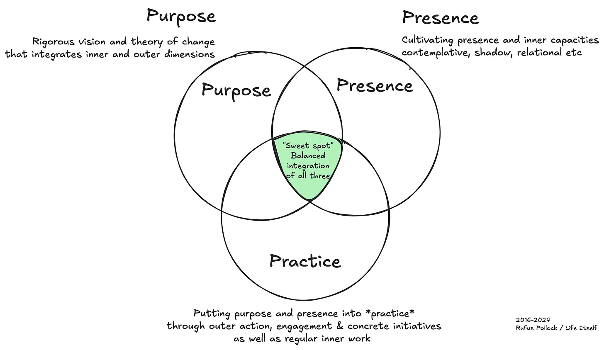

# 3P's of of purpose, presence and practice are key to second renaissance and addressing metacrisis

Here’s the trinity of purpose, presence and practice. Balanced integration seems key to engagement in this moment of civilizational (meta-)crisis and a [second renaissance](https://secondrenaissance.net). And ... it seems *really hard* to do — based both on my own personal experience 🤣 and talking with others.

This “3P” diagram of purpose, presence, and practice has been around since early days at [Life Itself](https://lifeitself.org/). We’re still playing with it.

The idea is that one wants to *have* (and value)each of these in a balanced way. You want to have **purpose** i.e. a direction for your aspiration, **presence** i.e. inner capacities to be present, to act with love and compassion for yourself and others, and **practise** i.e. active engagement to take forward your purpose and cultivate your presence.

### Comments

#### Purpose is more than a general vision, it’s a full theory of change

Purpose needs to be more than “a better world”. It wants to have a relatively worked through “theory of change” (to be clear we don’t especially like that term … and we haven’t yet found a better one).

Of course, any specific direction you choose will be flawed so it’s all about regular reflection and course correction. e.g. “Hey, we thought that this was a powerful way to address the climate crisis … and now we realize given the pace of things that we need to shift to X, Y, Z”.

#### Why we introduced practice

Originally we had a diagram with just “purpose” and “presence” with the idea being that …

- Purpose represented the outer side of getting stuff done, action etc
- Presence covered the inner side of things

In this version implementation was implicit: if you valued presence you’d be doing stuff to cultivate it. If you had purpose you’d be taking action towards it.

However, in sharing this over time, we realized that “putting into practice” isn’t as automatic as we thought. It’s quite possible to have a clear purpose — or to value presence — and not do a lot about it. Thus, we added an explicit third value of “putting into practice” / “taking action”.

Thus whilst adding practice sounds tautologous or pleonastic because if you value something you should already be doing it … it really is an important addition.

You could also see this as some ambiguity in the diagram as to whether it represents *values —* i.e. what one thinks is important — or *actions* — what one is actually doing. If *actions* then purpose and presence are sufficient — purpose then stands for outer action for social change and presence stands for inner cultivation.

#### Integration of the inner and outer

There’s also the integration of the inner and outer dimensions, which is implicit in that trinity. So, there’s that integration of theory and practice.

#### Integration is essential — an d hard

Too much purpose becomes all theorizing and visioning without balancing presence or concrete action to implement.

Too much practice becomes let’s just get shit done without the inner work.

Too much presence and we’re just sitting on the cushion all the way chanting the mantra “be the change you want to see”.

Balancing all three is **[hard](https://lifeitself.org/blog/2017/06/28/the-middle-way-what-were-about)** . More on why and what to do about it in a

### Analogies with …

- Three-legged stool in Buddhism: ethics, concentration and wisdom
- Integral: “all quadrants” and especially integration of inner and outer
- Theory and practice (Praxis)

### Questions for improvements

- Is there something unclear about use of “practice” here. Wonder if “performance” would be better.
