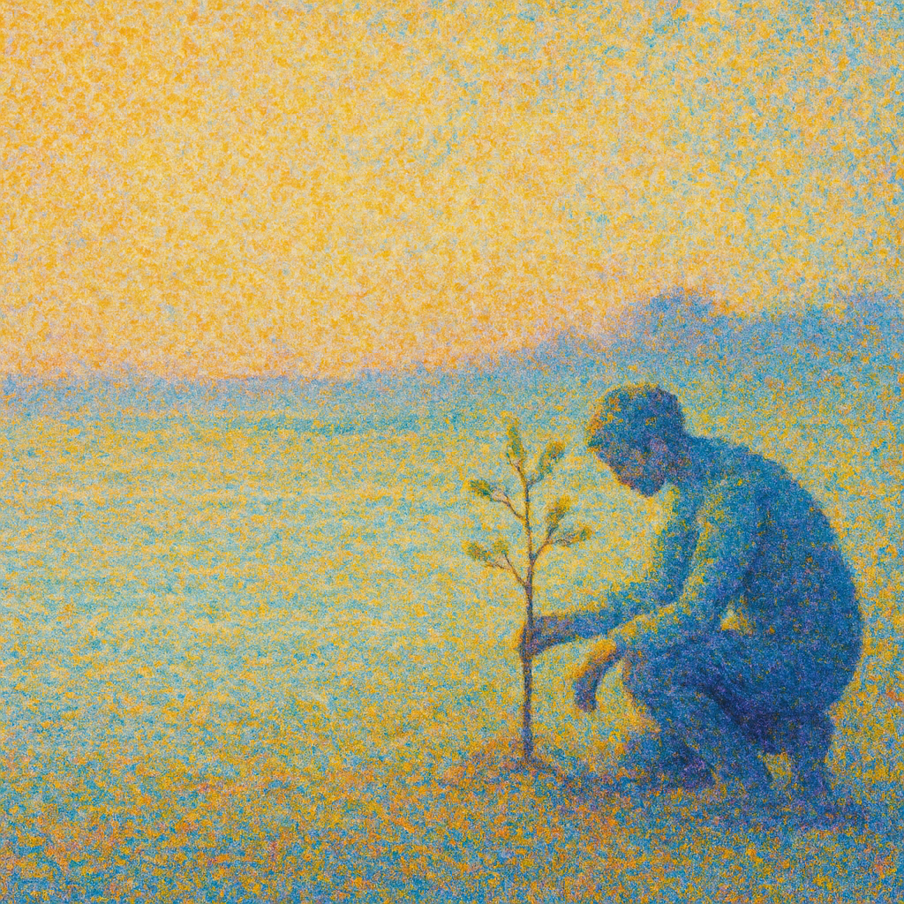

# A Prayer for Wisdom in a Time of Unravelling

I have a dream—a dream that we can become wiser, that we can cultivate the wisdom to hold ourselves, each other, and our world with care. To make the choices to give our children and all life a flourishing future. To have the humility to realize the small part we play in the great web of the unfolding.

One key aspect of wisdom is knowing when to go fast and when to go slow.

We are in a moment of great unravelling, of great change, of great suffering. I remain always hopeful. Hope is an act. Not an evaluation.

And at the same time, what we can now see coming involves almost certain breakdown. Of a more or less major kind.

And what we do matters.

Building networks of trust, care, resilience, and action are essential. Both to mitigate harm, and take steps towards the radically wiser, weller future for all life that we dream of.
