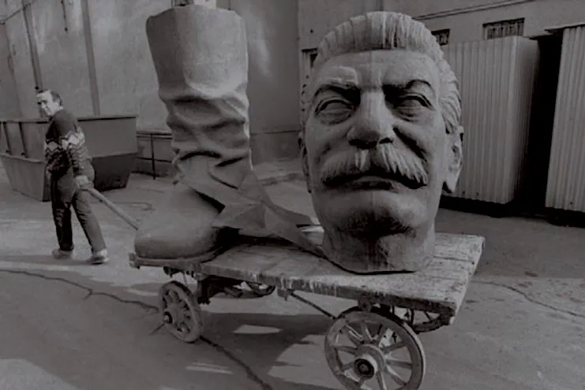

# An introduction to a Politics of Being

Politics today often feels like a hollow shell, stripped of vision and hope. Our previous utopian visions have disappointed us (I’m looking at you communism). Neoliberalism tells us to forget our dreams — for they are dangerous. But what if the key to a better future lies not in new systems or policies, but in transforming ourselves—our being—both individually and collectively?

That’s what lies at the core of *ontological politics —* or a politics of (and for) being: a rethinking of politics as *for* the cultivation of inner capacities — “being” — as well as a recognition of being as key to realizing our political vision and enabling planetary-scale collective action.

*Note: the “[ontological politics](https://lifeitself.org/ontological-politics)” has been at the core of Life Itself’s vision from its earliest days.*

*Man with a demolished statue of Stalin in Budapest in the early 90s.*

## Summary

#### What Drew Me to Ontological Politics?

From an early age I was interested in politics as a vehicle for social change and societal improvement. History shows us vast shifts, for example from medieval monarchies to modern democracies. And these aren’t just change, they are change for the better.

Yet, as a teenager in the 1990s, I felt all too sharply that were living in a world bereft of vision. The fall of communism left a void, and the liberal political order that reigned seemed resigned to mediocrity of managerial capitalism where the most on offer was a bit more growth or a bit more redistribution. Grand visions to inspire or unite us were utterly absent.

#### The Failures of Past Ideologies

And there was a reason for this. Communism, for all its ideals of equality and justice, had badly failed. And this had lead us to deeply distrust utopian visions and transformative politics.

But why had Communism failed? Was it because all such utopian visions were doomed to failure — and worse, not only to failure to totalitarianism?

No, Communism failed because it relied on structural solutions—abolishing private property—without adequately addressing the deeper issues in human nature, especially our “greed” — in the broad Buddhist sense of our grasping.

And, on the other hand, liberalism failed us with its in-built assumption of humans as rational, self-interested individuals, and its promotion of a narrow vision of freedom and progress.

Both paths neglect the transformative potential of human beings and the role our inner states play in shaping society.

#### The Case for Transformation of Being

At the heart of ontological politics lies the belief that the transformation of being is both the goal and the foundation of meaningful political change. To avoid the pitfalls of the past, we need to cultivate new forms of consciousness and inner capacities, personally and collectively. This means fostering wisdom, compassion, and resilience to create a wiser political vision and enact it effectively. Without this deeper transformation, no structure or system can truly succeed.

#### Politics as Vision and Action

Ontological politics operates on two levels: envisioning a future for society where “being” and its evolution has primacy *and* the role of “being” and its development in enabling transformative collective social change.

Crucially, both aspects focus on the transformation of being. Wiser, more evolved ways of being is essential not only to imagine better futures but also to enact them. This dual focus on vision and process makes ontological politics a major rethinking of how we approach collective change.

#### Looking Ahead: Envisioning the New Political Vision

What does a politics of being look like in practice? How do we cultivate and enact it in a world yearning for direction? These are the questions that I’ll address in the next episodes.

And by placing the transformation of being at the center of politics, we can begin to shape a second renaissance—one that integrates inner growth with societal evolution.

---

## Transcript (original with minor edits)

So today I want to introduce a new topic that I will term ontological politics or the politics of being. Or, perhaps now, the politics of the [second renaissance](https://secondrenaissance.net/).

I want to start with the question of what drew me to this.

#### What drew me to this?

I have always been interested in politics and social change at least as far back as I could think about such topics in my early teenage or even earlier years.

And for me, politics was obviously intimately related to social change and even social improvement.

And I was always very interested in history. And if you looked at history, obviously there were these vast changes. To take just one example, in the medieval times there was the king and people who argued with the king were often executed. And obviously today that is very different: there is no king or the king does not have that kind of authority anymore. So we can see these vast changes in the social order — and in ways that often seem good to me, at least in that example.

And the other thing I noticed quite quickly, I think, was there was this lack of vision and hope in our society and in our politics.

We just seemed really bereft.

I was a teenager in the 1990s. It was after the fall of the Berlin Wall and Communism was dead. Despite that, I even tried to be a communist as a teenager. That's why I felt at my heart. There was something very beautiful about the ideal, about wanting a radically fairer society. But Communism had been dismantled.

And I also read Isaiah Berlin when I must have been like 15 or 16.

And he had this powerful argument about positive and negative liberty and this strong thesis that visions of positive liberty, like those in communism, were actually dangerous. Positive liberty being the idea that freedom was not only freedom in narrow sense of freedom or speech or action but an enabling freedom, the provision of the conditions that would truly empower them — hence the removing the shackles of class and wealth and so on that held people back etcetera.

And his argument was that that this positive version of liberty led, almost inevitably, to authoritarianism and to the Gulag.

And while I didn't completely buy Isaiah Evan's thesis, certainly there was strength to it. We had seen what happened.

And so I was very skeptical sort of communism, yet my heart kind of yearned for some kind of great vision like that.

And I saw a world in which politics today, even back, well, 30 years ago now, was emaciated.

There was a just total lack of vision.

And there's this beautiful quote from proverbs, which is: **without a vision, the people perish.**

And there's a sense in which we are perishing and we were perishing as a society because of this lack of vision.

And some people projected onto that a technological cultural jog that we've made.

You know, the future was tech, the future was AI one day it would take over.

That was even there then.

And I was also very skeptical of that because what kind of god would it be?

And this brought me to a sense as I examined the failures, if you like, of communism and elsewhere and the lack of vision in the liberal political order when I studied economics, which I feel as the epitome of that more than capitalist liberal order, was the key was the transformation needed in ourselves.

So crudely put, communism had failed because it thought that structure was a solution.

If only we got rid of private property, all would be well.

Yet, of course, there was still human collective action problems.

There was greed.

There was manipulation.

There were bad actors.

There was Stalin. There was Mao Zedong.

And it needed something deeper if communism was to be realized.

And on the liberal side, this story, I I saw that how economics so rested on this assumption of the rational, self-interested individual.

There was an actual strong ontological assumption about the nature of human beings embedded in that vision. And from that flows the resignation of the modern liberal vision: “this is the best we've got”. And, as per Isaiah Berlin, attempts to do better, lead to disaster. So … just give up, content yourself with being able to play your music whenever you want, buy whatever you want, etcetera.

And so what brought me to this question of ontological politics was, first of all: **What would be a new political vision?**

And, second: **How would it come about?**

Well, the key to both was in the **transformation of being** .

And there was also the question of politics, which is the second meaning of the word politics, I think, which is how do we enact a vision?

That has also gone very wrong in the past.

So I think politics are these two senses of how do we collectively envision a future for ourselves? And, secondly, how do we enact it?

And key to both of those lay in our being and in new kinds of being personally and collectively.

We needed to be wiser than we had been if we were to enact better political visions. If we were to avoid the disasters that had befell socialism and communism and so on.

That was the motivating force for this examination of of on ontology of being, transformation of being, and this idea of an ontological politics of politics focused both in vision, as I will come to, and in process on transformation of being.

So what I mean by that is that a major end of politics is to enable and to cultivate inner capacities and the transformation of being person collected new, if you like, new forms of consciousness in that somewhat grand term.

And secondly, that that transformation of being is also essential to doing politics.

So, for today, I think that's enough of an introduction and we'll come in the next question of what does that vision look like and in particular how do we envision this new political vision being realized?

So in summary today, the exploration of ontological politics stems from my desire and the desire to address the lack of transformative vision in modern politics and to understand how our being influences the enactment of political vision.

And the next question is, how do we envision this new political vision being realized?

### Asides

More on the history of statue destruction [https://www.nytimes.com/2017/08/17/world/controversial-statues-monuments-destroyed.html](http://More on the history of statue destruction https://www.nytimes.com/2017/08/17/world/controversial-statues-monuments-destroyed.html)
