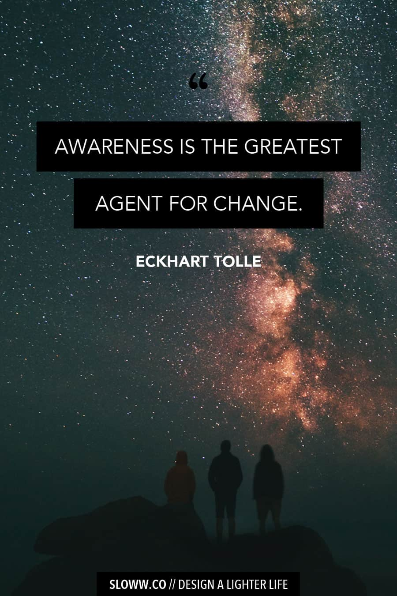

# Awareness is the greatest agent for change?

Came across this Eckhart Tolle quote from *A New Earth: Awakening to Your Life's Purpose* . Got me wondering: but is it really?

### Why am i dubious about it ...

First, what exactly does it mean. I'm interpreting (given it comes from Tolle) that it means "awareness" in the spiritual sense of waking up i.e. becoming "aware" or even becoming "awareness". So the claim is that “waking up” is the greatest driver for change.

This is a classic claim: if we only woke up, saw that "god is love" etc we'd all just love everyone and the world would change (to the strains of John Lennon’s Imagine 😉).

And there *is* of course truth - and some deep truth - in that. And, at the same time, it is essentially wrong.

Why? Because it turns out that waking up is pretty distinct from cleaning up and growing up.

Put crudely, you can wake up and be a fascist 😉

Of course, some will argue that's impossible. They have *defined* waking up as not only moving into awareness etc but also being ethically more evolved (and acting on that). If so, then the claim is a tautology.

However, I think the more specific interpretation is correct. And here are the objections:

- **Waking up != showing up** Waking up can just lead to passivity -- everything is already perfect so no need to do anything.
- **Waking up != cleaning up.** Waking up doesn't mean you have dealt with the shadows. Shadows that may impede, cloud or distort action. Furthermore, Waking up can actually lead to more delusion/shadows if one isn’t pretty careful (and to spiritual bypassing). Even full I’m “Jesus Christ”, “I’m infallible” etc. cf Martin’s yoga pose research in Finders book.
- **Waking up != Growing up.** Waking up does not necessarily mean we “grow up” and expand our ethical “zone of concern” or our cognitive complexity to act sensibly on our concern and insight.

Buddhist teaching and integral teaching both have good stuff on this. Integral especially nails this.

- Buddhism: have 3 baskets. Concentration, insight *and* ethics. So, ... no concentration on its own won't give you ethics and hence "change"
- Integral: early (80s) Wilber gives the Wilber-Coombs distinction of waking up and growing up. And later on we have fuller multidimensionality with waking up, cleaning up, growing up and showing up. Just waking up won't give you cleaning up, growing up or showing up which is what we need for real change ...

#### Connections

- Relates to the “Be the change you want to see fallacy”.
