# Darzi report on NHS: Notes and Commentary

My rough and ready notes on recently issued [Darzi report on the NHS](https://www.gov.uk/government/publications/independent-investigation-of-the-nhs-in-england) ([full report PDF](https://assets.publishing.service.gov.uk/media/66e1b49e3b0c9e88544a0049/Lord-Darzi-Independent-Investigation-of-the-National-Health-Service-in-England.pdf)). Great introduction to what is happening and the challenges as well as some decent info on key inputs e.g. funding, management structure.

However, almost completely lacking in any detailed analysis of causes (certainly no [SCQH](https://assets.publishing.service.gov.uk/media/66e1b49e3b0c9e88544a0049/Lord-Darzi-Independent-Investigation-of-the-National-Health-Service-in-England.pdf)!). As such, final recommendations are bland motherhood and apple pie (e.g. use tech better, empower people) and don’t really go to the root of the issues (IMO).

*Commentary: I find NHS a fascinating case to study along several dimensions. First, it is a complex institution at end of the modernity. Second, as a provider of a vital service in our societies, it is something that pundits and people in general love to opine on — yet is rarely rigorously analysed (thus, it is a rich source for seeing patterns of thought and worldview — “oh it’s the bloody managers”, “too much obsession with competition” etc). Finally, healthcare is something that everyone has an opinion on, especially in the UK, and so a good source for engaging in dialog on the above.*

#### Key points

Demand is inexorably growing as population ages. Plus other socioeconomic issues especially mental health (the metacrisis!).

Spending on NHS has been growing (albeit slowly during 2010s) but more rapidly recently: ~ 3.4% increase per year in real terms before 2010 and gain since 2019 (ed: clearly unsustainable given that is higher than GDP … ). Total healthcare spending is now over 10% of GDP.

No clear analysis of causes. Here’s one rough theory put forward somehow implicitly for some of what is happening:

- there were cuts to local services. local services provided care in community especially long-term care
- that led to more of those people coming to emergency services and hospitals
- that is inefficient use of NHS time …
- implies reduction in productivity even though spending more money in last 5y.

## The state of play

#### Not achieving goals

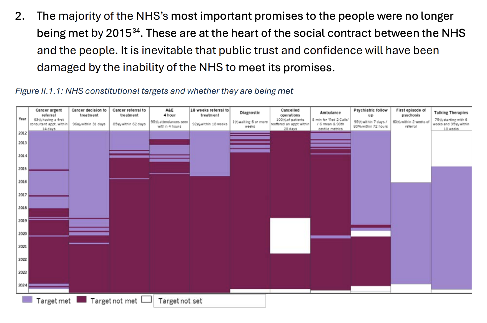

#### Waiting lists are growing and include over 7.5 million people

> 34. As we can see in the chart overleaf, in June 2024, the total waiting list stood at 7.6 million people. More than 300,000 people had waited for over a year, and some 1.75 million people had waited for between 6 and 12 months84. More than 10,000 people are still waiting longer than 18 months (although this has fallen sharply from its peak of 123,000 people waiting that long in September 2021)85. By far the largest group waiting were working age adults – some 4.2 million people86. As we will explore in the next chapter, the Covid-19 pandemic saw the most rapid rise in waiting lists. But in February 2020, waiting list already stood at some 4.6 million people, over 2 million more than 10 years earlier87

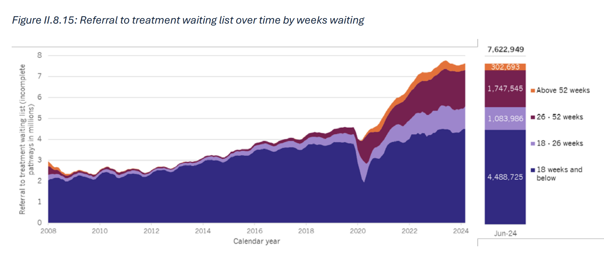

### Evidence for significant rising demand

#### Call numbers are rising (almost doubled in last 10y)

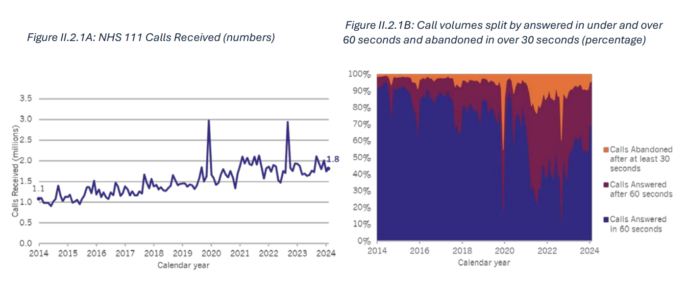

#### Demand for assessments for ADHD and Autism have grown exponentially

> Demand for assessments for ADHD and Autism have grown exponentially in recent years. Since 2019, the number of children waiting at least 13 weeks for an assessment for Autism has increased at a rate of 65 per cent a year, while for adults the increase has been 77 per cent a year67. Activity has risen too, with services now seeing 33,000 people a month68. But as of March 2024, there were still more than 70,000 children and young people under 18 and more than 50,000 adults waiting at least 13 weeks for an assessment for Autism69.

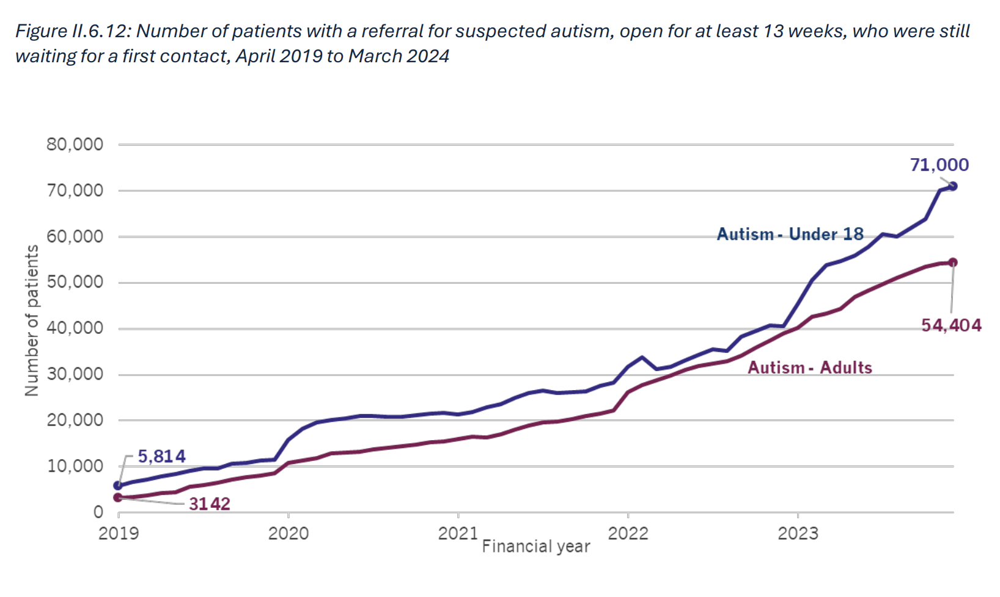

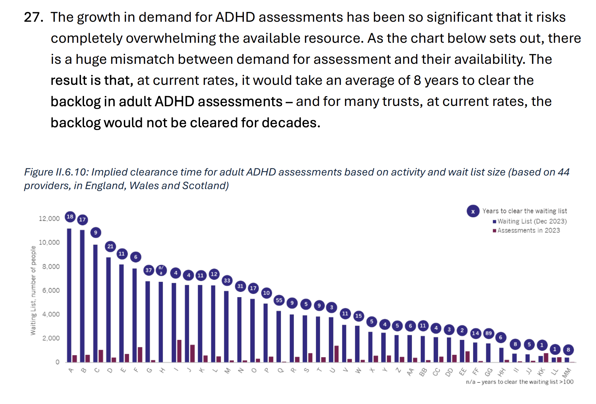

> 28. There is no consensus around what explains the dramatic increase in demand for assessment for ADHD and autism. Some believe that it is the conversion of unmet need into demand for assessment as stigma has reduced and awareness has increased. Others argue that is the result of self-diagnosis induced by misleading INDEPENDENT INVESTIGATION OF THE NATIONAL HEALTH SERVICE IN ENGLAND | 35 discussion on social media. No matter the cause, it is clear that with services overwhelmed, many people who need help will be missing out. NHS England’s taskforce on ADHD70 will have important recommendations to make.

#### SEMH support demand is growing at 5.3% a year

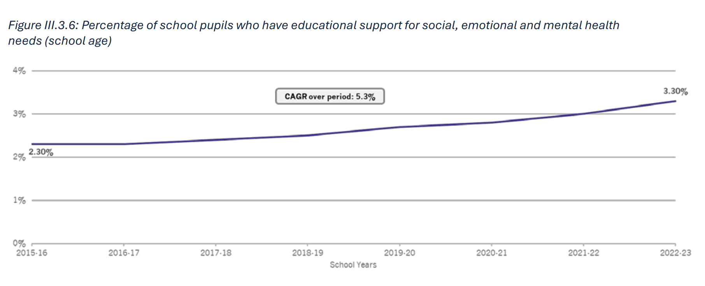

#### Disease burden shifting to long-term conditions (aging population)

> As we saw in chapter 1, there has been a substantial rise in the prevalence of some longterm conditions. Perhaps more significantly, more people now have multiple long-term conditions: between 2017 and 2022, the number of people with two or more long-term conditions increased at an annual rate of 6.1 per cent123. This matters because multiple conditions can interact with each other, which increases complexity and makes their management more challenging. Many long-term conditions are caused or exacerbated by lifestyle factors, such as tobacco or alcohol consumption, and obesity

#### Alcohol and obesity getting worse

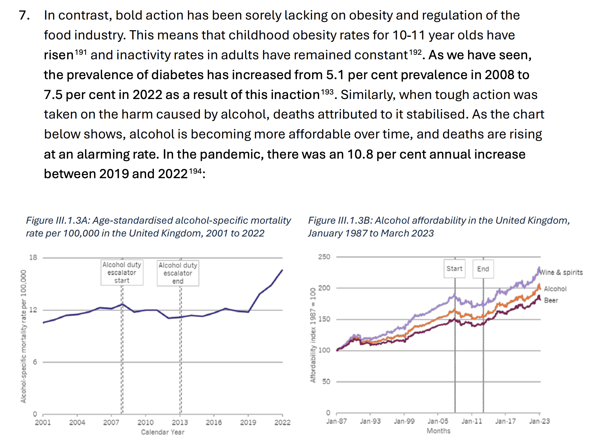

### Perverse policy

I suspect most of this is because headline NHS spending is a hot topic where spending to local government isn’t (the results of cuts to local spending are hidden). Overall the issue is people (meaning public) are reluctant to increase spending …

#### Cuts to local spending impacted successful local diabetes prevention

p.65

> 8. Everybody knows that prevention is better than cure. Interventions that protect health tend to be far less costly than dealing with the consequences of illness. Take the NHS-funded Diabetes Prevention Programme which reduces the risk for type II diabetes by nearly 40 per cent195. Given the potential power of preventative interventions, it is perverse that the public health grant to local authorities has been cut so substantially. Analysis from the Health Foundation shows that the public health grant was cut by more than a quarter between 2015-16 and this year196. Moreover, cuts to public health allocations have tended to be greater in cash terms in more deprived areas.

#### In general spending flowed to hospitals away from community care and other areas

e.g. UK ended up with more people working in hospitals than most other places.

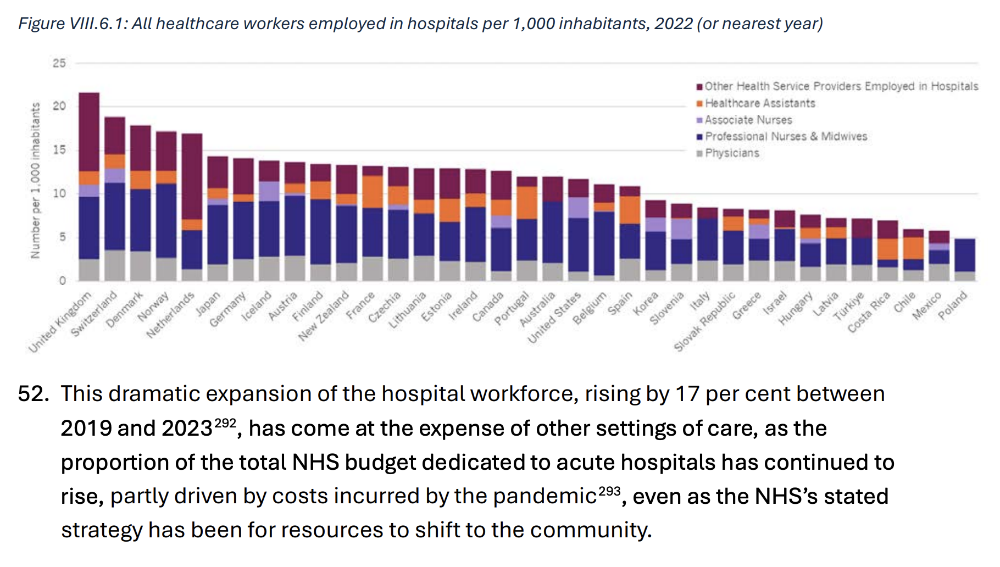

## Part II: Drivers of Performance

*Commentary: This is an area of the report which could be **so much better** with some actual structured analysis of how different factors fit together and their relative importance.*

Roughly we can guess there is some approximate relationship like:

$$\textrm{Performance} = \frac{\textrm{Effective supply for healthcare}}{\textrm{Effective demand}}$$

More precisely, it is not a simple fraction but rather a function where first term has positive effect on performance and the second a negative effect.

$$\textrm{Performance} = f(\textrm{Effective demand}, \textrm{Effective supply})$$

Effective demand = Population X Avg needs [or more directly: summed needs]

Effective supply = amount spent (per capita) X effectiveness of spending (~ productivity)

Then the question is what are the drivers of these various items.

- Is lower/higher peformance just that we spend less/more per capita than other countries?
- Is declining satisfaction largely driven by increasing effective demand (outstripping)?
- Do we have the wrong mix of spending e.g. too much on hospitals and not enough on care in the community locally. Or too much on treatment and not enough on prevention

NB: you can also note that satisfaction is some odd function of performance.

NB: you also have to be careful about lags. e.g. supply is a function not just of this year’s spending but spending on prevention 10y ago.

NB: of your this is not supposed to be mathematically precise thing. Formulae here are just indicating some rough relationships. Could draw this

#### Supply is increasing but much less once adjusted for population

🔥 This is a fascinating graph. First, spending has been increasing (mainly under Labor government). However much of that gain has been eaten up by changes in population and especially composition.

We are spending 10% of GDP on health by 2019 and more today.

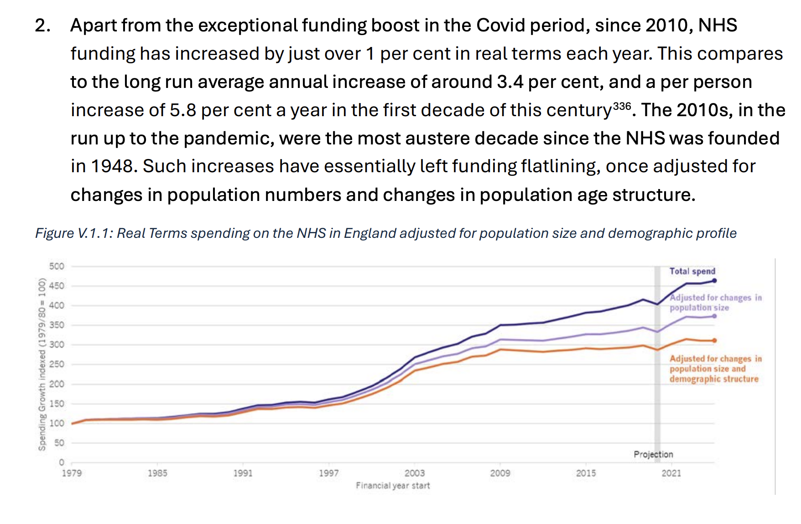

#### UK spends amount same as EU average and less than nordics by about 20%

p.99

> When analysed per person at purchasing parity, the UK spends about the same as other European countries ($5,600 compared to an EU15 average of $5,800). But we spend substantially below both countries where English is predominantly spoken and the Nordic countries, which spend about $1,900 and $900 per person more respectively343. This reflects differences in the performance of the economy overall (in those countries, GDP per capita is higher344, so the same percentage share translates into higher spending).

#### Capital investment lagged massively in 2010s

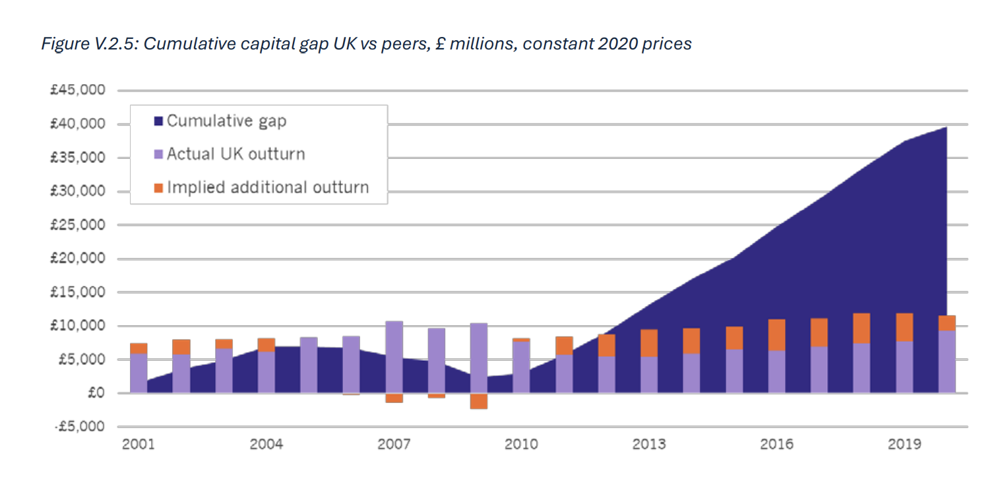

#### Massive reorg in 2012

> 2. The Health and Social Care Act of 2012 was without international precedent. It was a uniquely complicated piece of legislation, comprising more than 280 clauses plus 22 schedules, amounting to some 550 pages407. Indeed, it was three times the size of the 1946 Act that founded the NHS408. During the chaotic parliamentary process, more than 2,000 amendments were submitted409.
> 3. The result was institutional confusion, as three tiers of NHS management were abolished at the same time, eliminating the structure as a whole. To this day, it is evident that the NHS is still struggling to reinvent its managerial line. It is therefore impossible to understand the state of the NHS in 2024 without understanding why its managerial structures are so challenged.
> 4. The reforms were intended to dissolve the management line of the NHS, a move that the white paper framed as “liberating the NHS”410. If the goal was to increase the role of GPs in commissioning, a single sentence of legislation—requiring a majority of the board of directors and the chair of a primary care trust to be registered with the GMC as general practitioners—would have accomplished it. Instead, every commissioning organisation in the health service was abolished and entirely new clinical commissioning groups had to be constructed from scratch. **It was a hitherto unprecedented ‘scorched earth’ approach to health system reform.
>
> …
>
> 7.** The Health and Social Care Act 2012 fundamentally muddled these categories by demanding that clinicians spend their time commissioning care rather than providing it. Despite the name “clinical” commissioning groups, these were in fact dominated by GPs who were not equipped with the training or resources to succeed, and who had no functional organisations that they could inherit. Indeed, the opposite was true: by dissolving the old structures rather than reforming them, GPs were to all intents and purposes set up to fail. … An analysis of international health systems prepared for this report could find no example in any advanced country of the top-down reorganisation of a health system that deliberately fragmented commissioners (variously known as payors, purchasers, or insurers)

#### Major loss of expertise following the 2012 scorched earth reforms

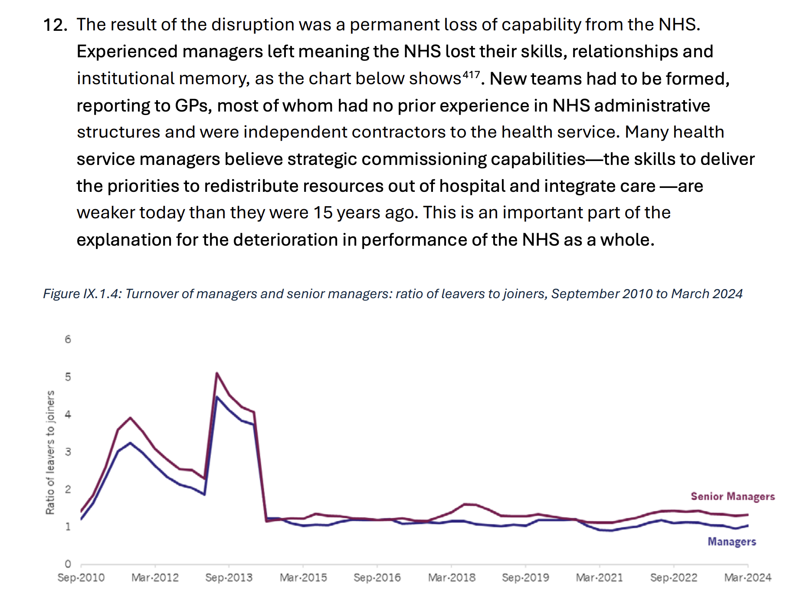

#### Health and Social Care Act 2012 imprisoned more than a million NHS staff in a broken system for the best part of a decade.

Clearly Darzi is really relishing the chance to say what he thinks here …

> 3. Rather than liberating the NHS, as it had promised, the Health and Social Care Act 2012 imprisoned more than a million NHS staff in a broken system for the best part of a decade.

#### Management is needed and management has been declining

> The problem is not too many managers but too few with the right skills and capabilities.

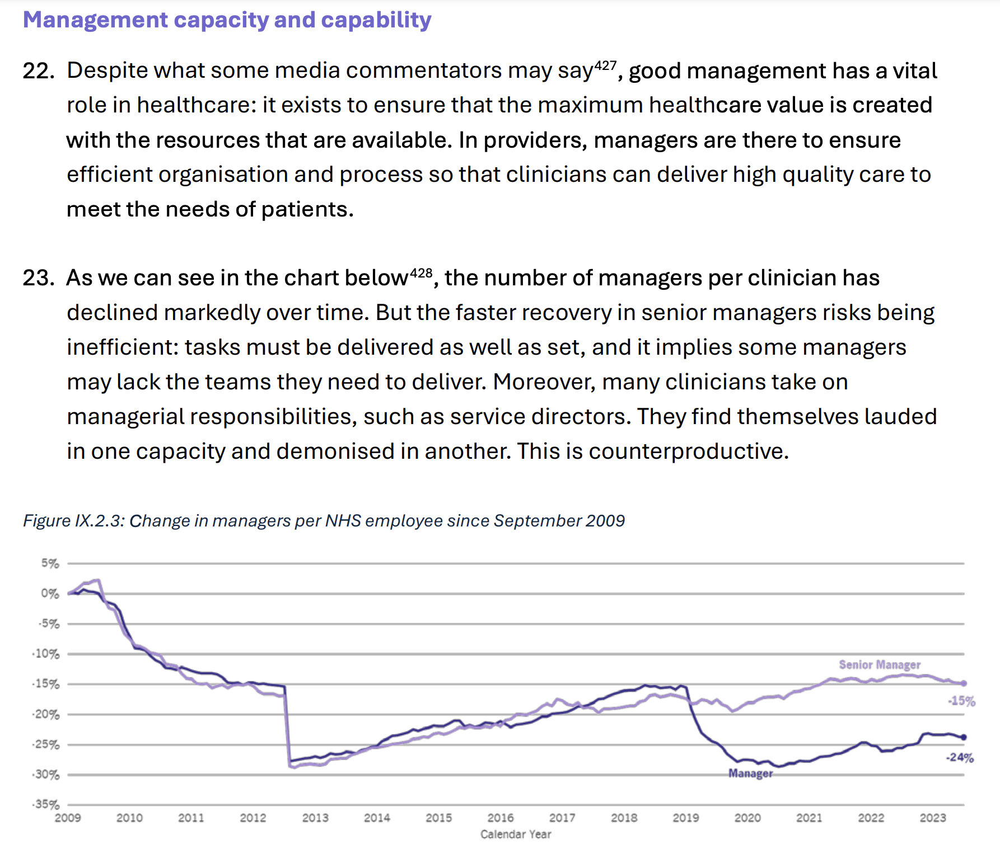

#### UK spends 40% less on managers than most other places

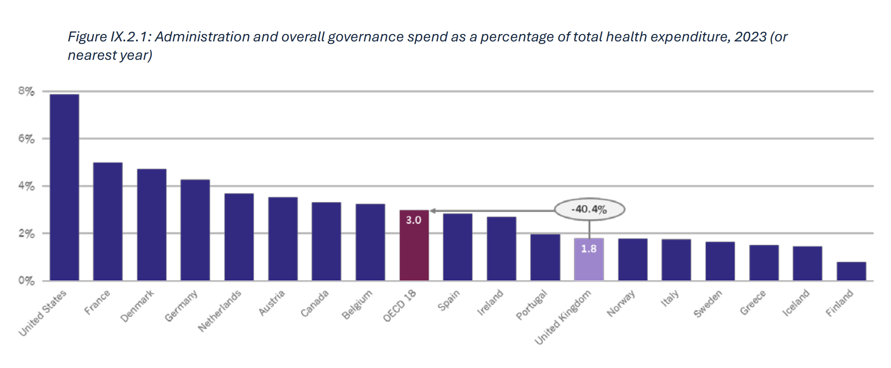

### Appendix of Asides

#### Nordics are better

Yet more evidence the nordics seem to do it better 😉

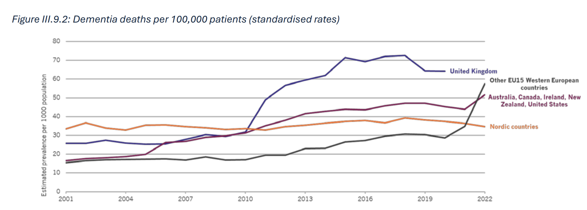

p.55

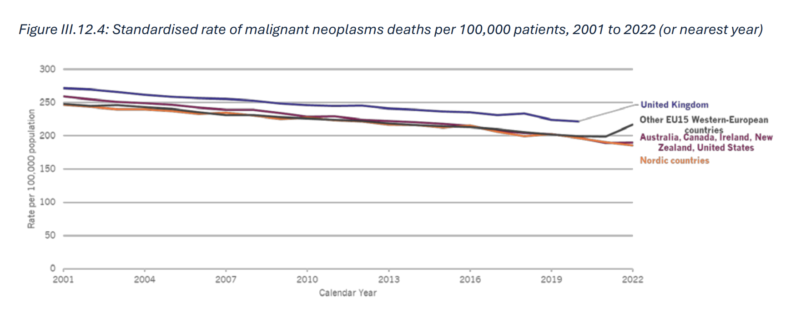
