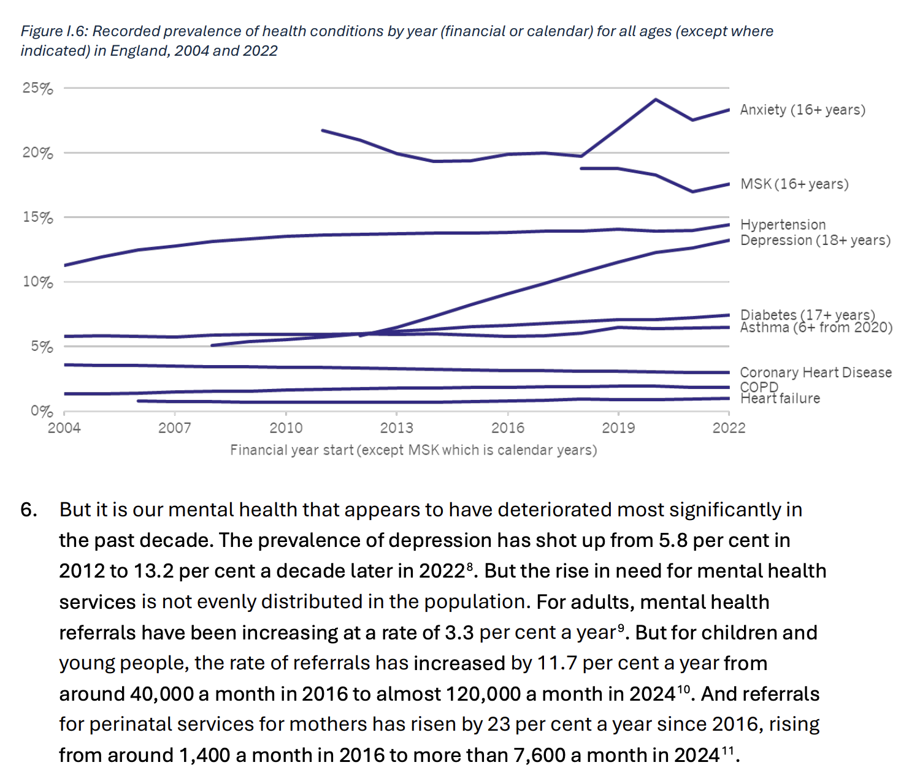

# Darzi report on the NHS flags mental health epidemic

Look at the indicators for depression. It’s sky-rocketed since the early 2010s.

> But it is our mental health that appears to have deteriorated most significantly in the past decade. The prevalence of depression has shot up from 5.8 per cent in 2012 to 13.2 per cent a decade later in 20228 . But the rise in need for mental health services is not evenly distributed in the population. For adults, mental health referrals have been increasing at a rate of 3.3 per cent a year9 . But for children and young people, the rate of referrals has increased by 11.7 per cent a year from around 40,000 a month in 2016 to almost 120,000 a month in 202410. And referrals for perinatal services for mothers has risen by 23 per cent a year since 2016, rising from around 1,400 a month in 2016 to more than 7,600 a month in 202411.

Source: [Darzi report on the NHS](https://www.gov.uk/government/publications/independent-investigation-of-the-nhs-in-england) p.19 of the [full report (PDF)](https://assets.publishing.service.gov.uk/media/66e1b49e3b0c9e88544a0049/Lord-Darzi-Independent-Investigation-of-the-National-Health-Service-in-England.pdf)
