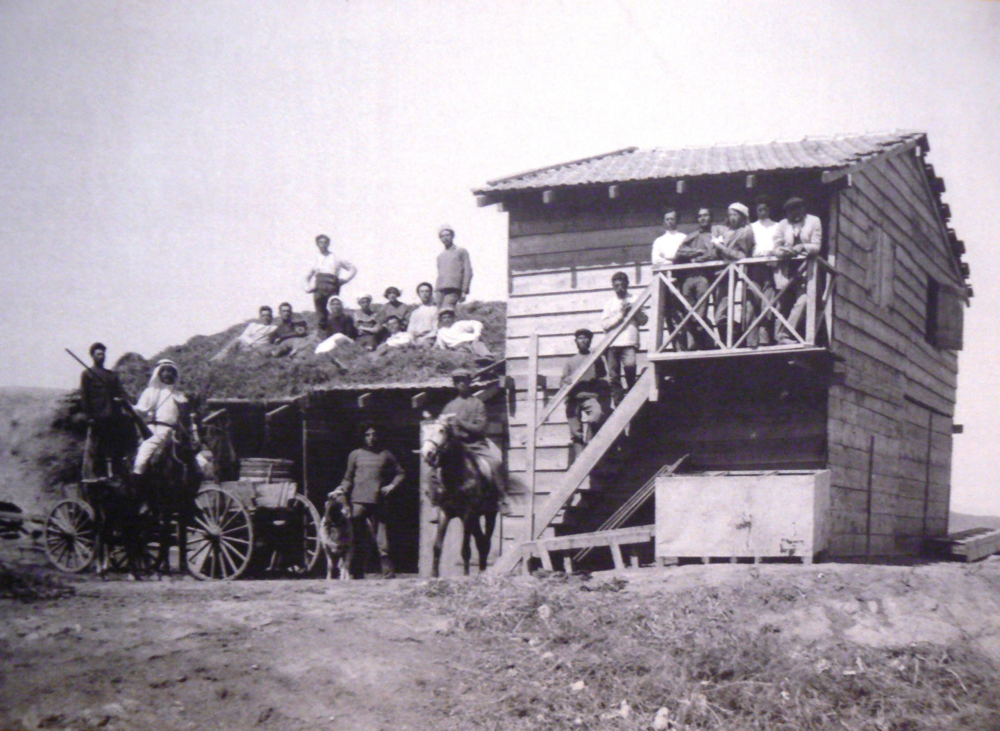

# Hard thing about hard things re building a wiser world

It’s easy to listen to Gould play Bach and say to someone (or yourself as I did age 14): “Play like that”. It’s even easy to describe what you need to do in theory: put your fingers here and there, play that trill like that.

And it’s very hard to do it.

Most people never play at concert level and those who do have years and years of practice. In this case the ‘what’ is easy and the ‘how’ is very hard.

This is a case of the ‘hard thing about hard things’.

*Glenn Gould playing Bach.*

So too with profound (paradigmatic) ontological and cultural change. It’s (relatively) easy to describe what an integral world, or a right-hemisphere world, or … [insert term here] world would look like. And it’s the *how* that really matters: *how* do we do it, how do we transition, how do we overcome the [collective action problems](https://wiki.secondrenaissance.net/wiki/Collective_action_problems) that are in the way.

The what is (relatively) easy, the how is hard. The how is what matters (more).

*From my notebook 2024-02-12*

### On why McGilchrist and the intellectuals miss the point ([aka ideas are cheap, implementation is costly](https://rufuspollock.com/ideas-are-cheap/))

Crude and overstated version

- Context: [metaphor of mountain (wiser world) and paths to the mountain (how we get there)](https://lifeitself.org/blog/2023/05/04/research-community-open-call-1-april-2023).
- A lot of talking/theory (in our space) about the mountain i.e. the better, weller, wiser future we want ...
- And we roughly all agree on the mountain we want to go to — and hard to get much more specific until we get closer
- Hard part (right now and perhaps in general) is the *getting to the mountain*
- And that normally involves collective action problems
- Little discussion about how to solve those collective action problems …

#### Example

E.g. McGilchrist (who I *really* admire) says all this excellent stuff ... e.g. about a more right brain world, or (just heard on podcast) about us all slowing down …

And … I completely agree … and he is (implicitly) a) describing a collective action problem e.g. it is hard for me to slow down if others don’t slow down too[^1] b) more generally describing humanities unwisdom in general and especially in relation to collective action problems.

These are old and hard problems. The issue here isn't knowing that we should coordinate but ***doing so*** .

To overstate it: it's as if we are in a real life prisoner's dilemma where you and I have both been arrested for the bank robbery and someone keeps shouting at us "cooperate, you idiots and don't rat on each other". Well we *know that* and ... i still worry that my buddy will confess and rat on me ...

*Aside: would really prefer a better name and example than prisoner's dilemma which focus on criminals.*

It's like McGilchrist going on about us being left brain oriented etc. And you're like: “I know, I know ... and i'm trapped in a left brain system where i need to act like that etc etc.”

Conclusion: **we need to move move on from "what" to "how"**

### Life Itself: how ...

What's our hypothesis about how at [Life Itself](https://lifeitself.org)?

Preamble: any hypothesis is just that. Not exclusive. In addition, there is much that will be emergent.

#### Claim 1: local density (and majority) is key to "be" (think, act, etc) different from the mainstream.

Look at your daily social interactions. you will largely end up with similar views/values to the people you daily interact with over a sustained period of time.

Converse: it is very difficult to act different from the majority of those you interact with day to day. We "think together". Thus if i want to sustain an evolution in my views and values i need to be (largely) interacting with others who are similar (similar at least in valuing and supporting alternative thinking -- not necessarily identical in thought)

#### Claim 2: the majority of our time is spent in our "living" environment and/or our "work" environment

Note: living environment and work environment may not be distinct but they often are.

#### Implication: you need conscious collectives …

Implication: you need to form EITHER physical conscious intentional neighborhoods and communities OR virtual conscious communities in which people can then spend most of their time.

OR conscious work collectives, but that is more complex (b/c work environment has less influence IMO than your daily living environment)

Recursion: finding enough people who want to operate like that is hard => you need to build beacons to attract sufficient people.

*Initial settlement at Degania, the first Kibbutz (1910*

#### More generally ...

- Solving collective actions problems we are in requires ontological/cultural change
- Hence, we need cultural/ontological change
  - More precisely, we need paradigm change i.e. major onto-social
- Such change is itself something of a collective action problem ...
  - Hard to do things differently from others around you ...
    - socio-economically: if everyone else is working 40h+ a week it is hard for you to work for 20h a week (people expect you to be able to sync, housing prices may be too high etc)
    - Psycho-emotionally (ontologically): it is hard to act differently from others.
      - doubt creeps in: am i really on the right path
        - One solution is to isolate with other dedicated others e.g. join a remote monastery
        - However, we are more interested in being proximate to the mainstream because a) very limited set of people willing to join a remote monastery b) you want to influence the mainstream
      - Our sense of our own value/purpose is very tied up with others e.g. what your parents think of what you are doing etc.
- The way to solve it is to move into micro-communities …
  - That helps solve material issue (e.g. you can work less)
  - Others around you share values etc
  - etc

#### Conclusion

You need those [conscious collective pockets of a second renaissance](https://secondrenaissance.net/assets/second-renaissance-how-whitepaper-2.pdf)

And, specifically at Life Itself, you want to start building up that Kibuddhist network 😉

[^1]: If I tell my boss I want to start working 20h a week rather than the usual 40h i may end up out of a job …
