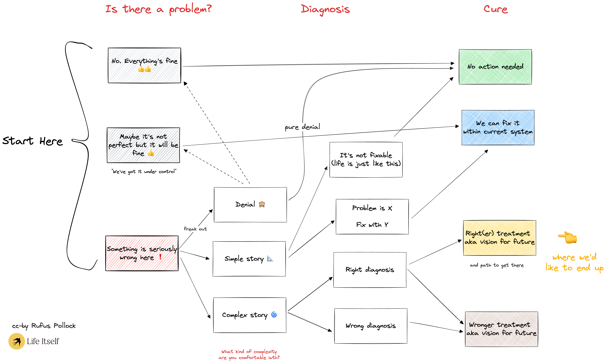

# Isn't it all going to be fine? A flowchart to map the different ways people respond to major social problems / crises

This is a rough map of how we react to a significant social issue or problem. Here there are three stages: Is there a problem? What's the source? Finding a cure. In the first, and often most significant stage: we often start from the classic response of "Everything's fine" or "It's not fine but we have it under control", evolving depending on our disposition and the evidence to: "Something's wrong here". Once we actually agree there’s a problem we need to accurately diagnose the issue and then (hopefully) find a good solution — but there are plenty of less desirable options.

### Example: climate change

Let's take possible responses to climate change:

**1. Everything is actually fine.** No real problem: it's #ClimateScam, we've always had climate changes etc.

**2. Maybe not fine but it will be.** Yes have a problem but we'll fix it e.g. tech is amazing, look at all those Teslas

**3. Woah, something is seriously up here ...**

### Growing inequality

Or take growing inequality ...

1. Nothing to worry about, it's just capitalism doing it's thing

2. Sure, we need to do something but we can fix it with a bit of tax and redistribution

3. There's something seriously up here, we need to look at the fundamentals of our economies. See e.g. [Open Revolution](https://openrevolution.net) …

### Apartment on the 50th Floor

Another metaphor is you're in an apartment on 50th floor. You notice a growing crack in the wall.

1. Nothing to worry about

2. Hmmm, that needs fixing. Probably just some plaster needs doing. I'll get the superintendent to come up.

3. Woah, something's seriously up here, we better start investigating the structural integrity of the building.

This metaphor of the building and cracks in the wall refers to our overall civilizational situation — i.e. late modernity. See the [Second Renaissance white paper for more](https://secondrenaissance.net/paper).

### Wrong complex diagnoses …

[Jan Demiralp asked](https://x.com/J_Demiralp/status/1658487711542710273)

> I observe quite a few people being stuck in the 'wrong complex diagnosis' box. What do you think are some ways we could help people move from this box to the 'right diagnosis' box?

This goes to the heart of good sensemaking. I think there are certain common features of good diagnoses and/or solutions at least for significant social issues.

Some features of "righter" solutions to significant social issues include

- **Longtermism** e.g. operating over decades
- **Inner-led** or at least inner incoporating. ie. including inner change (as well as outer change)
- **Political** i.e. involving collective action
- **Grounded** i.e. no magical thinking

Wrong-er approaches have more of ...

- **Shortermism** "we only look at next 3-5 years" (something I was once told by a major philanthropic funder who explained that there strategic priorities tended to reset every three to five years or so)
- **Outer change focused:** we just need more solar
- **Individualistic** : based on individual choice and action
- **Magical thinking** : web3 will fix #climatechange (or some other major collective action problem). [Life Itself Research did an extensive dive into this one](https://web3.lifeitself.org/guide).

#### The personal is political fallacy.

The "personal is political" fallacy can be a big one here: if we all just recycle - or buy hemp clothes - we can save the planet ... no need for politics anymore.

Context:

> I like this way of looking at things. What comes to mind for me is a radar diagram with these four qualities mapped in each corner. For a politician (for example), they would be low on long-termism, low on inner change focused, but high on collective and grounded thinking.
>
> On the other side of the spectrum, you have individual activists who do the inner work, read about social action, and fill their wardrobes with hemp clothes (this is me to an extent 😁) but fall victim to fantastical thinking and lack the community to mobilise collective action. [[Source](https://x.com/rufuspollock/status/1658196136228691983)]

### Colophon

Originally posted at [https://x.com/rufuspollock/status/1658196136228691983](https://x.com/rufuspollock/status/1658196136228691983)
