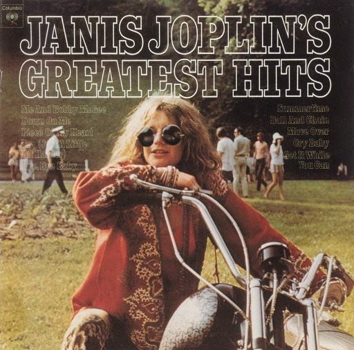
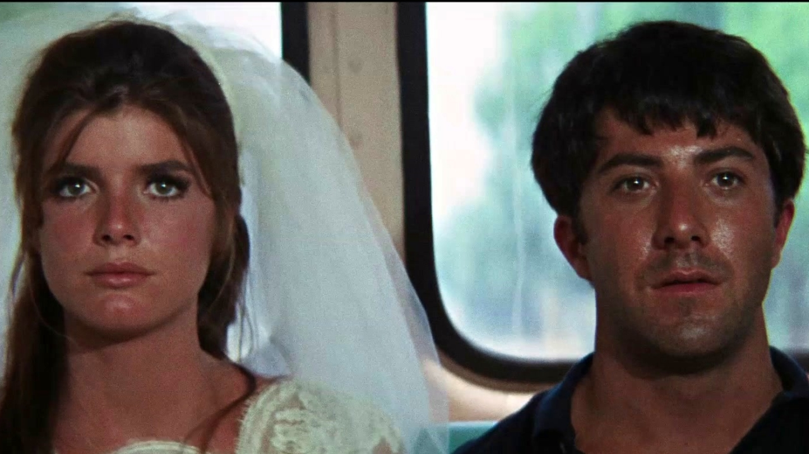

# Making peace with the 60s

Just go. Just burn. If you're going to burn, burn brightly. I think of Janis then, wrapped up in the still just-burning embers of a 60s counterculture, of the holding company and the chelsea hotel and all the bitterness of the dream that went bad.

I want to hold on those fragments. There's something so vivid, so compelling about hope even if it is dashed ones. When we push in the CD (as I did back then) or just push play on your phone and fall back into that rush of her crooning voice high on whatever it was that day telling us in that beautiful whacked out way that "it's all the same fxxxing day man". The brightness of the costumes, the clothes, the self-belief, the crazy correct contention that the system *is* just held up by all of our own simultaneous belief in it and hence, that, simply through a singular, sudden collective coordinated shift, the whole thing could come tumbling down and we could build anew.

You can feel it at moments in the sixties. This crazy sense (sure within its own echo chamber) that with just a tiny push the whole house of cards with its corruption and contradictions could come tumbling down. There's Ginsberg and Watts gabbling away on the houseboat in SF some time in 67/68, there's Leary with his gift for the gab and that immortal phrase "We have America surrounded". That if only everyone would "turn on, tune in and drop out" it could really happen.

But even the Graduate (early on, it’s ‘67) knew there was something wrong with that picture. That collective mind is much stickier, much more rigid than we would like. And the collective consciousness, the collective culture is something alive, something that can and will fight back when its current structure is threatened.

*The last moments of the The Graduate (1967). Deeply ambiguous: they have escaped … but to what?*

And that's how it ends. With Easy Rider, with Hunter S. Thompson, with the chicago convention, and the Rolling Stones at Altamont, the Beatles ended and Janis and Jimi dead.

And you can read it in Didion's *Slouching Towards Bethlehem* . You can see what the underside really looked like. How many of those kids were just lost, weren't tuning in to anything except escape and weren't dropping into anything except anomie and nihilism. You can read the history of drop city (I did) and marvel at how anyone ever, anywhere thought this was going to happen.

And yet, and yet, and yet ...

There is something contagious about hope. And youth. And belief. And there is a fragility to belief equilibrium (and a robustness — we have to acknowledge both).

And I also wonder whether naiveté is a prerequisite. If we knew how hard it was, we'd never start. Or, is it the naiveté which condemns the (r)evolution? Would a more sober, honest hope would burn longer if less bright and in so doing would be more likely to source the change we want to see? It's hard to tell. But ultimately i'm in the latter camp. I distrust the excitement, the fervour of the former. Revolution is just *so* goddam exciting (at least when we read about it). And yet how rarely it achieves its end, how often it devours its children or their hopes or both.[^1] Instead, I'm a slow revolutionary: an evolutionary. It seems like the better half of judgment and the better part of valor, the wiser way, a weller path even if it means I may not live to see the fruits.

So I both envy and resent the 60s -- a classic combination. I envy them their naivete and the hope and joy and commitment that came with it. I envy their sense of progress, the incredible combination of full wallets and full hearts. I envy their music: its aliveness, novelty (never before had youth had the purchasing power to make culture, never before had so many mind altering substances been enjoyed by so many), its creative genius, its overflowing wonder. The firstness of its all. Before it all got integrated into the big machine, into big brother and the holding company.

I resent them for letting us down. For not having the discipline and integrity to live up to the dreams. For being Timothy Leary: a drunken lecher who messes around his friends and screws over the psychedelic movement for his own self-aggrandizement. I want more Ram Das. I want less Kesey and pranksters having LSD-laced gang-bangs with hell's angels and more zen and more meditation and more real communes that fricking make-it and don't burn up in the afterglow. And yet I've got to see the 60s also gave me Ram Dass and Be Here Now. It gave us the San Francisco zen center (even if Baker's a bit of a douche-bag). It gave us EST and Erhard even if its wrapped in something just a little off: just a little too profit-oriented and self-helpy. No dark, no light. No mud, no lotus.

So i'm left ultimately with love and appreciation and a commitment to do it better this time around. even if time it won't be so pretty. it won't be electric guitars and hendrix making ladyland. even if this time we're not saving a civilization but sitting in life boats watching it sink and looking for the nearest island where we can start again. You've got to appreciate the effort and everything they did even if in some way it wasn't yet ripe, ready to really make it against the ecological status quo — like a new vine not yet strong enough to make it in the rainforest.

[^1]: To give the 60s their due, if the heights were delusional, if the war wasn't ended by the students but by walter cronkite (and if they were actually wrong about the war and they were buying all that NV propaganda about the NLF being some independent force etc etc), nevertheless at the more base level something was a-happening. Many of those birthed by the 60s went on to do much even if their path was a twisted one. The most exemplary i can think of is whole-earther Stewart Brand whose twist and turns have taken him everywhere from the merry pranksters to the mother of all demos to a million copy bestseller out of a back his truck to the reboot in the 80s as management guru and beyond. What an absolutely extraordinary feel for the zeitgeist, for the feel of the times. He is exemplar of the post-modern man, born from LSD and riding the wave of semiotics and sensation, a hippie marketer whose every project had a capitalist tinge or the genius of madison avenue.
