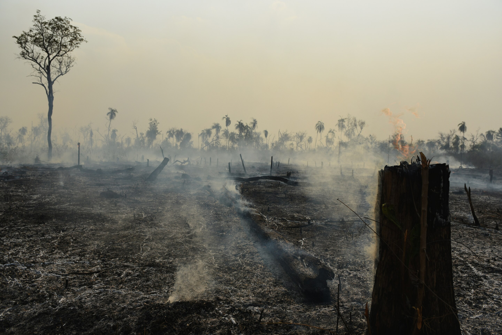

# On value misalignment, ecological crisis and the need for wisdom (Wisdom, Value and Choice Part I)

*Our current economic and political systems misalign value creation with compensation and prioritize individualism over collective goods, leading to ecological crises and flawed measures like GDP.*

*This essay is the first part in an essay series on “Wisdom, Value and Choice in a Second Renaissance”. We propose that wisdom, especially networks of collective wisdom, is crucial for making better choices and correcting the systemic issues described here. As such, wisdom is a central capacity of the [Second Renaissance](https://secondrenaissance.net/).*

### **Misalignment of value**

There seems to be something off with both our economics and our politics, and they appear to be related in that they both involve us collectively choosing things—whether through the market or through systems like voting, democracy, and representational government.

*Deforestation and fire in the Amazon rainforest in 2017 ([source](https://commons.wikimedia.org/wiki/File:Terra_Ind%C3%ADgena_Porquinhos,_Maranh%C3%A3o_(25758143568).jpg))*

#### Is a hedge fund manager creating 1000x the value of a nurse on a cancer ward?

First, do we believe that the people who are paid the most in our society are generating the most value? And conversely, do those who generate the most value receive the most compensation? Is the time of a nurse in a cancer ward “worth” a thousand times less than a hedge fund manager?

I doubt anyone reading this would say yes. In fact, the gap seems enormous. For instance, individuals in hedge funds, who seem to generate almost no societal value, are paid huge sums of money. Or consider figures like Jeff Bezos or Elon Musk; they are not personally responsible for generating most of the value they are credited with.[fn This critique stretches back to Marx and before, particularly in the context of capitalism.]

#### A tree in a rainforest: cut down worth thousands, left standing “worthless”

Another example is the ecological crisis. Crudely put, if cutting down a tree and turning it into firewood or tables generates thousands of dollars, we’ll cut it down—even if it has stood for 800 or 1,000 years. The tree, sitting in its natural state, has almost no monetary value. While this perspective has shifted somewhat (e.g., valuing ecosystems for services like tourism), in general, the value is assigned only when humans consume the resource. Many people instinctively feel something is off about this. And not only that, this disconnection may be a large part of what is driving us toward an ecological catastrophe.

#### Individualism and private property

Furthermore, the value systems we operate under are rooted in individualism and private property, which presents challenges when it comes to collective goods. Because no one owns the atmosphere or the control of a lake, for example, it becomes difficult to value and care for these things within a system that prioritizes individual choices and preferences.

#### GDP only measures what is commodified

Another example is GDP. If a woman stays home to care for her child, it reduces GDP, but if she works and hires someone to provide childcare, GDP increases. Even if she earns exactly the amount she pays the nanny, society is not better off—yet GDP would indicate otherwise. In fact, it might be better for her to spend time with her child, yet our economic systems don’t recognize that.

#### Conclusion

These examples point to something fundamentally off in our mechanisms for aggregating value into collective choices. Our current culture and systems of collective choice are flawed, and establishing new mechanisms is key to a second renaissance.

These mechanisms require wisdom, collective wisdom, and networks of collective wisdom. But what does that mean? Any alternative demands robust justification, especially given the scepticism many may have when hearing terms like wisdom-based economy or wisdom-based society. This is what we will address in the following parts of this series.

### **Context of the series: Wisdom and a Second Renaissance**

*Diagram from our earlier piece [https://rufuspollock.substack.com/p/wisdom-a-practical-capacity-to-choose](https://rufuspollock.substack.com/p/wisdom-a-practical-capacity-to-choose)*

In what comes after modernity, the capacity we cultivate personally and collectively to make good choices is wisdom. This is an ancient capacity but one we would cultivate with a renewed (and perhaps novel) degree of importance, attention and refinement – for example, by integrating empirical science with intuition (aside: this kind of integration is itself very “integral” and second renaissance).

This approach would transcend and include (and replace) the approach we have adopted in modernity of using rationality, science and materialism. In summary, in a second renaissance, in making personal and collective choices we move from using reductionist reason and materialist empiricism to using a (re)new(ed) capacity of wisdom.

#### Secondary motivations

There are two complementary reasons for looking at wisdom.

**1) Wisdom as answer to the question:** ***what*** **do we do and** ***how*** **do we do it**

Wisdom provides the answer to the key social and political questions of: *what* do we do and *how* do we do it? **Wisdom is the capacity that replaces rationality.**

**2) Exploring wisdom is a way of looking** ***concretely*** **at what a future paradigm looks like**

Often in projects like [Second Renaissance](https://secondrenaissance.net/) you hear these concepts like wisdom, interdependence, beyond capitalism. Sounds good ... but what do they *actually* mean? How do they *actually* show up in terms of culture, in terms of institutions, in terms of how we live day to day? By exploring wisdom concretely and how it would relate to how we would run society we answer this need for concreteness.

### **Colophon**

The first consolidated version of this material was created in April-June 2024 based on ideas and notes going back several years. A full [white paper](https://secondrenaissance.net/paper) is in progress based on these materials and should be released later this year.
