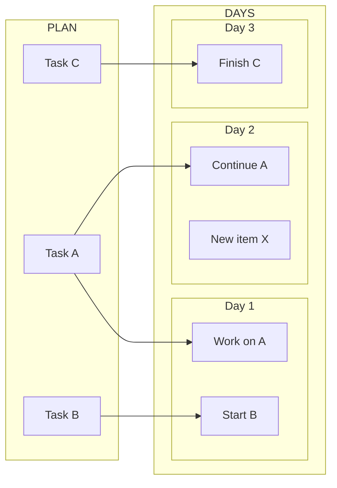

My daily planning repeatedly requires consulting a broader project plan. At present, the two are separate and lack structural linkage, which makes it hard to see how today’s actions relate to the wider constellation of tasks, epics, and sub-issues.

The following is a write-up of one way to think about the underlying model and a way to visualize it.

---

## Description of the model

### Motivation

Your daily planning repeatedly requires consulting a broader project plan. At present, the two are separate and lack structural linkage, which makes it hard to see how today’s actions relate to the wider constellation of tasks, epics, and sub-issues.

### Core idea

Maintain **two parallel surfaces** of work that are **explicitly linked**:

1. **Plan-side (left):**
   A structured set of tasks, epics, sub-issues, and sub-documents.
   It forms a **vertical hierarchy** from “master plan” → “epics” → “sub-tasks.”

2. **Daily-side (right):**
   A chronological journal (one entry per day), containing today’s tasks, notes, and discoveries.

3. **Cross-links:**
   Each item in the daily journal can link to one or more items in the plan.
   The same plan item may appear on multiple days; these links form a *temporal web* around the structured plan.

### Behaviour over time

* When you add a task during the day, you check whether it already exists in the plan.
* If so, you link it; if not, you place it into an inbox region of the plan.
* Over multiple days, you obtain a **many-to-one lattice:** multiple daily actions pointing to a stable plan element.

### Mental geometry

* The **plan** is a vertical “stack” or “spine.”
* The **daily notes** form a horizontal ribbon of pages.
* The cross-links are lateral strings between the two.
* When plans become more complex (e.g., epics with sub-documents), you get a **3-D sheet stack** on the left linked to a **chronological sheet stack** on the right.

## Visualizations



### 1. Basic 2-D: One plan + one day

Think of it as:

```
[ PLAN ]
 - Task A ---------> [Today Journal]
 - Task B ---------/
```

### 2. 2-D with multiple days and repeated links

```
[ PLAN ]
 - Task A ----> Day 1
               Day 2
               Day 4
 - Task B ----> Day 1
 - Task C -------------> Day 3
```

Repeated links show continued work across time.

### 3. Emerging 3-D structure: master plan → epics → sub-issues

Imagine layers:

```
     [ Master Plan ]
            |
   -------------------
   |         |       |
 Epic 1   Epic 2   Epic 3
   |         |       |
 Sub-tasks ... etc.

Daily journals sit to the right:

 Day 1, Day 2, Day 3, ...

Cross-links connect sideways from any layer of the plan-stack to any daily page.
```

## Raw

I want to describe a visual idea for how I would organize tasks. Let me start with the motivation.

Right now I was about to plan out what I was doing today on the Life Itself website migration, and I realized that what I often want to do is just have a plan for my day of what I’m going to do now. And I may have an existing plan of all the things I need to do but i often ignore that and dive in (because otherwise i get bogged down in reviewing the plan) and so either:

- i end up with duplication (i have task in day to day and in plan)
- or maybe i don't have the task already in my overall plan - so it should be added there

And first I want to think about how the day to day planning and the overall plan are related. And i think it best to think about this first visually.

### Side by side with links

I want these side by side with links.

So I have the plan, and then I could follow an arrow. If I was drawing on a wall, I’d have one whiteboard with the Plan in one column and the daily items in another vertical area. And I would draw, put a piece of string between a topic in the main plan and what I’m doing today.

I could be working in my today journal of notes, and I could be adding new items, and I’d be looking up if there’s something that already matches in the overall plan, and then I would just be linking that. And if it wasn’t, I’d actually be creating something in the plan, maybe in an inbox area, and then link it to today.

I would end up with this web of each day’s work, and I could see what it linked back to, and I could see when the same task shows up on several days. I keep working on it over several days.

I have this visualization in my mind that the plan could divide up into: there’s the overall plan document, and I see this almost three-dimensional layer, and then below that are sub-issues or substructures. You’ve got the overall plan, and then you’ve got substructures on one side, and then there’s the daily day-to-day work on a separate side that is linked across. So you’ve got this web that’s almost vertical on one side, which is the plan, and then there’s the day-to-day working in your journals on the right, and there’s this linkage between them.

First I would like to write that out, and secondly I wonder if I could visualize the various steps. To start with, it would be on a two-dimensional piece of paper: there’s the plan with a list of checklist items, and there’s a line going from a given checklist item over to my daily journal. Maybe the same task shows up on several days.

Then moving to this three-dimensional model, which is when the plan gets more complicated. I’ve got a master document at the top, and then there are sheets of paper underneath which each represent an overall item, which are then linked somehow to the top one because they have their sub-issues, basically, of this major epic.

So that’s the picture.