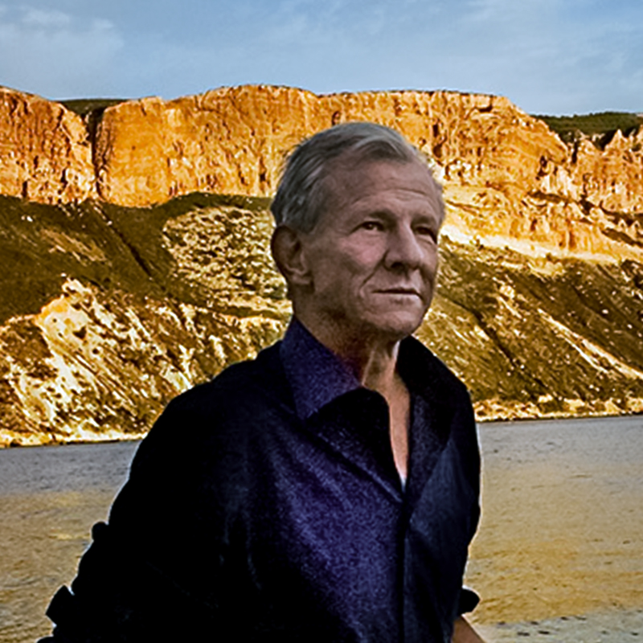
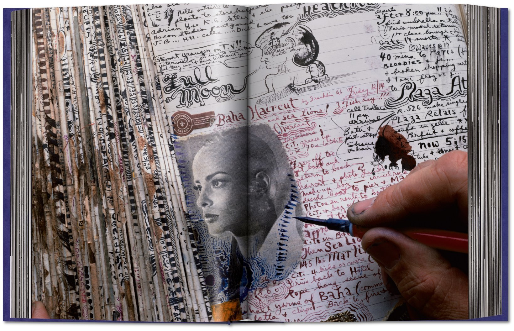
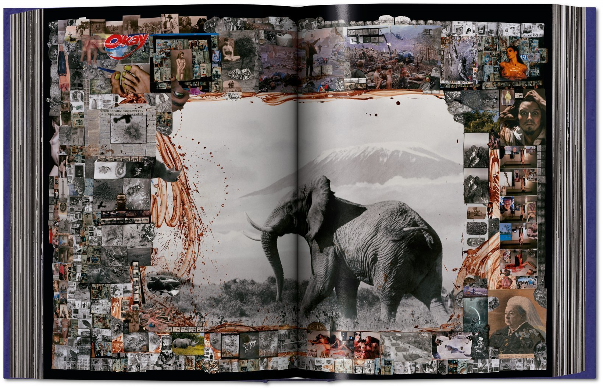
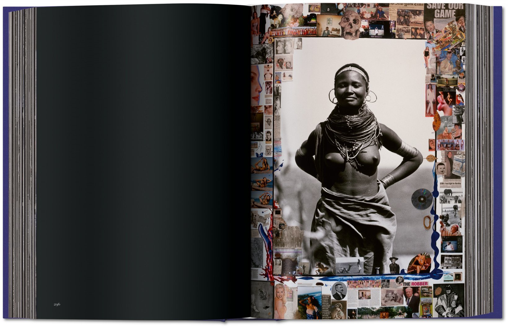

# Peter Beard

*Peter Beard on a beach. Photo: Marcio Scavone, [Wikimedia Commons](https://commons.wikimedia.org/wiki/File:Peter_Hill_Beard_beach_photo_Marcio_Scavone.jpg), CC BY-SA 4.0.*

## Why I'm interested

My main interest is his artwork and his diaries, which are quite extraordinary. Both his life as a kind of bon vivant, but also as an artist, and also as someone who came from a more patriarchal age and how he behaved towards women. It's a moment: the James Bond type is going out of fashion, but it was very cool in the 1960s — the jet set, from a wealthy family.

You can imagine him as a character in a novel. A piece of colour that's useful but also just intriguing, particularly the artwork. The art is probably the most relevant bit — useful for UX patterns and moodboarding (dense collage, hand-lettering, diary-as-artefact).

## Life in brief

- Born 1938, New York; died 2020, Montauk. Photographer, artist, diarist.
- Heir to old WASP money — great-grandson of railroad magnate [[James J. Hill]] (his middle name, Hill, comes via his grandmother Ruth Hill).
- Went to Kenya after Yale (1961). Documented the Tsavo elephant die-off; *The End of the Game* (1965) made his name. Later lived at Hog Ranch beside Karen Blixen's old farm.
- Lifelong diarist: photos, clippings, leaves, drawings and India ink — sometimes his own blood — layered into the pages.
- Social orbit: Jackie Onassis, Warhol, Francis Bacon, Mick Jagger; married Cheryl Tiegs (1981–83), then Nejma Khanum (1986).
- Dementia and a stroke late in life; wandered off from his Montauk home on 31 March 2020, found dead in Camp Hero State Park on 19 April.

## Art

*Diary spread from the TASCHEN edition of *The End of the Game*. © Peter Beard Studio / TASCHEN, via [New Mags](https://new-mags.com/fr-fr/products/peter-beard).*

*Elephant before Kilimanjaro, ringed with collage and blood-paint. © Peter Beard Studio / TASCHEN, via [New Mags](https://new-mags.com/fr-fr/products/peter-beard).*

*Portrait of a Samburu woman framed by collage. © Peter Beard Studio / TASCHEN, via [New Mags](https://new-mags.com/fr-fr/products/peter-beard).*

[[The End of the Game]] (TASCHEN, 304pp) combines his photographs, diaries and collages with historical accounts of Africa's wildlife crisis — Theodore Roosevelt, Hemingway, Blixen and others.

## Bio snippet

> He was the original 20th century "enfant terrible" with the looks of a Greek god who blazed like a comet across the worlds of art, photography, and fame. The scion of several old WASP fortunes, he was by instinct an adventurer, and the more dangerous the escapade, the better: whether he was hunting big game in Africa, ingesting epic quantities of drugs, or pursuing the most beautiful women in the world. Among his friends were Jackie Onassis, Andy Warhol, and Francis Bacon. When Peter Beard died in 2020 after mysteriously disappearing from his Montauk home, he remained an enigma to even his closest friends. [...] Sir Mick Jagger called him "a visionary."

— blurb for Graham Boynton's biography [*Wild: Peter Beard, Photographer, Adventurer*](https://www.amazon.co.uk/Wild-Peter-Beard-Photographer-Adventurer/dp/1250274990)

## Links

- [Wikipedia: Peter Beard](https://en.wikipedia.org/wiki/Peter_Beard)
- [TASCHEN: The End of the Game](https://www.taschen.com/en/books/photography/02223/peter-beard-the-end-of-the-game/)
- [New Mags: Peter Beard](https://new-mags.com/fr-fr/products/peter-beard)
- [Wild (Boynton) on Amazon UK](https://www.amazon.co.uk/Wild-Peter-Beard-Photographer-Adventurer/dp/1250274990)
