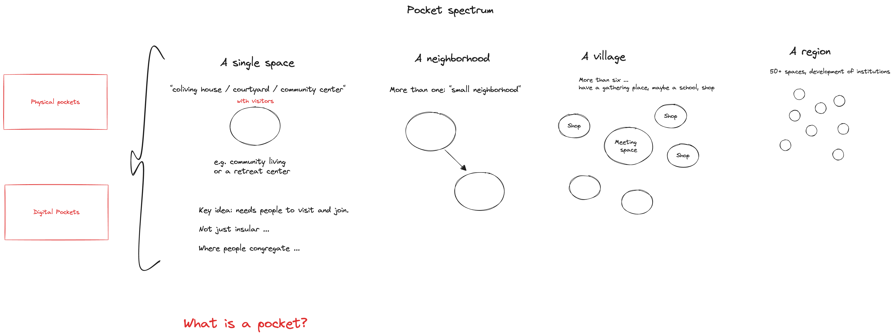
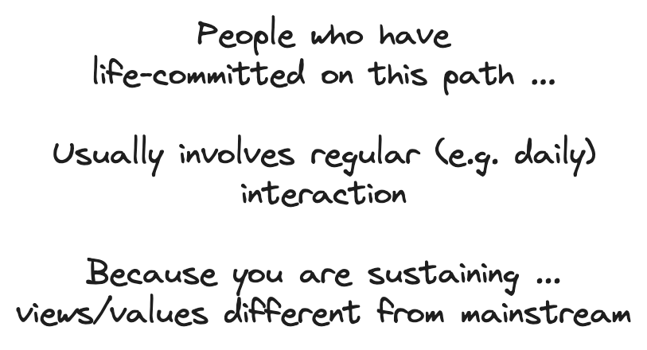

# Pockets of a Second Renaissance: a Spectrum

### What is a pocket?

A group of … t **hree plus people (preferably five plus+)** who are **regularly interacting** — daily or at least weekly. And where the great majority of the group (70%+) are:

1. Consciously aware of the [second renaissance](https://secondrenaissance.net) and subscribe to most of the core views and values
2. Are actively day to day engaged in that group and those view/values e.g. they are living or working in a conscious collective e.g. conscious coliving, conscious village or conscious enterprise

The key point is: most of your interactions are now with "fellow believers" which is essential to sustain and deepen the commitment given that this isn’t the mainstream.

NB: this does NOT mean cutting off connection with wider mainstream society — far from it. Regular interaction should be encouraged.

However, very hard to sustain alternative approach and attitudes if *majority* of day to day interactions are with mainstream given the very different views and values.

#### In summary …

A pocket contains people who have … life-committed on this path ... and usually involves regular (e.g. daily) interaction … because that is needed for sustaining …. views/values different from mainstream

