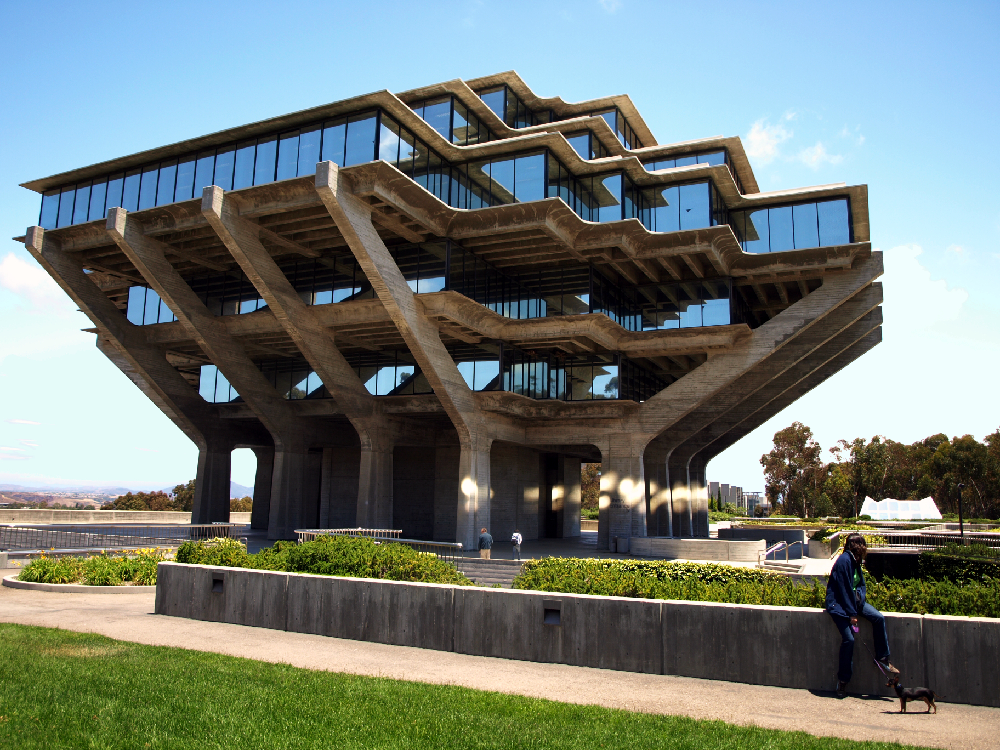
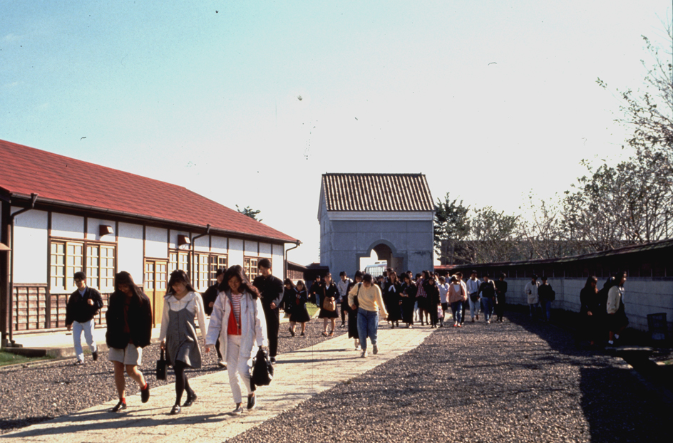

# Seeing the difference between paradigms: using the built environment

Talk of ‘paradigm shifts’ can sound abstract. So it’s helpful to try to envisage how a paradigm or worldview shift might actually be embodied in a future society. In particular, what it would look like in a specific area: the built environment — and *what* and *how* we choose to build.

*William Pereira's Geisel Library (1970), University of California, San Diego. An example of “modernist” (or even post-modernist) architecture. Appearance and surface are clearly central. But does it convey a sense of the living? What is it like inside? Is it helpful to have nothing on the ground floor?*

*Entrance gate and walk at Eishin Campus, near Tokyo. Built by Christopher Alexander and colleagues in the 1980s. It doesn’t look particularly good in photos (why should architecture look good?). Yet students report returning again and again after they leave because of the special feel of the place. It was also developed in collaboration with staff who would actually work and teach there. More pictures and information at https://www.livingneighborhoods.org/ht-0/eishincampus.htm*

### A “concrete” example: how do we collectively co-regulate the built environment

Take for example the built environment. At the scale of whole societies, how do we have ways of decision-making to plan, construct and alter our homes and civic buildings so that they serve the public good? Are they standardized and centralized, or flexible and distributed?

What principles and values guide our choices about what we create? Is beauty important? Or profitability? Who decides what density we — or a developer — can build at? More fundamentally, how do we arrive at a shared account of the public good that these choices serve?

#### How we do this today in the west: objective, measurable values and abstract plans

Let’s look at how we do this today in western societies. These societies are operating within the paradigm of late modernity / early postmodernity. As such, we see that , building regulations that are largely quantitative, based on *objective, measurable* factors e.g. density on plot, height, “overlooking”.

Even environmental factors are largely present as simple measurable items e.g. preserving the number of trees on the plot etc. Approval is almost entirely based on *plans* – often abstract 2d drawings – not actual engagement with the space. The *representation* is privileged over the actual both in regulations and in the practice of architecture itself — for example, often what matters in architectural competitions or books are *photos* of buildings or their *facades* ie. how they look “from the street” rather than what they are like to live and be in.

Many of these are regulations we would of course wish to preserve in any desirable society. *How strong are our buildings; how safe and durable? How well ventilated, efficiently heated and served by good sanitation?*

#### What is not included: does it make us feel alive and whole?

However, there are other qualities that measurements do not capture so well. Do the buildings we inhabit make us feel alive and whole in a deep sense? Are they connected to the living? Are they conducive to community?

Some individual architects may value such things and include them in their work, but few if any are required to do so. Certainly these are considered to be relative, subjective qualities rather than universal or objective. As a consequence we care absolutely and inflexibly about, for example, how far a new building may be situated from the pavement, but we care very little about whether the people who use it as a place of work are likely to find it beautiful, for example, and be kinder to each other as a result.

### What and how — aka value and process. Two distinct, related aspects of a paradigm

In reflecting on this, we’ve come to see two useful *distinct* areas to examine when comparing paradigms e.g. comparing metamodern / second renaissance and modernity / post-modernity.

These are the area of ‘ *how’* or *process* and the area of *‘what’* or *value.*

#### Regarding process

First, about ***process*** : in modernity we have a bureaucratic process based on formal *rules* based on *abstract* plans which are approved *before* and hence take precedence over the actual building itself. The bureaucratic process is inflexible and hence so are the plans and so the actual implementation. The process generally privileges …

- Formal over flexible
- Abstract over actual
- Regulatable process over adaptable emergent (iterative etc)
- Institutional systems over community engagement

#### Regarding value

Second is about *what* or *value(s)* :the things that are attended to (or not), i.e. the things are *valued* by the system/paradigm. These are deeply embedded in worldview but often become visible within institutions like the building planning process or the law courts as the permissible ‘matters of concern’ i.e. things we are allowed to object or debate about.

In modernity, the implicit core value is some idea of ‘utility’ but this is essentially subjective and therefore not a permitted basis for regulation. The only ‘universal’ or common values are things that are measurable, “objective” like plot density or similar.

Even in relation to more utility like items what matters are those factors which are measurable/observable. For example, overlooking, noise etc are allowed because they impinge on things we all “like” or “dislike” and where the causative factor is observable e.g. can I see in your garden, does my sound disturb you. Things like beauty or wholeness don’t come in this category.

#### Views are common

Worldview informs both of these factors obviously. For example, you can see the importance of objective measurement showing up both in process and in value.

### Colophon

This comes from a longer piece we are developing about wisdom, [Christopher Alexander and the Second Renaissance](https://news.lifeitself.org/p/christopher-alexander-second-renaissance). It takes inspirations from the insights Alexander developed regarding the built environment and looks at how we can apply them more broadly to the question of wisdom and how we govern ourselves and our societies.
