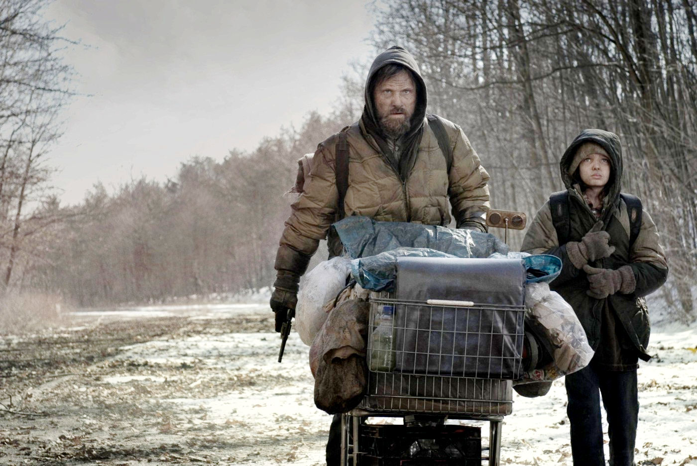
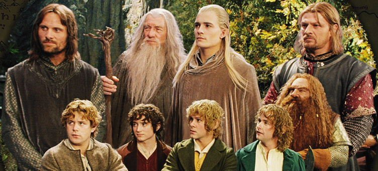
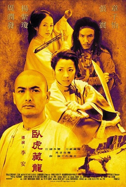

# So you want to create social infrastructure to rebuild the better future world when this one breaks down ...

So you want to build social infrastructure to rebuild the better future world when this one breaks down ...

What will you need?

#### Winter is coming, and so is spring

**Winter is coming** : Variety of reasons that our world civilization is headed for a crash

**But so is spring** : Quick coverage of some of the major world-historical breakdowns e.g.

- late bronze age collapse (then we got the axial age)
- 14th century dark age (then we got the renaissance and modernity)
- post-fall of roman empire (when we got the rise of Christianity and Islam)
- WWII (!) (then we got the rise of liberal democracy)

#### Something beautiful will be born out of the ruins.

Something beautiful will be born out of the ruins ... But we have to get there first ...

Whether you are straight up survivalist or a dreamer for that better society … in a future world you'll want to ...

- create the best conditions possible to survive in near-term
- flourish in the medium term

And we suggest that these two paths converge a bit ...

#### In need of Spiritual Warrior Fellowship

We’re going to need people called to spiritual warriorship, to fellowship for the wiser world our hearts know is possible. The people who want to be Gandalf-like (or Sam Ganji-like), or like Li Mu Bai and Yu Shu Lien in Crouching Tiger Hidden Dragon.

People who want to be pioneers and protectors. Feeding the hungry, helping the weak, protecting the defenseless.

Building the "[City on a Hill](https://en.wikipedia.org/wiki/City_upon_a_Hill)" of the future.

#### So how is that future going to happen?

So how is that future going to happen? Well, there are lots of ideas ...

Here's [ours](https://lifeitself.org/): a glocal (globally connected, locally organizing) network of transformative communities and businesses.

Connected more by a shared culture (and even a neo-religion) than by formal governance (but there can be some of that).

Inspirations: Fierce Blue Fire, The Parable of the Sower

### Colophon

Originally written in Dec 2023. This was the outline of a course on spiritual warriorship. There are also some notes on Cistercians in there.

It’s also something of a vision for [Life Itself](https://lifeitself.org/).
