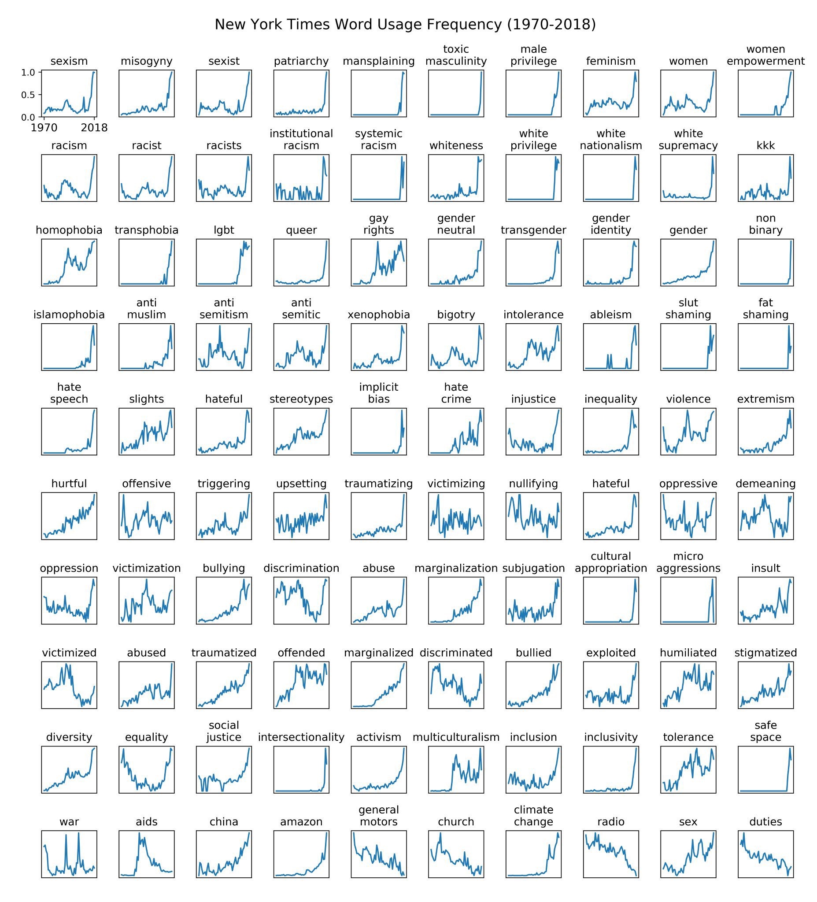
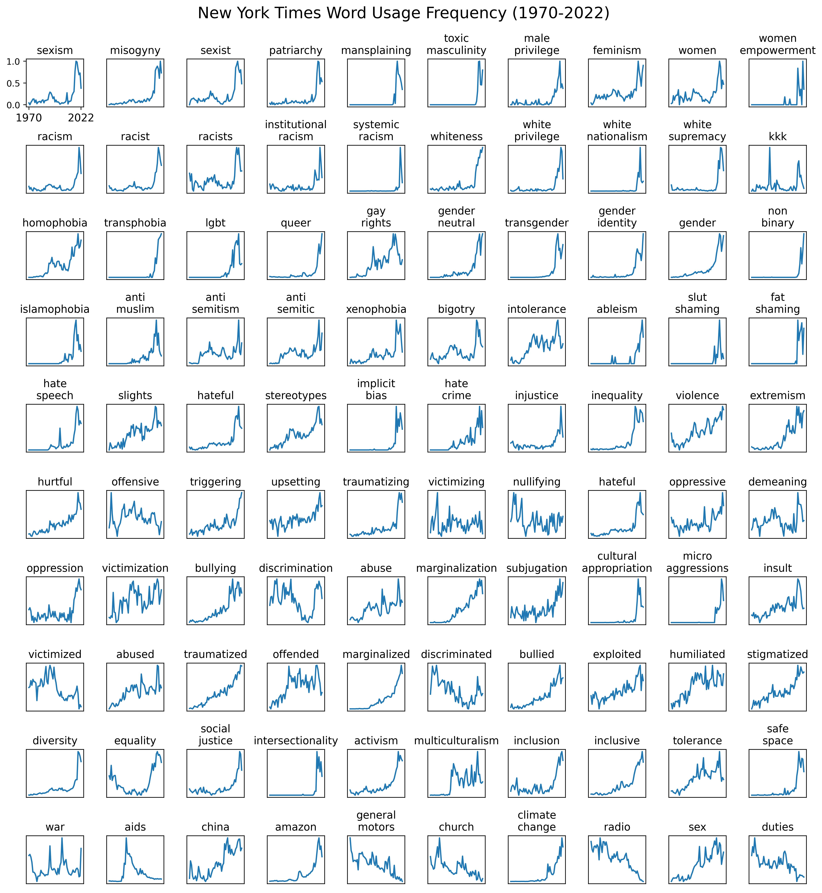
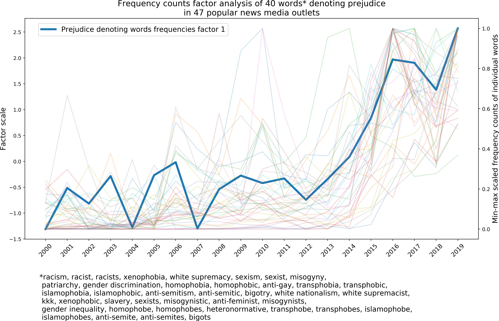

# Some nice data tracing the rise of woke-ness and postmodern values

From two [nice](https://davidrozado.substack.com/p/ppdwnmd) articles by David Rozado

Let’s focus on the NY Times first as a beacon of the rise of the postmodern cultural paradigm as evidenced by wokeism.

From [New York Times Word Usage Frequency Chart – An Update](https://davidrozado.substack.com/p/new-york-times-word-usage-frequency)

Updated to 2022 - there seems to be a something of a reduction …

Aside: from a visualization perspective it would have been nice to do a little bit of consolidation — something we have in the next chart.

This is from [Prevalence of Prejudice-Denoting Words in News Media Discourse](https://davidrozado.substack.com/p/ppdwnmd)

