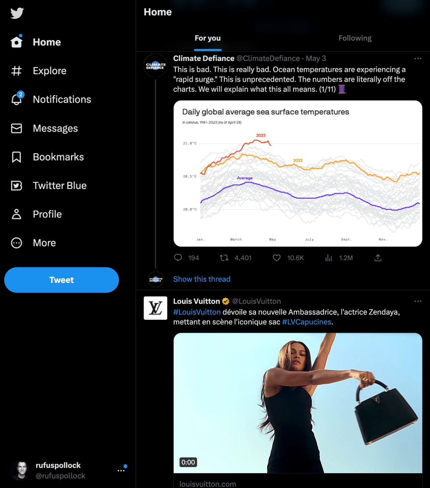

# The Climate vs Louis Vuitton

This extraordinary juxtaposition appeared in my twitter feed back in 2023. The LV item is a video ad so watch the screen capture for full effect.

*[Video embed omitted — original Substack-hosted video not recoverable from export]*

On the one hand, the climate crisis with soaring ocean surface temperatures. On the other hand, we have unabashed luxury consumerism with Zendaya cavorting on a rooftop in Corfu via a Louis Vuitton promoted ad.

It encapsulates perfectly the contradictions and tensions of late modernity and its consumerist capitalism — I would bet money Louis Vitton have a whole sustainability and climate commitment. And all brought together by an automated algorithm.

