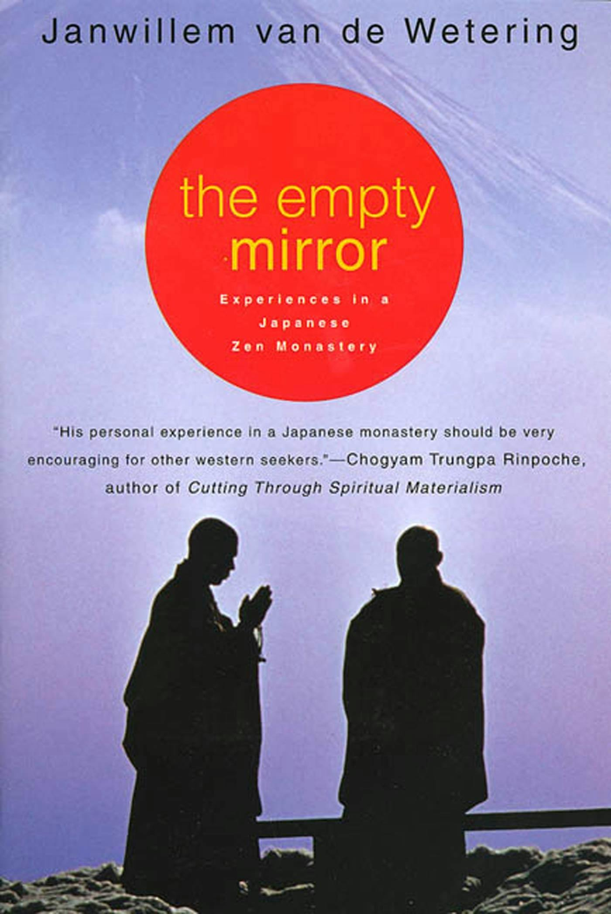
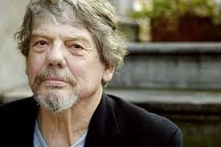
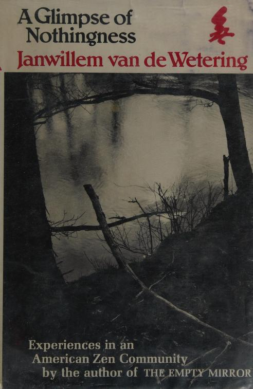
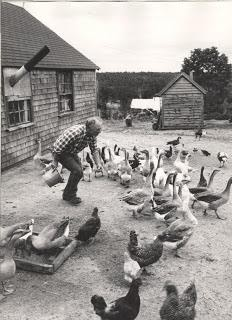

# The Empty Mirror by Janwillem van de Wetering

The excerpt comes from the very last page of The Empty Mirror by Janwillem Van De Wetering. Published in 1973, it describes his year in a zen temple in Japan in the late 50s.

> Three days before the ship sailed I rode to Kyoto to say goodbye to the master. The head monk gave me tea, didn’t show any disappointment, and took me to the master’s house. The master received me in his living room. He gave me a cigarette and sent the head monk to the meditation hall to fetch a stick, the sort of stick which the monks used to hit each other. He drew some characters on it with his brush, blew on the ink, waved the stick about, and gave it to me.
>
> “The characters mean something which is of importance to you. I wrote down an old Chinese proverb, a saying taken from the Zen tradition. ‘A sword which is well forged never loses its golden color.’ You don’t know it, or you think you don’t know it, but you have been forged in “this monastery. **The forging of swords isn’t limited to monasteries. This whole planet is a forge. By leaving here nothing is broken. Your training continues. The world is a school where the sleeping are woken up. You are now a little awake, so awake that you can never fall asleep again.”**
>
> The head monk looked at me kindly and the master smiled. The heavy gloomy feeling which hadn’t left me in Kobe fell away from me. I bowed and left the house.

### About Janwillem van de Wetering

Born in 1931 in the Netherlands, he went on to write a famous series of police procedurals — this is how I came across him (thanks to my mother who read his police novels and then purchased the Empty Mirror).

He also wrote a sequel to The Empty Mirror called A Glimpse of Nothingness ([text on terebess](https://terebess.hu/zen/mesterek/Wetering-glimpse.pdf)) which I can highly recommend. He died in 2008.

For more about him, I recommend [this article in Bomb Magazine from 1996](https://bombmagazine.org/articles/1996/07/01/janwillem-van-de-wetering/):

> Janwillem van de Wetering’s life reads like the stuff of fiction: born to a Dutch merchant family, educated in economics and philosophy, lived in South America, Africa, Australia, and for two years studied Zen in a Kyoto monastery. Then, after seven years as a part-time patrol cop in Amsterdam, he moved to Maine in 1975 where he first wrote two non-fiction books about his Buddhist experiences. The “Dutch Cop” series of 12 novels which followed distinguishes itself from the rest of the pack by lively, idiosyncratic prose and Zen sensibilities.

### Peter the pianist

Those who read the Empty Mirror may wonder about the identity of Peter, the pianist and an advanced student of the master. He also features in the Empty Mirror’s sequel where he has returned to the US and is a teacher and master in his own right. Well, Peter is [Walter Nowick](https://www.morganbayzendo.org/walter-nowick) who founded a zendo in the US called Moonspring Hermitage.

> Walter Nowick was born on January 29, 1926 and died February 7, 2013 at the age of 87. He was the sixth of seven children born to Frank and Anna Nowick of Kings Park, Long Island, New York. Walter’s early childhood was spent on his parents’ potato farm. As a young boy of four or five, Walter heard the piano lessons of all of his five older siblings and was easily able to pick out melodies he heard. He had perfect pitch and showed musical promise even before his first lessons. It was apparent by the time Walter was fourteen that he not only had musical promise but he was truly gifted. He was accepted into the preparatory division of The Juilliard School of Music in New York City. His piano teacher Henriette Michelson summered on Newbury Neck, and in the early 1940s, Walter and some other students came to study with her in Surry. He stayed with Addie Morgan and walked the Cross Road twice a day to his teacher's house. He practiced in the Methodist Church that once stood on that road.
>
> After high school, Walter enlisted in the army. Following basic training at Fort Bragg, he shipped out to the Pacific and, at the age of nineteen, took part in the final sweep of Okinawa where he was wounded and received a Purple Heart. After the war, he saw firsthand the devastation of Japan, which impressed him deeply.
>
> Upon his return to New York, Walter continued his studies at Juilliard with his teacher, Henriette Michelson, who not only nurtured Walter's musical talent, but also introduced him to Zen Buddhism. He began attending the First Zen Institute in New York City, and in 1950, returned to Japan to pursue his interest in Buddhism. He studied with the Zen master Goto Zuigan Roshi in Kyoto until his death in 1965. During Walter's years in Japan, he supported himself by teaching music at universities and performing. He became fluent in Japanese.
>
> In 1966, after Goto Roshi's death, Walter returned to Surry to live at the Morgan farm, which his family had purchased for him. He also invited Japanese music students to study and perform with him during the summer. However, his reputation as someone immersed in Japanese culture and the practice of Rinzai Zen began to grow. Eventually, people began to come to him wanting to study Zen, and Walter’s farm became a center for Buddhist practice. In 1970 the meditation hall or zendo was completed and dedicated the following year as Moonspring Hermitage. Meanwhile the farm expanded to include farm animals, gardens, and sawmills.
>
> In 1983 Walter and some of his students viewed the TV movie “The Day After” which gave a horrifying picture of life following a nuclear explosion. He was profoundly moved by it. To support the efforts of Ground Zero, an organization working to reduce the threat of nuclear war, Walter performed a benefit concert series consisting of the complete cycle of Beethoven’s 32 piano sonatas and an equal number of Haydn sonatas at the Grand Auditorium in Ellsworth.
>
> In Kyoto in the 1950s, Walter had accompanied a concert version of the Verdi opera Aida. In 1984 he set out to do the same in Surry—and to use this work as a vehicle to bring people together in pursuit of peace. That summer he persuaded dozens of local people to sing Aida, the first of approximately twenty operas (several of which were complete operatic performances) and choral works which Walter directed, accompanied, and conducted.
>
> In 1986 members of the Surry Opera Company traveled to the Soviet Union for the first time where they met Julia Firtich, director of the Leningrad Amateur Opera Society, who was to become Walter’s collaborator in many international music festivals and concerts that took place in Maine, Russia, Japan, France, Germany, Canada, Boston and New York over the next 25 years.
>
> In 1985 Walter resigned as Zen teacher at Moonspring Hermitage to devote himself to music. Moonspring Hermitage was reincorporated as the Morgan Bay Zendo, which is still an active meditation center today.
>
> After suffering from a debilitating stroke last June, Walter died on his Surry farm surrounded by friends and former students. He continued to play the piano up until a week before his death. Memorial services will be held later in the spring at the Concert Barn in Surry and at the Zendo.
