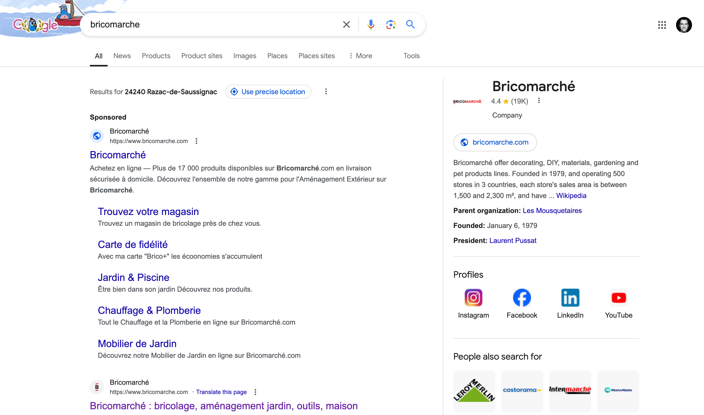

# The Google Tax

Today I did a search for a building materials shop called “Bricomarche”. Here’s the result.

What do you notice?

Yes, that’s right. They have a sponsored link (which they pay for) before the organic link to the exact same thing. Furthermore, in this case there is no other “sponsored” link that competes with them.

And what will I do — and what will most people do who come to this page? We’ll click on the first link we see: that sponsored link. And what happens then? Well Bricomarche pay Google for this click through on their ad.

And yet if i’d just clicked on the organic link: the first link google actually had in their “proper” results, Bricomarche would have to pay nothing (and Google would get nothing).

This is a really pure example of the “Google tax”. Here Google are getting paid in an ad for what is already there in their search results.

And this is a direct transfer from YOU dear user to Google (because ultimately the businesses pass this on you in terms of higher prices and/or less quality).

