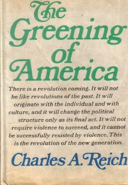

# The Greening of America by Charles Reich

Just came across the Greening of America, 1970 cultural landmark written by Charles Reich, then professor of Law at Yale, and his 1970. (Came across via this [1997 review](https://www.jstor.org/stable/1123413) of Unger’s What Should Legal Analysis Become).

Major best-seller when it came out. Also a sign of those times that a tenured law professor at ivy-league Yale would write a book praising smoking pot etc.

From [Wikipedia](https://en.wikipedia.org/wiki/The_Greening_of_America):

> ***The Greening of America*** is a 1970 book by [Charles A. Reich](https://en.wikipedia.org/wiki/Charles_A._Reich). It is a paean to the [counterculture of the 1960s](https://en.wikipedia.org/wiki/Counterculture_of_the_1960s) and its values. Excerpts first appeared as an essay in the September 26, 1970 issue of *[The New Yorker](https://en.wikipedia.org/wiki/The_New_Yorker)* .[[1]](https://en.wikipedia.org/wiki/The_Greening_of_America#cite_note-newyorker-1) The book was originally published by [Random House](https://en.wikipedia.org/wiki/Random_House).
>
> #### Overview
>
> The book's argument rests on three separate types of [world view](https://en.wikipedia.org/wiki/World_view):
>
> - "Consciousness I" applies to the typical values and opinions of [rural](https://en.wikipedia.org/wiki/Rural) [farmers](https://en.wikipedia.org/wiki/Farmer) and [small businesspeople](https://en.wikipedia.org/wiki/Small_business) which dominated society in 19th century America.
> - "Consciousness II" represents a viewpoint of "an organizational society", featuring [meritocracy](https://en.wikipedia.org/wiki/Meritocracy) and improvement through various large institutions, the ethos of the [New Deal](https://en.wikipedia.org/wiki/New_Deal), [World War II](https://en.wikipedia.org/wiki/World_War_II) and the 1950s [Silent Generation](https://en.wikipedia.org/wiki/Silent_Generation).
> - "Consciousness III" represents the worldview of the 1960s [counterculture](https://en.wikipedia.org/wiki/Counterculture), focusing on [personal freedom](https://en.wikipedia.org/wiki/Personal_freedom), [egalitarianism](https://en.wikipedia.org/wiki/Egalitarianism), and [recreational drugs](https://en.wikipedia.org/wiki/Recreational_drugs).[[2]](https://en.wikipedia.org/wiki/The_Greening_of_America#cite_note-2)
>
> The book mixed [sociological](https://en.wikipedia.org/wiki/Sociology) analysis with [panegyrics](https://en.wikipedia.org/wiki/Panegyric) to [rock music](https://en.wikipedia.org/wiki/Rock_music), [cannabis](https://en.wikipedia.org/wiki/Cannabis_(drug)), and [blue jeans](https://en.wikipedia.org/wiki/Jeans), arguing that these [fashions](https://en.wikipedia.org/wiki/Fashion) embodied a fundamental social shift.

### Commentary

Flagging as:

- Explicitly talks about worldviews
- Looks like an an early work explicitly describing late-modern to early post-modern social views (i.e. not academic post-modernism but more about attitudes and behaviour)
- Consciousness I = early modern cultural paradigm — plus a good chunk of pre-modernity e.g. in religion)
- Consciousness II = mature modern cultural paradigm
- Consciousness III = late modern / early-post modern cultural paradigm.
  - Individualism is moving from freedom to do (freedom of conscience, expression etc) to freedom to be and on its way to “I can be anything”. Egalitarianism is reaching its final, strongest phase and about to encounter post-modern deconstructionism. Drugs are both consumerist and a major loosening on consensus reality.
- Re III: cf connection with Inglehart-Welzel map and its second dimension of self-expression values. This is an early intuition of that dimension without data (Inglehart was just starting to plan the precursor the WVS when this book was published).
