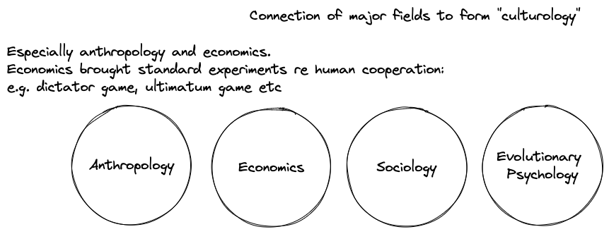

# The New Culturology and Why It's a Big Deal

A synthetic summary of Henrich (2017) [[The Secret of Our Success]] and Henrich (2020) *Weirdest People in the World* and why this new work represent a milestone in the development of a new scientific culturology.

NB: by this new work I mean the whole emerging field that Henrich’s books and work represents (starting with his mentors Richerson and Boyd).

For more about Henrich’s work itself see the 4 part interview series with Henrich we released at Life Itself [https://lifeitself.org/learn/cultural-evolution](https://lifeitself.org/learn/cultural-evolution).

> [!note] These are notes I wrote for myself in April 2022, tidied up and published on Substack in 2024.

### Why do I consider Henrich and co's work to be so significant?

#### Reason 1: it’s first, unified "scientific" anthropology / culturology

It’s a (long-awaited) unification of anthropology with economics, sociology, evolutionary biology, cognitive science

The first version of "culturology" e.g. a rigorous, study of culture with evolutionary structure

#### Reason 2: Coherent, plausible, well-evidenced hypothesis about cultural evolution

It provides detailed theory about cultural evolution … which

#### Reason 3: Helps us answers big questions like ...

- What's different about homo sapiens (why "us" vs great apes, why so "successful")
- Why the "west"? (why did west take-off with industrial revolution etc)

#### Reason 4: Support for hypotheses / key debates around second renaissance politics

For example, direct support for [[Primacy of Being|primacy of being thesis]]. Detailed evidence around role of culture in ontology and ontogeny ie. how we come to be the people we are.

#### Reason 5: Ecosystem-ic model of the interplay of ontology, institutions and technology

With both examples and data.

### The synthesis

Culturology is a converging synthesis of various disciplines:

- Psychology, cognitive science, neuroscience etc
- Anthropology, economics, (archaeology), (sociology)
- Biology and evolution

Massive advances (and interconnection) in all of these in last 50y (i.e. since 1970) and especially last 20-30y e.g.

- Sociobiology and evolutionary psychology in 70s and new life in 90s and 2000s
- Cognitive science (since 70s/80s) which itself is a convergent discipline
- Economics and anthropology which have connected (and with psychology) and both become much more empirical

Out of this grand synthesis we are starting to be able to convincingly answer (or at least have strong hypotheses) related to a couple of the really big questions of the social sciences like:

- **Why "us"** (versus other species)? Why did homo sapiens become the dominant species? What is "special" about us? Are we just smarter, more cooperative, or what?
- **Why the "west"?** Why did the "west" (i.e. western europe plus) become the dominant societies/cultures today?

Many more related to human behaviour and/or the structure of our societies ...

- **Why are we racist?** Is it genetic, cultural, some mixture etc? (Ans: we culturally learn from "people like us" and prepare ourselves for lives with "people like us". Hence, we have evolved to identify "people like us" based on a variety of ethnic and other markers e.g. do they speak same dialect, dress the same)
- **How do we scale (human cooperation)?** We face huge collective challenges (e.g. climate crisis) that require action at unprecedented global scale. How could we expand our sense of the collective so that we can work together to address these? How have we grown this in the past?
- How did we go from almost entirely nomadic gatherer-hunter 10k+ years ago (and as we had been for 10s of thousands of years before) to the technologically advanced, socially complex societies we have today?
- **Why do we have patriarchy?** Why has it been so common? Why could we overcome it?
- **Is culture somewhat arbitrary or is it canalized in important ways?** (whether by our genes, or by principles or organization etc)
- **Why has every known human society had religion?** Is it genetically programmed?
- **How does culture influence genes and vice versa?**
- **How does culture evolve?** How does it co-evolve with our biology?
- **How does ontology (individual and collective), structure and technology co-evolve?** What has primacy?
- **How does culture spread?**

### Key Ideas

- (Good) Cultural learning as *the* distinctive *homo* feature
  - We aren't smarter (than say apes)
  - But we're (much) better imitators and hence cultural learners
  - Cultural learning does happen in other species. Just pretty limited.
    - Some evidence in apes
    - Evidence in elephants (or is it just evidence for learning and memory?)
- Why "homo" (vs other apes or whales or elephants)? Why did "we" start down this evolutionary trajectory and why haven't other done it, if so powerful?
  - Cultural learning is hard (to evolve as evolutionary feature) ... and hence only homo have managed this (even if once evolved it provides exceptional benefits)
- Culture-gene co-evolution.
  - Examples:
    - water-carrying with endurance hunting (long-distance running)
    - pastoralism/animal domestication with lactose tolerance
- Social scaling and cultural complexity
  - Pro-sociality (explanation thereof in dynamic culture-gene evolutionary terms)

To integrate

- What is culture

## Secret of Our Success in a Nutshell

Question: why have "we" (i.e. homo sapiens) been so successful*?

* successful simply means in terms of being dominant in ecosystem and implies no moral or positive (or negative) connotation.

Ans: because we are truly a cultural species i.e. we are able to learn rapidly, richly and reliably from others. As a result we are collectively intelligent: we have shared knowledge that is collectively embodied and transmitted. More specifically we have the ability to develop and transmit culture i.e. not just knowledge, but social norms and rules, beliefs etc. ... And underlying that the **capacity for cultural learning** .

This contrasts with various other explanations e.g.

- We are smarter
- We are more cooperative
- We are stronger
- We have language
