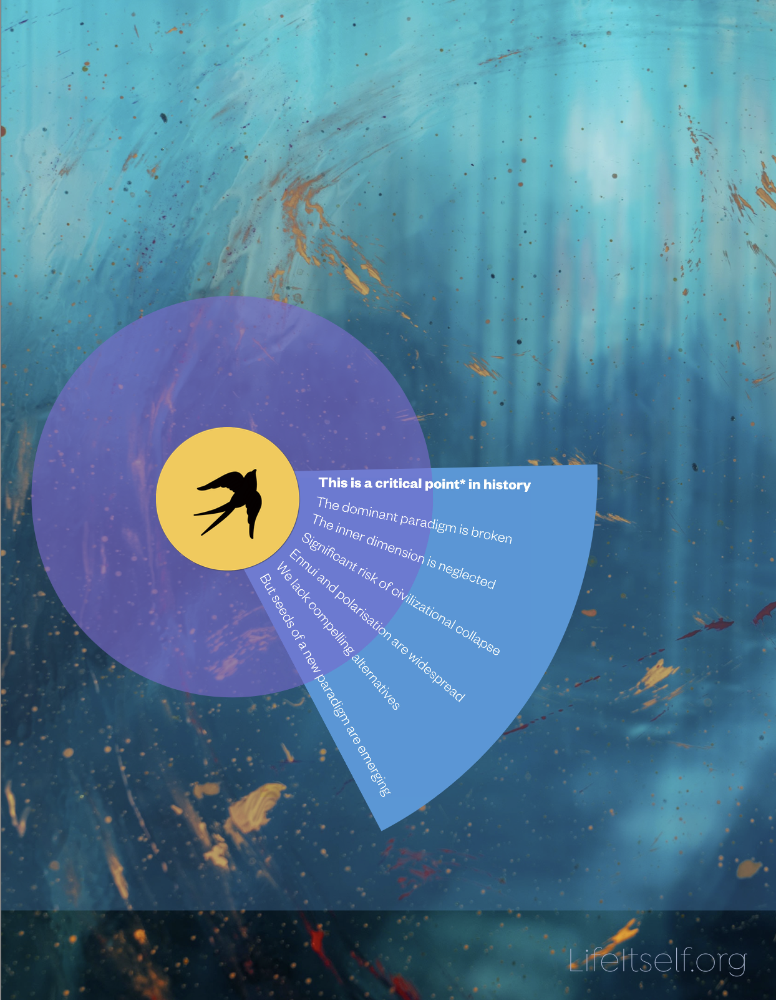

# Things are a bit f'd personally and collectively. Let's do something about that.

*Back in February someone asked me for a succinct description of [Life Itself](https://lifeitself.org/) and what we believe. This is what I said. Whilst part is specific to Life Itself, I feel some of the general sentiment must be shared more widely.*

### Who we are

We are a collective of pragmatic utopians dedicated to a [second renaissance](https://secondrenaissance.net) and a radically wiser, weller world.

We’re nurturing the seeds of a second renaissance — creating paths to awakening societies.

We seek to walk a fine line combining purpose and presence — getting shxx done wisely and mindfully. We frequently fail at this — and we keep trying.

### What we believe

We think things are a bit fxxxxx — personally and collectively.

We believe we can unfxxxx things — or, at the very least, build bastions to last through winter until spring.

We believe that the inner dimension is crucial — if we don't transform *ourselves* it won't matter how much outer stuff we do, how much new tech we invent, how much new governance we have we'll still be fxxxxx.

And it's not (just) sitting on your ass all day saying om: we've got some serious barn-raising to do. Movements to build, collectives to found, people to help.

We call this moment of civilizational crisis and rebirth the [second renaissance](https://secondrenaissance.net).

If this resonates with you — whether you're just curious or ready to move — come find out more, connect with others, and get empowered to take action for the radically wiser, weller world our hearts know is possible.

If it doesn't - cool come tell us why we're wrong, or come back in a few years when the climate crisis, political dysfunction [insert issue here] has got a bit worse.
