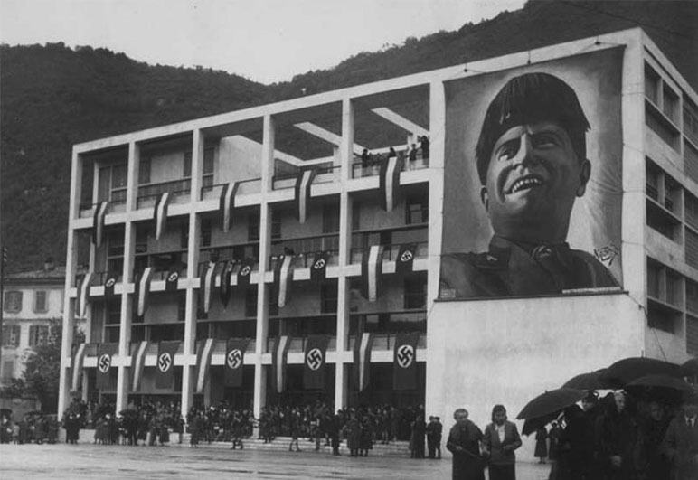

# Trump, Neo-fascism and the Crisis of Modernity

In this episode, we delve into the concept of neo-fascism, its historical roots, and its relevance to the U.S. election and global populist movements. By exploring the intersections of economic populism, cultural conservatism, and nationalism, we trace the parallels between past and present crises of modernity and their influence on political ideologies. [Originally published 19 Dec 2024 in A Little Wiser]

*Casa del Fascio covered in Fascist flags.*

*Pete Hesgeth, Trump’s nominee for head of the military with his crusader tattoos. See [this piece](https://www.thebulwark.com/p/whats-the-deal-with-pete-hegseth-crusader-tattoos)*

### Summary

*Check out the recording for the full version.*

#### **First, a ‘trigger warning’**

Fascist is one of those words that often ends conversations. By labelling someone as fascist we immediately place them “beyond the pale”, outside the realm of civilized discourse (communist is used similarly). We should try to avoid that here. We want to look at fascism clear-sightedly — what it was, what it offered, why it arose when it did. This also means avoiding, for example, the immediate equation of fascism with the horrors of the Final Solution.

#### Historical fascism combined three things

- **Nationalism** **(and cultural conservatism)** . This was the “national” in national socialism.
- **Populist economic** **policies** . The “socialism” in national socialism.
- **Authoritarianism.** The strong leader who provides certainty and clarity.

#### Neo-fascism

**Neo-fascism** adapts this blend for contemporary contexts and **Trump-ism has clear Neo-Fascist traits** e.g. populist economic policies in the form of anti-immigration and bringing industry back to US; nationalism and cultural conservatism (“Make America Great Again”, anti-abortion etc); and finally authoritarianism with the “strong president” framing.

**Aside: we should at the same time note that the most obvious modern fascist state is … China** whose modern blend of nationalism, authoritarianism, and populist economic policies resemble a classic fascist model (even if communist in name!)

#### **Sensemaking: why is this happening now?**

Let’s move from this parallel to examine bigger question and the bigger picture: why is this happening now? And why did it happen in the 1930s?

#### **Fascism emerged a century ago during a major crisis of (maturing) modernity**

It was a moment of disillusionment with market-based capitalism and nascent liberal democracy. The industrial transformation of modernity remade whole societies and was extremely disruptive, creating many groups who were dispossessed and disenfranchised.

Modernity was especially fragile after the destabalisation and horror of the first world war. Fascism arose in the 1920s and 1930s as a response, attacking some of modernity’s greatest blindspots (anomie, disintegration of community, economic instability etc). Whilst modernity seem imperiled at the time , looking back, it is now obvious that modernity was still ascending. WWII ended with the Allies victories and modernity ascendant everywhere (note that Communism is most definitely a modern ideology).

#### **Today, modernity is again in crisis, but this time modernity is in a decline/decay phase**

Today’s political polarization reflects broader societal discontent with modernity. However, in contrast to the 20s and 30s, today modernity is in decay and faces fundamental challenges, for example the ecological crisis and the “limits of growth” challenge the capitalist growth narrative. Post-modernity challenges core assumptions of rationality in modernity.

Of course, it is impossible to say if this moment heralds the full end of modernity or there will be another cycle. Nevertheless the direction of decline seems clear.

#### The role of leading edge groups (even if small)

[Second-renaissancers](https://secondrenaissance.net/) (aka/and Integral-ers / teal-ers / metamoderns) can play a key roleat this time in help to create dialog between the conflicting factions and create paths forward — even if still a very small minority.

### Colophon

First published privately in A Little Wiser on 19 Dec 2024.
