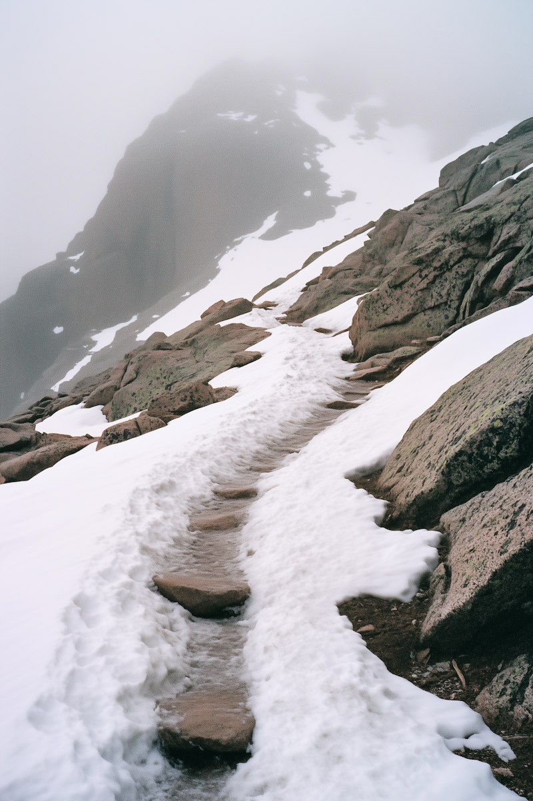

# Truth is a mountain with no top

> … like postmodern poststructuralists **it thoroughly confuses the fact that no perspective is final with the notion that all perspectives are therefore simply equal.** It thus fails to notice that that stance itself actually (and appropriately) rejects all narrower perspectives (which clearly shows that all perspectives are not equal).”

Ken Wilber. *Sex, Ecology, Spirituality: The Spirit of Evolution* (1995). (emphasis added).

This is a key point. **Truth may be a mountain with no top, but there is still an up.** There can be a right *er* even if there is not an absolute right. No perspective is final (absolutely right) but perspectives can be righter (or broader).

This conflation of “no perspective is final” with “all perspectives are equal” is a common mistake in postmodern thought and epistemology. As Wilber points out, building on Habermas and others, it is a clear fallacy, mostly directed illustrated by the famous performative contradiction of postmodernism: the claim that “there is no truth and all views are relative” is itself asserted as a truth.

*Truth as an infinite staircase. We can advance upwards even if we never reach an end.*

The Buddha also talked about "right views" and "wrong views" and we have the core doctrines of the Four Noble Truths (not beliefs). Of course, the Buddha also emphasized that such truth was in the relative, historical dimension and that the ultimate dimension was conceptless and hence beyond right/wrong, true/false.

### Fuller lead-in (all emphasis added)

> **The “multicultural movement,”** which claims a universal tolerance of all cultures freed from the “logocentric, rational-centric, Eurocentric” dominance and hegemony, **is a step in the right direction** , with all good intentions, but ends up being self-contradictory and finally hypocritical. It may claim to be “not rational-centric,” **but in fact cultural tolerance is secured only by rationality as universal pluralism** , by a capacity to mentally put yourself into the other person’s shoes and then decide to honor or at least tolerate that viewpoint even if you don’t agree with it. You, operating from the pluralism of rational worldspace, might decide to tolerate the ideas of a mythic-believer; the problem is, they will not tolerate you—and, in fact, historically they would burn your tolerant tail at the stake in order to save your soul (whether your saviors be Christian, Marxist, Muslim, or Shinto).
>
> In other words, **multiculturalism is a noble, logocentric, and rational endeavor** that **simply misidentifies its own stance** and claims to be not rational because some of the things it tolerates are not rational. But its own tolerance is rational through and through, and rightly so. **Rationality is the only structure that will tolerate structures other than itself.**
>
> Nor can a genuine multiculturalism be established by “feelings” or by “coming from the heart,” because my feelings are merely mine, not necessarily yours or theirs. **Only in the space of rational pluralism can different feelings and thoughts and desires be given a fair play and an equal voice.** It is from the platform of rational pluralism that the next stage, the truly aperspectival-integral (and universal-integral), can be reached.
>
> Put differently, multiculturalism is a noble attempt to move to the integral-aperspectival structure, but, like many postmodern poststructuralists, it thoroughly confuses the fact that no perspective is final with the notion that all perspectives are therefore simply equal. It thus fails to notice that that stance itself actually (and appropriately) rejects all narrower perspectives (which clearly shows that all perspectives are not equal).

*We can sense a path upwards even if we cannot discern or attain the summit*

### Colophon

Originally posted as a note.
