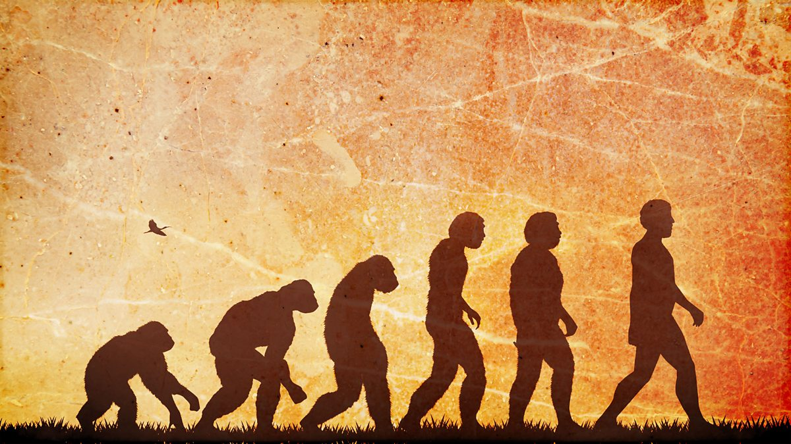

# Tyson Yunkaporta's yarn about Prussian education & the "descent of the west"

This is from Chapter 7 of Tyson Yunkaporta’s brilliant Sand Talk.

He crafted this as an antidote to the simplistic “ascent of civilization” narratives where there’s a linear progression upwards starting from the low of stone-age hunter-gatherer “tribalism” with gradual ascent from early states, to Rome, to the nation state, and finally arriving at modern man with his technologies and his corporations.[^1] It’s brilliant, funny and thought-provoking.

> There is a reason ideological battles and culture wars filled with rhetoric about patriotism and nation-building are fought around schools and schooling. Schools are sites of political struggle in this civilisation because they are the main vehicles for establishing the grand narratives needed to make progress possible. The entire history of globalisation hinges on the story of modern public education, how it began and why. I often wonder what would change if people were able to see this story retold from the perspective of an Aboriginal person reading back through old federation documents and the earliest syllabuses from Prussia.
>
> The answer is: it would be an outlandish conspiracy theory that has no place in a glass cabinet full of skulls. That’s why I’m going to tell it here.
>
> While most of the facts are verifiable, I have been very selective in which facts I used to build the narrative. I created the story to illuminate the way history can be twisted to suit the interests and narratives of the people who write it. But mostly I wrote it for a laugh—it is fun to imagine what history would look like if it were written not by the winners but by losers like me.
>
> The story of modern public education, then, is a story of transition between an age of imperialism and an age of modern globalisation. It begins, like all stories about civilisations, with the theft of land from indigenous people. The people were the Prūsai, natives of an area between modern day Germany and Russia, who lived there from at least 9000 BCE. They traded amber and hemp across Europe and into Asia, but mostly lived by hunting and fishing. They maintained this society right up until the thirteenth century.
>
> In the south, trouble had been brewing for centuries. Germanic and other Nordic refugees (from previous Roman invasions and rising sea levels, and from starvation as a result of degraded soil caused by recent incursions of agriculture) went viking across Europe. Viking was a verb meaning raiding in those days, and these boat people really were a problem. They had overrun Britain and changed that island forever, although Roman and Celtic invaders had already been there before them, so the poor old British copped a triple dose of colonial abuse. The Prūsai, however, were lucky enough to escape the worst of this colonisation process for many centuries, and continued their traditional lifestyle, along with many other indigenous nations to the north. For a while, at least.
>
> There weren’t single big nations like today, but pluri-national groups of regions—lots of regions all with different laws, languages and customs: very much like Australia was before colonial occupation. Big countries with one law, one language and one people are a very recent invention designed to facilitate more effective control of populations and resources for economic purposes. This is why, after Rome had left the Germanic regions, the rich landowners struggling for dominance there worked hard to restore the Roman system of social control. They fought to reinstate this power system for a thousand years, with many small states battling each other for supremacy, the Roman eagle standard emblazoned on their coats of arms. This obsession with Rome would cause some problems down the track, particularly for the indigenous Prūsai to the north.
>
> In the thirteenth century, an organisation called the Order of Teutonic Knights broke away from the other German regional groups and decided to create their own new state. The site they chose was Prūsailand, so they invaded and exterminated or assimilated the Prūsai people, making the entire population Teutonic. In classical and fantasy art, however, you won’t find any images of knights wiping out indigenous people. What you will find instead are armoured heroes bravely slaughtering beasts, dragons and mythical monsters. These creatures came to represent the tribal cultures of the world: the romantic European image of the knight slaying the dragon is actually a hidden reference to the systematic genocide of what were called pagan peoples. This European tradition of propaganda in which victims of genocide are portrayed as dangerous animals was later used to great effect against the Jews, and even our own ‘mob’ here in Australia, who up until half a century ago were often considered animals rather than human citizens.
>
> By 1281, the Order of Teutonic Knights had all but wiped out the native Prūsai and created the new state of Prussia. The interesting thing is that these ‘white knights’ had been heavily involved with the Crusades, in which the Roman Church had been fighting a Christian war for centuries to take over Jerusalem and other holy places. They failed so badly that instead of bringing Europe to the Middle East, they brought the Middle East back to Europe, in the form of a system of government that they had seen there and liked. This system was in its final stages of decline during the Crusades, with most of the Middle Eastern forests and farming land stripped bare and turned into desert by the ravages of the world’s first civilisations. The survivors had begun returning to more sustainable ways of life—tribalism, subsistence agriculture and pastoralism in the following centuries (a way of life that would later be turned upside down again by twentieth-century Anglo oil interests).
>
> The failed model borrowed by the Teutonic Knights wasn’t invented in the Middle East. It had its origins in an unsuccessful Asian experiment of large states with total government authority and rampant expansion and production. This was completely alien in Europe, which was used to a system of petty warlords and oligarchs struggling chaotically over dwindling natural resources, while local peasants in villages persisted much as they had since the beginning of the iron age, periodically disrupted by the activities of the powerful. The exotic new system introduced by the Teutonic Knights was all about absolute power concentrated into one highly organised central government that would control the daily lives of all.
>
> Remember too that these new Prussians had just spent a thousand years trying to replicate the system of control that they had experienced under the Romans who had originally conquered Germania. (Britain and the US later mastered Rome’s imperial method—a system of establishing indigenous elites to keep conquered peoples in check, promoting lateral violence and competition to make subjugated peoples self-policing vassals.) Prussia even adopted the Roman symbol of the eagle as a logo, which was later picked up by the Nazis and the United States. Rome introduced mesmerising dreams of power and control that have not been easy to shake even in modern history.
>
> By the eighteenth century Prussia, under Frederick the Great, had become one of the greatest powers in Europe, despite its small size and lack of natural resources. This was due to the fact that it had a larger permanent military force than anyone else. No other country could force so many of its citizens into the army on a full-time basis. The Prussian system was one of total control, which successfully managed to coerce the population into complete submission to the will of the government. Creating a massive standing army was not a problem for them. (Over a century later, the US military would adopt their formula for maintaining permanent standing armies on the advice of a Prussian military consultant named von Steuben.)
>
> Prussia didn’t stop there. The more rights it stripped from Prussian citizens, the more powerful it became. Frederick the Great’s nephew continued this process, depriving every adult of all rights and privileges.
>
> Then in 1806 the Prussians suffered a shattering military defeat at the hands of Napoleon. After their beaten soldiers fled from certain death, they decided to turn their attention to the children, realising they had to start young if they wanted to instil the kind of obedience that would override the fear of death itself.
>
> The government decided that if it could force people to remain children for a few extra years, then it could retard social, emotional and intellectual development and control them more easily. This was the point in history that ‘adolescence’ was invented—a method of slowing the transition from childhood to adulthood, so that it would take years rather than, for example, the months it takes in Indigenous rites of passage.
>
> This delayed transition, intended to create a permanent state of child-like compliance in adults, was developed from farming techniques used to break horses and to domesticate animals. Bear in mind that the original domestication of animals involved the mutation of wild species into an infantilised form with a smaller brain and an inability to adapt or solve problems. To domesticate an animal in this way you must:
>
> 1. Separate the young from their parents in the daylight hours.
>
> 2. Confine them in an enclosed space with limited stimulation or access to natural habitat.
>
> 3. Use rewards and punishments to force them to comply with purposeless tasks.
>
> Effectively, the Prussians created a system using the same techniques to manufacture adolescence and thus domesticate their people.
>
> The system they invented in the early nineteenth century to administer this change was public education: the radical innovation of universal primary schooling, followed by streaming into trade, professional and leadership education. It was all arbitrated by a rigorous examination system (on top of the usual considerations of money and class). The vast majority of Prussian students (over ninety per cent) attended the Volksschule, where they learned a simple version of history, religion, manners and obedience and were drilled endlessly in basic literacy and numeracy. Discipline was paramount; boredom was weaponised and deployed to lobotomise the population.
>
> This system worked so well that Prussia became one of the most powerful countries in the world, at a time when the idea of ‘nations’ (rather than regions, kingdoms, tribes or city-states) was first being promoted as the dominant form of social organisation on the planet. The Prussians began to make plans to spread the institution of schooling as a tool for social control throughout the world, as it facilitated the kind of uniformity and compliance that was needed to make the model of nationhood work. The US could testify to the effectiveness of Prussian education as a tool for domination and power, as American educators had been making pilgrimages to Germany for more than half a century. Excitingly, test schools across America proved that the artificially induced phenomenon of adolescence was achievable outside of Prussia, too.
>
> In 1870, Prussia got its revenge on France by annihilating the French military in the Franco-Prussian War, and immediately established Germany as a unified nation state—the dream of the Teutonic Knights finally realised. After that, the Prussian education system (and the new institution of extended childhood) became all the rage around the western world. It was modified to some extent, probably because the Prussian model seemed a bit weird, even to the power-hungry ultra-rich of Europe—it was so all-encompassing that women were required to register each month with the police when their menstruation started. Prussia was described jokingly as an ‘army with a country’ or a ‘gigantic penal institution’. Towns and cities were built like prison blocks, grey grids of rigid cubes and plain surfaces. The government worked hard to ‘cleanse’ the society of homeless people, gypsies, Jews and homosexuals as they expanded and enforced their embryonic doctrine of eugenics. (Their motto for education was Arbeit macht frei, work sets you free, a slogan that the Nazis adopted and later placed above the gates of concentration camps, including Auschwitz, used for Jewish slave labour and extermination. There are many schools in Australia today with a similar motto in Latin: Labor Omnia Vincit, work conquers all. Now, as ever, the creation of a workforce to serve the national economy is the openly stated main goal of public education. And, as ever, the inmates of this system are told that their enthusiastic compliance with forced labour will be in their best interests at some future point.)
>
> Germany’s compulsory education system expressed six outcomes in its original syllabus documents:
>
> 1. Obedient soldiers to the army.
>
> 2. Obedient workers for mines, factories and farms.
>
> 3. Well-subordinated civil servants.
>
> 4. Well-subordinated clerks for industry.
>
> 5. Citizens who thought alike on most issues.
>
> 6. National uniformity in thought, word and deed.
>
> And it spread like wildfire: to Hungary in 1868, Austria in 1869, Switzerland in 1874, Italy in 1877, Holland in 1878, Belgium in 1879, Britain in 1880, and France in 1882. From there it quickly expanded further to European colonies, including Australia.
>
> As we’ve seen, the US had been involved much earlier, with even Benjamin Franklin advocating the Prussian system. In 1913 Woodrow Wilson established the Federal Reserve, copying Germany in its centralised banking system too: this way, the state would control both learning and money, just like Germany did.
>
> As the twentieth century wore on, more interesting links emerged between Germany and the US, both drawing on the symbols and dreamings of ancient Rome—because Germany’s old obsession with ancient Rome hadn’t gone away. They called their leader Kaiser, German for Caesar; they adopted the symbol of Roman fasces, bundles of rods with an axe that once represented Roman state power. The US followed suit. American education documents emerged with those same symbols printed on the covers, and today the fasces are still a prominent symbol of American power, proudly on display in many official ceremonies.
>
> The Roman fasces came to represent a whole modern belief system around social control and national domination—that’s where fascism got its name—and a version of the Roman salute was famously adopted by the Nazis.
>
> In that period, when Hitler was Time’s man of the year in America, the pseudo-science of eugenics that the Nazis so enthusiatically adopted was popular throughout the western world. It purported to legitimate a decades-old tradition of white supremacy that had earlier informed the nationalist values established during Australian federation and exemplified by the White Australia Policy.
>
> Not just in Australia, but all around the world, new systems of education, nationalism, finance, corporatism and social control were informed by fascist ideas and theories from Germany and the United States, encouraging the extermination of indigenous people and minorities, just like the white knights of yore. Cataclysms followed as new nations that had missed out on the empire-building activities of the age of discovery tried to catch up with their land-rich neighbours. When the smoke cleared, lands and power and blame were redistributed unevenly among the survivors and a new world emerged with new stories providing a sanitised history of good triumphing over evil. In Italy, for example, it used to be common knowledge but is now all but forgotten that Hitler’s fascist partner in crime, Mussolini, exterminated the Cavernicoli, a cave-dwelling people who were still maintaining a Palaeolithic culture.
>
> But the structural racism installed through Prussian-style schooling and the eugenics movement would not be discarded, merely rebranded. Later, following long civil-rights struggles and campaigns for social justice, racial inferiority was renamed ‘cultural difference’. Racial integration was called ‘reconciliation’. In the colonies, assimilation was relaunched as ‘Closing the Gap’. The language became more politically correct, but the globalising goals of cultural uniformity, economic compliance and homogenised identities remained the same.
>
> In my crackpot version of this history, public schooling plays a principal role in the story of transition from one age to the next. It is by no means a complete account, but I hope this marginal perspective is far enough ‘out of the box’ to provoke some questions regarding the sustainability of the global systems that shape our minds and lives. Where is our current turbulent period of transition taking us? Do we want to go there? What form will knowledge transmission (aka education) need to take during this transition? Us-two may also tentatively wonder whether our minds are now too domesticated and shrivelled even to contemplate these questions effectively.

[^1]: TODO: see my notes topic on the “wiggly swoosh” version of long history that I think is the more accurate than the linear, ascent model.
