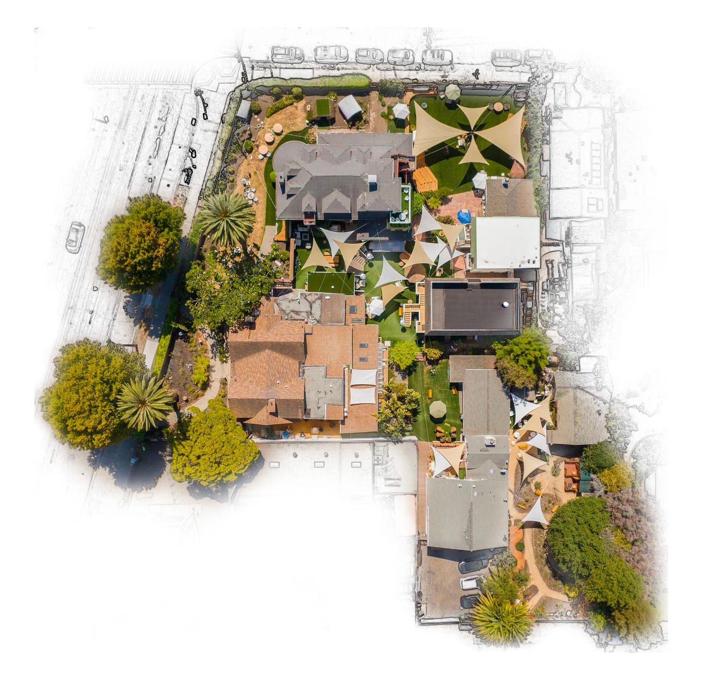
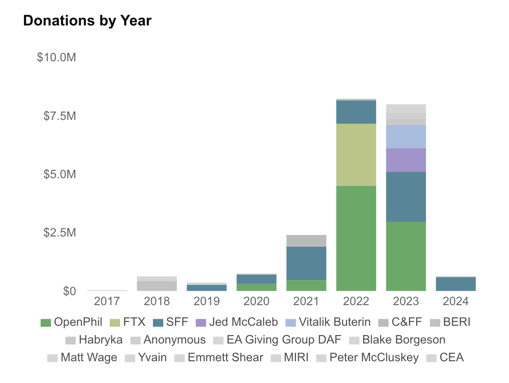
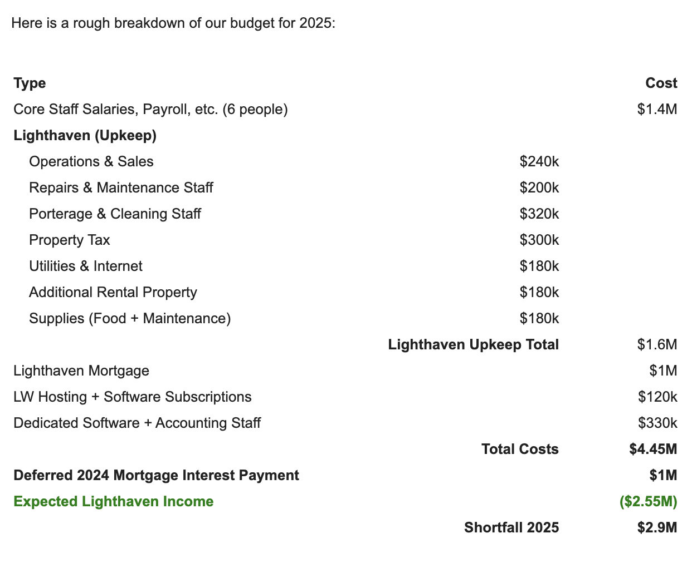

# What Lightcone Infrastructure's financial crunch tells us about the effective altruism community's ecosystem and funding

I’m fascinated by EA (effective altruism) and associated rationalist community, particularly from the sociological perspective of “how this new (memetic) group emerged and gained influence / power so quickly” (including what could we learn from that for pragmatic utopianism / second renaissance).

Part of the answer to that is simply: “money”. EA aligned with (and/or recruited folks at university who 10y later would make a lot of money) the newly emerging silicon valley technocracy (and old-school finance). This meant a *lot* of money flowed into EA from (wildly guessing) ~2015 onwards, and especially once crypto took off (which for reasons we could look at later is for some reason highly popular in rationalist / EA circles). To get an idea I estimate that FB co-founder Dustin Moskovitz’s Open Philanthropy poured a few hundred million a dollars

Anyway, for today all i want to share is some interesting insight into that funding and how it may be changing (triggered largely i think by the FTX catastrophe) courtesy of Lightcone Infrastructure’s recent funding crisis and their wonderfully transparent and detailed [report on this](https://www.lesswrong.com/posts/5n2ZQcbc7r4R8mvqc) (a great EA trait btw)!

### Excerpts and commentary

#### They got a lot of money, especially recently

Lightcone who basically just built and ran the LW forum originally (they do a lot more now) were getting over $7m a year, largely (afaict) in **core, unrestricted** funds. This is a lot of money in the non-profit world in an emergent area.

#### And they spent it … including on “LightHaven” a $16.5m hotel on which they then spent $6m

> Since mid-2021 the other big thread in our efforts has been building in-person infrastructure. After successfully reviving LessWrong, we noticed that in more and more of our user interviews "finding collaborators" and "getting high-quality high-bandwidth feedback" were highlighted as substantially more important bottlenecks to intellectual progress than the kinds of things we could really help with by adding marginal features to our website. After just having had a year of pandemic lockdown with very little of that going on, we saw an opportunity to leverage the end of the pandemic into substantially better in-person infrastructure for people working on stuff we care about than existed before.
>
> After a year or two of exploring by running a downtown Berkeley office space, we purchased a $16.5M hotel property, renovated it for approximately $6M and opened it up to events, fellowships, research collaborators and occasional open bookings under the name [Lighthaven](https://lighthaven.space/).

Wow! What can I say. This must have been special one-off funding as it is more than their annual budget items listed below (plus substantial borrowing). And it’s quite something …[^1]

#### They can’t get funding anymore

> Despite what I, and basically all historical funders in the ecosystem, consider to be a quite strong track record, practically all historical mechanisms by which we have historically received funding are unable to fund us going forward, or can only give us substantially reduced funding.

#### Here’s the key graph with donations per year

Not how the big “3” dominate and especially open philanthropy who gave them over $8m in this time period. (BTW i’m digging more into [Open Philanthrophy funding here](https://datahub.io/@rufuspollock/open-philanthropy-grants))

> You might notice the three big items in this graph, FTX Future Fund[[13]](https://www.lesswrong.com/posts/5n2ZQcbc7r4R8mvqc#fn1phqcvc9d6oj), Open Philanthropy, and the Survival and Flourishing Fund.
>
> FTX Future Fund is no more, and indeed we ended up returning around half of the funding we received from them[[14]](https://www.lesswrong.com/posts/5n2ZQcbc7r4R8mvqc#fngypqajzkuaf), and spent another 15% of the amount they gave to us in legal fees, and I spent most of my energy last year figuring out our legal defense and handling the difficulties of being sued by one of the most successful litigators of the 21st century, so that was not very helpful. And of course the Future Fund is even less likely to be helpful going forward.
>
> Good Ventures will not accept future Open Philanthropy recommendations to fund us and Open Phil generally seems to be avoiding funding anything that might have unacceptable reputational costs for Dustin Moskovitz. Importantly, Open Phil cannot make grants through Good Ventures to projects involved in almost any amount of "rationality community building", even if that work is only a fraction of the organizations efforts and even if there still exists a strong case on grounds unrelated to any rationality community building. The exact lines here seem somewhat confusing and unclear and my sense are still being figured out, but Lightcone seems solidly out.
>
> This means we aren't getting any Open Phil/Good Ventures money anymore, while as far as I know, most Open Phil staff working on AI safety and existential risk think LessWrong is very much worth funding, and our other efforts at least promising (and many Open Phil grantees report being substantially helped by our work).
>
> This leaves the Survival and Flourishing Fund, who have continued to be a great funder to us. And 2/3 of our biggest funders disappearing would already be enough to force us to seriously change how we go about funding our operations, but there are additional reasons why it's hard for us to rely on SFF funding:

#### Open Philanthropy is out of the space … because of reputational risk to Dustin Moskovitz (i’m guessing this is FTX fallout)

> Good Ventures will not accept future Open Philanthropy recommendations to fund us and **Open Phil generally seems to be avoiding funding anything that might have unacceptable reputational costs for Dustin Moskovitz** . Importantly, Open Phil cannot make grants through Good Ventures to projects involved in almost any amount of "rationality community building", even if that work is only a fraction of the organizations efforts and even if there still exists a strong case on grounds unrelated to any rationality community building. The exact lines here seem somewhat confusing and unclear and my sense are still being figured out, but Lightcone seems solidly out.

Note this is much more explicit than the rather generic statement on [https://www.goodventures.org/blog/an-update-from-good-ventures/](https://www.goodventures.org/blog/an-update-from-good-ventures/) which says almost nothing of substance (“we are overstretched and we need to cut back a bit” is classic PR speak)

#### Even in difficult times they could get big checks from tech/crypto folks

> I do want to express extreme gratitude for the individuals that have helped us survive throughout 2023 when most of these changes in the funding landscape started happening, and Lightcone transitioned from being a $8M/yr organization to a $3M/yr organization. In particular, I want to thank Vitalik Buterin [Mr Ethereum] and [Jed McCaleb](https://en.wikipedia.org/wiki/Jed_McCaleb) [Mr Ripple] who each contributed $1,000,000 in 2023, Scott Alexander who graciously donated $100,000, Patrick LaVictoire who donated $50,000, and many others who contributed substantial amounts.

#### Seems to be a clear flat-lining or decline on LW which may be indicative of broader community

#### Here’s their budget for 2025

Given that they say they have just **seven** [^2]staff this works out $200k per person. Not bad for a non-profit.

[^1]: And they own a $1m building next to LightHaven in full “We happen to also own a ~$1M building adjacent to Lighthaven in full, so we have a bit of slack. We are looking into taking out a loan on that property, but we are a non-standard corporate entity from the perspective of banks so it has not been easy. If for some reason you want to arrange a real-estate insured loan for us, instead of donating to us, that would also be quite valuable.”
[^2]: “I’ve consistently hired ~1 person per year to our core team for the six years Lightcone has existed (resulting in a total team size of 7 core team members).”
