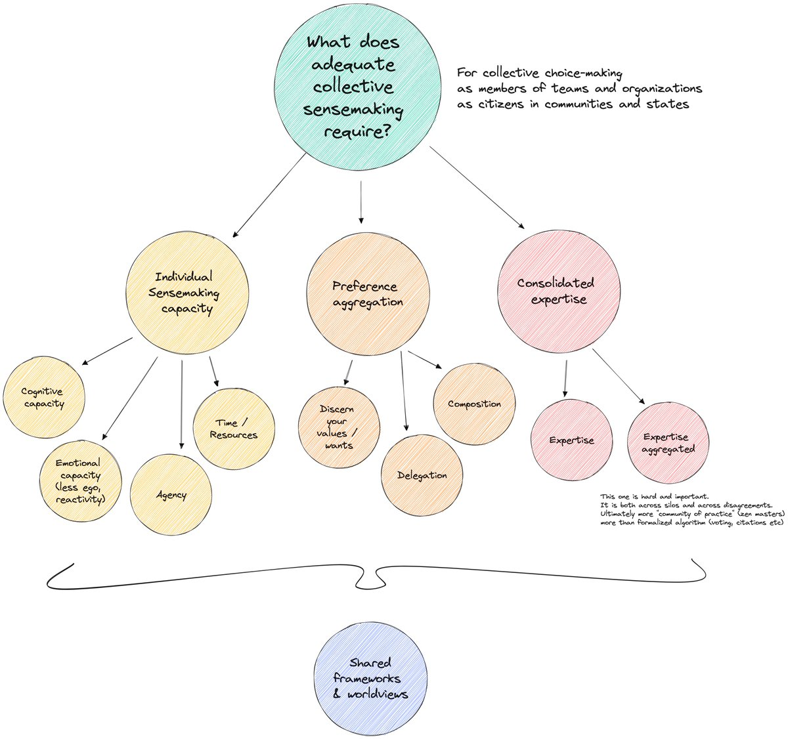
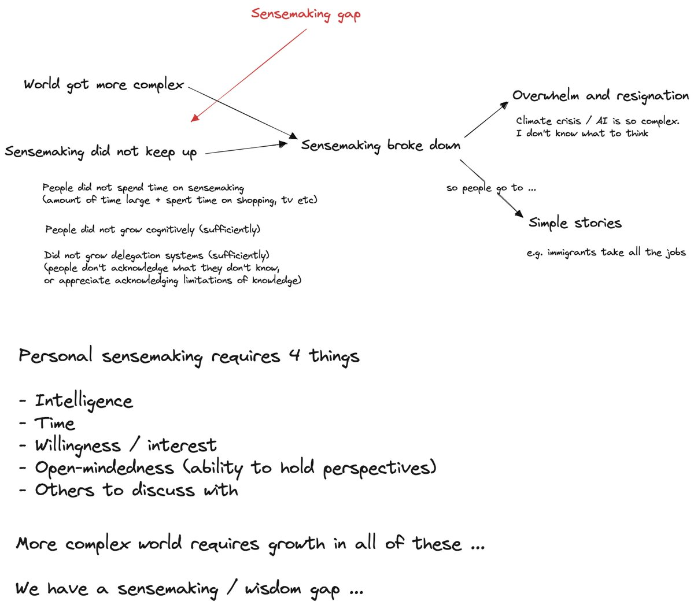

# What does adequate collective sensemaking require?

Sensemaking is hard, and collective sensemaking is even harder. It’s also crucial as [we enter a world of escalating, interwoven crises](https://secondrenaissance.net). Here, we sketch out some of the key factors and how they relate together.

First, what do I mean by ‘sensemaking’? Well literally, “making sense” — of the world. For example, when COVID hit, we had to evaluate what was happening, what it meant and then make choices personally and collectively out of that. What was this disease, how serious was it, what would happen if we left it untreated or we imposed lockdown. Should we wear masks or not? Should we get vaccinated? Should we require others get vaccinated.

It seems that we’re struggling to make sense adequately — to sensemake. As we discuss below the sensemaking gap is growing.

In the diagram we sketch out three main capacities that contribute to collective sensemaking:

- **Individual sensemaking capacity** : determining ‘what’s so’ — what is the state of the world. For example, for COVID: is there a new infectious virus and how fatal is it?
- **Preferences and preference aggregation** : determining ‘what I want’ and then ‘what we want’. For example, with COVID what’s my personal preferences over risk of getting ill (and dying) vs not seeing people and have disruption to my job and the economy.
- **Incorporating expertise** : for most complex issues, we can’t determine what’s so on our own. We need the input of expertise and especially aggregated expertise. For example, for COVID we need to work out what scientific expertise we want to rely on (or whether we rely on it at all).

### The Sensemaking Gap

The **sensemaking gap** is the gap between the complexity of our world and our capacity to make sense of it. (cf related [wisdom gap](https://notes.lifeitself.org/wisdom-gap)).

Over recent decades our world has grown much more complex. Sensemaking did not keep up. Today, many issues far exceed our individual and collective capacities to make sense of them — at least on the scales times-frames required e.g. COVID, AI, climate change etc.

### We fill the gap with simple stories and resignation

As sensemaking struggles, we fall back to two options:

1. Simple stories and logic e.g. “immigrants are taking all the jobs” or “it’s raining more so we can't be global warming'“.
2. Overwhelm & resignation: it’s all too complex and too much effort to make sense so best to give up and just forget about it

### We need better sensemaking especially collectively

Better sensemaking, especially collectively, is crucial in many important areas e.g. COVID, AI, climate change etc and will only grow more so as the [metacrisis](https://notes.lifeitself.org/metacrisis) unfolds.

### Colophon

Originally drafted in notebook in Taiwan and [posted on X in April 2023](https://x.com/rufuspollock/status/1644190679688704000).

### Connections

- See also [https://lifeitself.org/blog/2017/09/10/four-types-of-problem](https://lifeitself.org/blog/2017/09/10/four-types-of-problem)
- [https://web3.lifeitself.org/about](https://web3.lifeitself.org/about)
