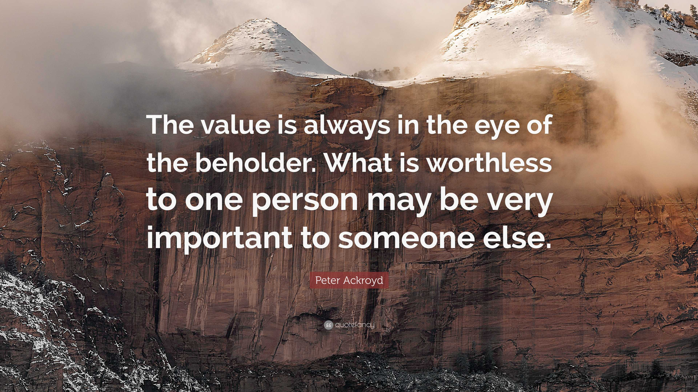

# What is valueception? And how does it contrast with what we normally mean by value?

This is a fairly raw transcript from a Q&A I had with someone answering the question: “What is valueception?”

Valueception is short for value *perception* . What does that mean and why is it significant?

First, is to contrast with the default sense of value we have today which is the idea of values as something *subjective* that we *have* (they are internal states) — a bit like I choose to like apples versus oranges I choose to value being nice versus not nice or value being on time etc. By contrast, the idea here is that value is something actually intrinsic, even objective in the universe.

*A quote expressing the current dominant view of value. In contrast to the idea of value-ception.*

Let’s take an example. Suppose you see someone beating an innocent child. There's likely something more there for you than the thought: “Oh, I just don't like that — but hey some people might”. Rather, for most of us at least, there’s a sense in a real and profound way that this is not well, not *good* .

This sense of *goodness* is real, it is, in some meaningful sense, objective. And, hence, something we can *perceive* — in the same way we perceive that tree over there. And this would also apply to things like beauty or wholeness — they are also *real* in a meaningful sense. They are things out (t)here[^1] that we can perceive.

This also means we can develop or cultivate our capacity to *perceive* value. Notice again the distinction from *having* values. It doesn’t make much sense to develop my capacity to have values. But I can develop my way of seeing, of perceiving (just as art expert develops their capacity to ‘see’ paintings or an world-class tennis coach will be able ‘see’ how you hit the ball).

### References

Note the idea of objective value and value-ception is common to most wisdom traditions. In modern philosophy, McGilchrist (who is almost always knowledgeable) cites [Scheler](https://plato.stanford.edu/entries/scheler/).

Much more on this in Zak Stein, Iain McGilchrist and others.

See also **[First Principles and First Values: Forty-Two Propositions on CosmoErotic Humanism, the Meta-Crisis, and the World to Come](https://notes.lifeitself.org/books/temple-2024-first-principles-first)** (by Stein, Gafni and Wilber) [Link to notes on it in Life Itself wiki]

[^1]: Out *here* (versus out *there* ) in the sense that these perceptions *codependently* arise — object and percept inescapably bound together in nondual arising. This is, by the way, true for all perceptions whether of a tree or of goodness.
