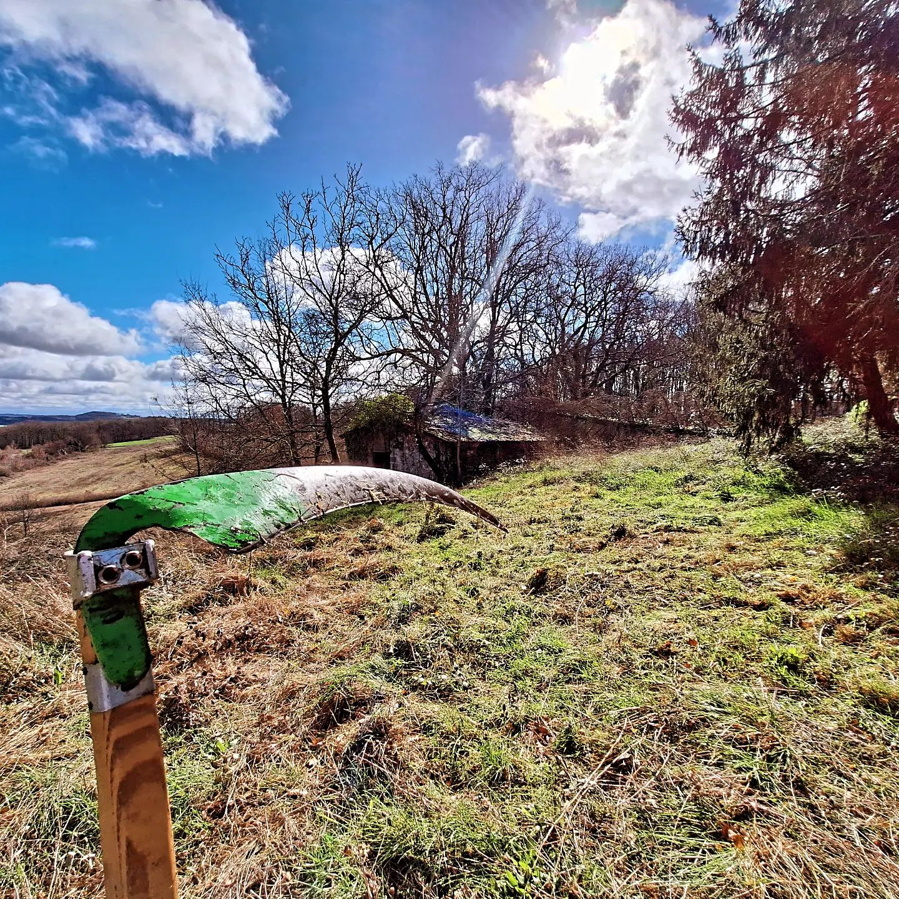

# What job(s) have you done done in your life that most nourished your aspiration and joy?

Here’s a prompt question that we recently shared in the [Life Itself community jobs board](https://lifeitself.org/community):

> What job(s) have you done done in your life that most nourished your aspiration and joy?

Here was one memory that came to me personally, somewhat unexpectedly.

*I’m around six or seven years old. It’s early autumn and I’m helping on the farm to clear a bramble patch. It’s a small group of us including my mother and a few others so there’s a real sense of togetherness. I am allowed to use a bill-hook and love hacking at the brambles. We pile them up and make a small bonfire as the light fades. There was such a sense of satisfaction in the work itself and in working with others — seeing what we’d cleared and watching the bonfire crackle as the day came to an end.*

I reflected a bit on what were the key aspects of this for me, things like:

- A sense of **fellowship** and working with others
- **Purpose** and a sense of **accomplishment** — you could see the cleared bramble patch at the end of the day
- **Exploring** new capabilities in being allowed to use the billhook
- Being **outside and active** physically and as part of work - not just playing a game. There is a sense of **aliveness** that comes from **purposeful physical labor** .

This makes me reflect: I’ve always had a dream that I would love to (re)build a stone house largely by hand. e.g. perhaps this one which lives near the [Life Itself farmhouse hub](https://lifeitself.org/hubs/farmhouse).

*[Instagram embed omitted — could not recover URL from export]*
