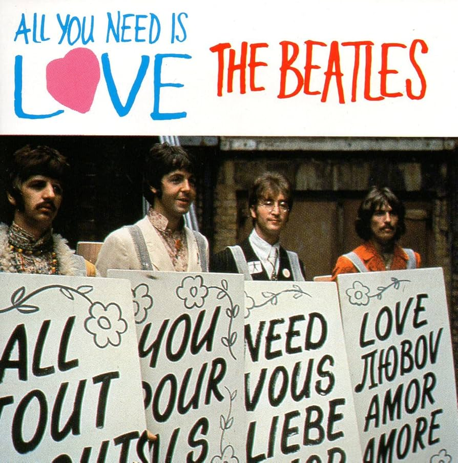
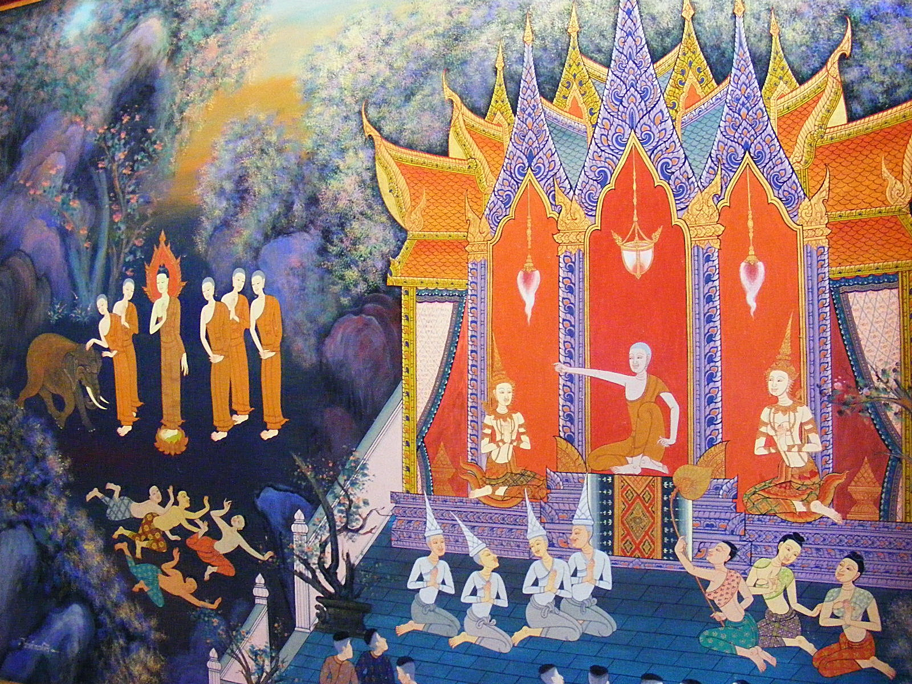

# Why Enlightenment Alone Won’t Save Us (and that's ok)

So I just read,[^1] quickly, Daniel Thorson’s [beautiful piece about needlessness and love](https://substack.com/@dthorson/p-156499118). At the end it contains this:

> In a world facing existential challenges, the emergence of humans capable of moving from needless power—aligned with love rather than driven by psychological compensation—are essential for our collective future. This is the revolution our time demands: learning to want without needing, to love without demanding, to move with the power that comes from fundamental safety and freedom.

### All you need is love (?)

This is a worthy message. At the same time, there’s something important to add to it. A corrective even to the cruder, more simplistic version of this which is “All you need is love”: if we would all just develop our capacity for true, “needless” love then everything would be wonderful.

Which is totally true: if we were all became Buddhas, if we all were enlightened, if we all just listened to John Lennon’s *Imagine* and did what it said, well—we’d be in utopia. We’d have a wonderful world. There’d be no conflict, there’d be no wars, we’d share what was needed, we’d feel safe and loved, there’d be an abundance of *agape* —true brotherly and sisterly love.

But we don’t live in that world. And it seems a long way to get there.[^2]

### We need paths to wiser futures that don’t rely on us all becoming Buddhas

Now, it doesn’t mean that doing that—becoming more enlightened, cultivating pure love—wouldn’t be a really great thing to do.

And … we also have to think about how we, personally and collectively, can evolve in a way that *doesn’t* rely on us all becoming Buddha, or Christ, or …

This is crucial to any credible [pragmatic utopian](https://lifeitself.org/blog/2020/12/21/pragmatic-utopianism) vision.

### Even in transformed communities we’ll have to handle bad actors

It’s useful to consider the story of the Buddha here. There are at least two stories from the canon I find particularly interesting.

The first is about Devadatta, a major disciple of the Buddha, the Buddha’s cousin, and a significant monastic figure. And Devadatta goes “bad”. And not in a minor way.

*Devadatta has an elephant charge at Buddha in an attempt to kill him.*

He tries to kill the Buddha. He splits the Sangha. I think this latter point is particularly noteworthy. It’s not as if the Sangha all say, “Oh yeah, Devadatta’s a bad guy, we’re going to stick with the Buddha.” There’s a major rift. It takes real effort by the Buddha’s senior disciples—Moggallana and Shariputra to heal it. They have to use great skill and even a little deception, to woo back a whole bunch of bhikkhus who follow Devadatta. So it is not just about one bad actor — it is also how many others are influenced by that bad actor.

This story shows that even in a really transformed community, where the Buddha has allowed Devadatta to become a monk, the monk’s heart may not be pure. He’s craving power.

So this should make us worry that **even in the most transformed communities** , one has to deal with what we might call politics— **and with how to handle bad actors** .

### We’ll also have to handle conflict even amongst the well-intentioned

The second story is about the Buddha going to visit one of his Sanghas that has a big rift. A fight has broken out between a precepts master and a sutra master, with one accusing the other of disrespecting him. The Buddha comes and says, “Okay, let’s listen to each other, let’s heal this rift, let’s bury the hatchet and use loving speech and deep listening.”

And the Sangha basically tells him to get lost.[^3] The Buddha is taken aback. He goes off into the forest and meditates. It’s not overwhelming, but it’s clearly a blow

This shows again that even in the Buddha’s Sangha there can be major problems. Here the issue is not even be a malicious actor, but simply two senior monastics who can’t really practice key aspects of the discipline—loving speech, deep listening—and whose division has infected the wider community. And even the Buddha can’t immediately resolve it.

### We need *more* than personal transformation

These stories should really make us think about how *challenging* it is to create a transformed community. They also suggest that, while continuing our transformation and cultivating our Buddha-hood / Christ-nature etc is valuable and deeply important, we maybe *shouldn’t count on that alone* .

We need to complement that kind of enlightenment with other approaches to building a radically wiser society and world. Approaches that include, for example, cultural evolution and systems change.

For more see [https://secondrenaissance.net/](https://secondrenaissance.net/)

[^1]: I wrote this the day the day after Daniel posted back in February. It then got lost in the drafts.
[^2]: There’s also a critique of the weaker thesis which is that that developing this kind of selfless love is *necessary* to achieving a radically wiser world. But even that is not so clear. Is it not possible that there are paths to radically wiser futures without all (or even some) of us cultivating this level of pure, needless love?
[^3]: Here’s how Thich Nhat Hanh tells it in *Old Path, White Clouds* (emphasis added): *“The Buddha put on his outer robe and went at once to the monastery’s meeting hall. Nagita rang the bell to summon the community. When all were present, the Buddha said, “Please cease your arguing. It is only creating division in the community. Please return to your practice. If we truly follow our practice, we will not become victims of pride and anger.”*

    ***One bhikkhu stood up and said, “Master, please don’t involve yourself in this matter. Return and dwell peacefully in your meditation. This matter does not concern you. We are adults and capable of resolving this on our own.”***

    *Dead silence followed the bhikkhu’s words. The Buddha stood up and left the meeting hall. He returned to his hut, picked up his bowl, and walked down into Kosambi to beg. When he was finished begging, he entered the forest to eat alone. Then he stood up and walked out of Kosambi. He headed for the river. He did not tell anyone of his departure, not even his attendant, Nagita, or Venerable Ananda.*
