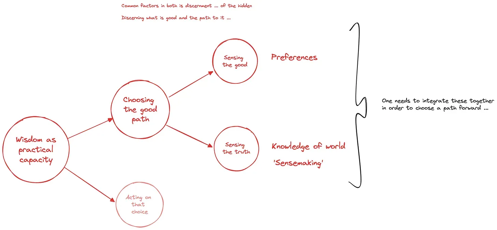

# Wisdom: a practical capacity to choose a good path

Wisdom is a practical capacity to *choose* a *good* path — and then *act* on that choice to realize it. Here, for now, we’ll focus on the choosing and leave the acting part for later discussion (see [four types of problem](https://lifeitself.org/blog/2017/09/10/four-types-of-problem) for why choosing and acting are different).

Choosing is often the key thing we think of when we think of wisdom. Take this clip from Gandhi for example.

![[https://www.youtube.com/watch?v=fCTA06w6bn4]]

### Individual and collective wisdom

There’s individual wisdom and collective wisdom.

Individual wisdom is about choosing at an individual level.

Collective wisdom is the ability of a group to act wisely: to make wise choices for the group and to act on them. For example, choosing as a planetary civilization to cut green house gas emissions — *and* doing it.

### Choice has two components: sensing what is good (valueception) and sensing the truth (sensemaking)

Choosing has two components which need to be integrated to find a good (wise) path forward:

- **Sensing the good** — or more accurately the ‘Good’ with a capital G. This is directly related to [valueception](http://rufuspollock.substack.com/p/what-is-value-ception-and-how-does)
- **Sensemaking** : Sensing what is so, understanding the world, discovering the truth — or what is true *r* . This is sensemaking.

Skill is then needed to integrate these together to suggest a path that has the best (or a good) chance of advancing the good.

*The various components of wisdom as a practical capacity to make good choices and realize them*

Take the famous story of King Solomon and the baby. First, Solomon sensed the good: returning the baby to its true mother. Second, Solomon sensed that a true mother would never sacrifice her baby even if it meant letting the other woman have it. He then integrated this together to create a situation that revealed who the true mother was by making his proposal to divide the baby in half. Notice that Solomon’s proposal on the face of it was not wise: it would involve killing the baby! In fact, this indirectness is precisely one of the aspects that made it wise: it was a skilful way of finding the truth and advancing the good.

We’ll talk more about these in an upcoming post.

### References

- [https://lifeitself.org/blog/2017/09/10/four-types-of-problem](https://lifeitself.org/blog/2017/09/10/four-types-of-problem)
- [https://notes.lifeitself.org/wisdom-gap](https://notes.lifeitself.org/wisdom-gap)
- [https://lifeitself.org/blog/2020/06/22/bridging-the-wisdom-gap](https://lifeitself.org/blog/2020/06/22/bridging-the-wisdom-gap)
- [https://rufuspollock.substack.com/p/what-is-value-ception-and-how-does](https://rufuspollock.substack.com/p/what-is-value-ception-and-how-does)
