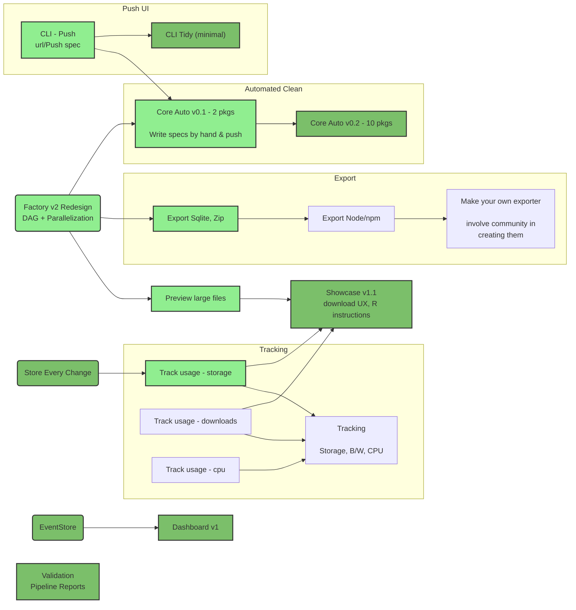



# Motivation: Roadmap SCQA II - Aug/Sep 2017

Situation: alpha running, no publishers yet, 50 signed up users.

Complication: we don't have any paying users yet (or know whether we will) and we don't have a clear plan of action.

Question: what tasks should we focus on in the next 3-6m to create a sustainable business within the next 6-12m?

  * what tasks features [user needs] and tasks should we focus on to create a sustainable business
  * How do we create a sustainable business?

Hypothesis: Focus on three complementary areas: provide a growing set of core data for consumers using our own tooling to automate this; provide an initial offering to datars focused on frictionless inspecting and sharing; and engage in "lean" market testing to test and validate products offers.

  * **Consumers - core data** Solidify and expand our core dataset offering in order to attract datars and validate consumer hypothesis (and eat our own dog food)
    * Develop workflows *inside DataHub* that make this cheap and automated (esp for datasets that change)
  * **Marketing / research** Put out "tasters" for main business offerings to see who is interested (e.g. enterprise, request data, FD consulting ...)
    * Do surveys, write up vision and use to inform how we write to people
  * **Push - datars** Focus on datars and make it simple and easy to push and pull data automatically and charge for private datasets plus storage over a certain level

*This got reworked - see next item*

# Roadmap (Sep 2017)

Hypothesis: Focus on three complementary areas:

* **Core datasets**: Solidify and expand our core datasets using our own tooling to automate this in order to eat our own dog food, attract datars and validate consumer hypothesis
  * Develop workflows *inside DataHub* that make this cheap and automated (esp for datasets that change)
* **Marketing / research**: engage in lean marketing to test and validate product offers by putting out "tasters" for main business offerings to see who is interested (e.g. enterprise, request data, FD consulting ...)
  * Do surveys, write up vision and use to inform how we write to people
* *[SECONDARY] **Push - datars** make it simple and easy for datars to push and pull data automatically and charge for private datasets plus storage over a certain level*

# Detailed Plan

## Marketing Roadmap

*Less defined. Added retrospectively ...*

## Developer Roadmap

NTS 2017-09-17

* Export formats and showcase -- lots of options
  * This is an obvious point for external developers to contribute
  * => Defining this contribution "endpoint" - creating drivers
* Import + Transform
  * Driven: part the core datasets
    * Add features needed to support them one by one
  * Do by hand and push
  * Then infer ...
* Interfaces e.g. CLI, Local App, Web interface
* Management features
  * Usage tracking
  * Privacy
  * Teams
* Getting paid
  * Integrating payment
  * Supporting users
  * Marketing

Developer ...

* EventStore: an index in MetaStore where we store user related events e.g. runs, user sign ins, dataset created, downloads (?)
* Store every change: new model for storing outputs of every flow run in an economical way - see TODO 
* Economising on version space ...
* Research electron multi-platform builds

Language

* Assembler
* Assembly line vs flow ... 
* Assembly spec (blueprint?)

## Features

Priorities

* Experiment and evaluate with "clean/transform" automation
  * Automate: cleaning 5-10 core datasets
  * Review the core datasets - do they require regular updating, how does update currently work
  * => Product definition on left hand side: UI for a automated wrangling system (that would allow us to compare this to other potential product visions ...)
* Export: npm, zip, sqlite, rds 
  * Fix R, python integration instructions ...
* Performance and tracking: work to speed things up etc, track usage, gather metrics about what is working ...
* Marketing: ... 
* CLI
  * progress bar ...
  * don't reupload if data already there ...
  * lots more
* Docs
* Comms & marketing
  * Pricing - and offer
  * Write posts about datasets
  * About tools ..

NTS:

Question: how do we connection "pipelines" together (concept of the dataset or project)

### More

* set privacy
  * change source ...
  * explicitly set public and private or ...?
* support charging
* preview large datasets
* introducing data validation (goodtables lite)
* data statistics: percentage complete  https://github.com/ResidentMario/missingno 
* Import from URL: `data add {url} --cron=1d`
* cron job scraping
* modify / add views
  * And the preview: preprocess the transform
* Transforms on data
  * => transform language ...
* edit title
* debug pipeline
  * view the pipeline structure and data at each stage
* push to bigquery
* showcase improvements
  * /v/{viewid}.png or /v/{viewid}.html?embed=true
    * Why: so you can embed
  * view json (?)
  * /r/{resource}/{primary-key-id}.[json|html|csv]
    * e.g. /data/population/r/annual/2010-us

# Evaluation of Q4 2017 (mid Dec 2017)

Hypothesis: Focus on three complementary areas:

* **Core datasets**: Solidify and expand our core datasets using our own tooling to automate this in order to eat our own dog food, attract datars and validate consumer hypothesis
  * Develop workflows *inside DataHub* that make this cheap and automated (esp for datasets that change)

> Outcome: 70% - core dataset automation so far is only about 10% done. Current priority and by end of year we may have advanced substantially towards what we want.
>
> Available to users but undocumented

* **Marketing / research**: engage in lean marketing to test and validate product offers by putting out "tasters" for main business offerings to see who is interested (e.g. enterprise, request data, FD consulting ...)
  * Do surveys, write up vision and use to inform how we write to people

> Outcome: 30%.
> 
> * Request data done
> * Pricing done
> * Did not do FD consulting and enterprise.
> * Blog posts and rising traffic

* *[SECONDARY] **Push - datars** make it simple and easy for datars to push and pull data automatically and charge for private datasets plus storage over a certain level*

> Outcome: 80%. 
> 
> * Implemented pricing
> * Implemented automated pull of data (but not super well promoted)

Extras

* We implemented data validation so that we can validate it as a product
* We completely rebuilt our data factory which massively improved performance

# Appendix

## Discussion 3 Sep 2017 - Rufus + Adam

"Pipelines" can be used for:

* cleaning: "..."
* transform: "normal pipelines"
* export aka "dump"

Discussion:

* Where do we focus in the data flow (for now)
* Do we focus on clean, on transform or export? 
  * Adam: there isn't a lot of benefit of pushing a static data file directly to bigquery - it's not that interesting ..., it's a bit trivial
  * Rufus: good point, and partly that's why we emphasise showcase so much?
  * what's gives value to users and what can we get money from?
  * Rufus: it is a tough sell for people to get automated cleaning - because they have to understand *and* adopt your system
* Proposal
  * Experiment and evaluate with "clean/transform" automation
    * Automate: cleaning 5-10 core datasets
    * Review the core datasets - do they require regular updating, how does update currently work
    * => Product definition on left hand side: UI for a automated wrangling system (that would allow us to compare this to other potential product visions ...)
  * Export: npm, zip, sqlite, rds 
    * Fix R, python integration instructions ...
  * Performance and tracking: work to speed things up etc, track usage, gather metrics about what is working ...
  * Marketing: ... 

Product ideas

* Export to your own RDS ...
* Metaphor of "deployment"

If we want to use pipelines for cleaning:

* DSL to define clean operation (delete first two rows, do this regex etc)
  * ?? - has significant limits - not clear what 80/20 looks like (?) - "this way lies madness" ;-)
* "Dockerize" or DPP-ize the operation: allow people to write code either any kind of code (docker) or new pipelines that: raw data -> data package
  * => registry for "processors" (be they docker or a pipelines)

Golden path

1. Simple cleaning operations DSL e.g. Borrow from unix shell
    * https://github.com/rufuspollock/command-line-data-wrangling
    * http://datapipes.okfnlabs.org/
2. Allow for snippets (leading to full blown pipelines)
    * (middle way) defined limited API 
