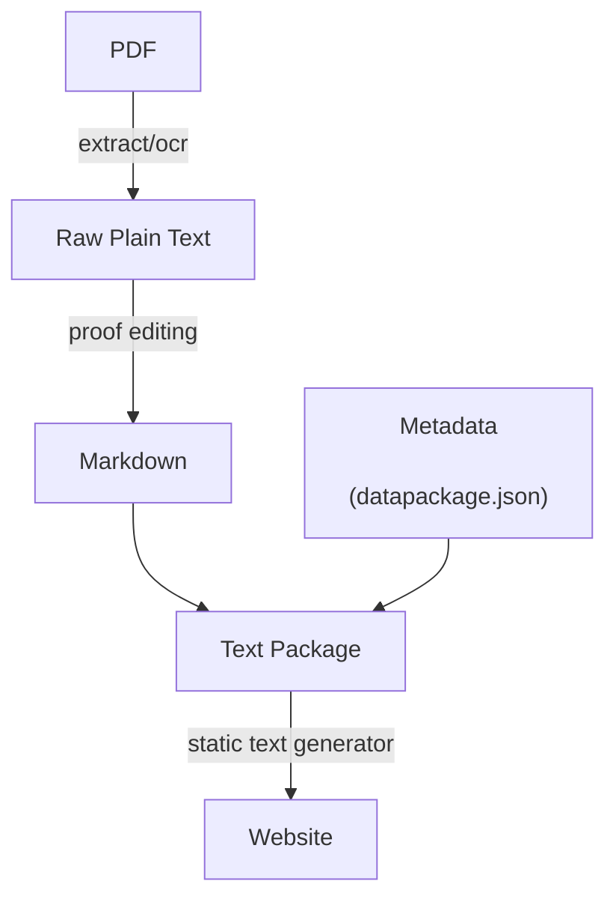

Two parts:

* How official inquiries works -- and a plan for future
* A review of learnings from past projects and thoughts on building "open text" projects going forward including e.g. open literature
# Plan

## First piece - Official Inquiries

Document current and planned official inquiries tech architecture

## Bigger story

Motivation:

1. Why is the Arden Shakespeare still produced as a dead-tree or PDF experience
2. Why are we still living with the codex as our experience (PDFs reproduce dead-tree books)
3. Why is is a pain to find and share books across devices (without getting locked in to one ecosystem (kindle))
4. Why is it such a pain to get texts in a form that you can copy, annotate etc (i.e. structured plain text)
5. Why aren't texts "unified" - that is interlinked (one footnote links to exact right page in the referenced book)

**Summary: What do we want in "open text" projects, why has no one built it, and how would you build it?**

### FAQs

**What is an "open text" project?**

Text = cultural artefact, fixed texts -- i.e. published and fixed.

* Books - esp books with major cultural significance "Open Literature"
* Official Documents -- "Official Inquiries"
* Law ...
* News articles (if old and now of of historical value)
* [Journals]

Not:

* News
* Blogs
* Ephemera

**What does that imply about features?**

* Texts are fixed
  * No need for CMS style features, for an ordinary text editor
* Size - texts are large
* Context - cultural connext and making connections will be important
  * Want to enrich the text with (authoritative) commentary

**Why open texts?**

The platform is actually suitable for any text -- open or closed. However, we focus on open texts (as per [http://opendefinition.org](http://opendefinition.org)). Why?

Open texts are open -- anyone can access which means we can do things (e.g. extract plain text and publish) and support features (e.g. interlinking) that are otherwise hard. We can also avoid all the (c) problems that are the cause of all the DRM'ing restrictions etc which require us to then a) spend most of our energy on rights clearance b) building features (like DRM) that users don't want.

**Are there commonalities with building interfaces to other cultural artefacts?**

Yes, there are analogies with building a really great interface to a catalog of any other artefacts e.g. building museum interfaces. However, the focus on text is important (though a text archive may need to support images e.g. from scanning)

### Plan

* [ ] Inventory Rufus / OK's existing work
  * [ ] Inventory other efforts (?)
    * [ ] gitenberg
    * [ ] openlibrary
    * [ ] gutenberg
    * [ ] https://github.com/Git-Lit/git-lit
* [ ] Analyse needs
  * [ ] (c) as a blocker (Dreams of a Unified Text)
* [ ] Create architecture of the "perfect text systems"

# Official Inquiries

*We summed it pretty well here -- (this was my 5th/6th iteration :wink:) Excerpt here. Then link into other projects*

Microcosm to macrocosm: official inquires => open texts projects (open literature)

# Frictionless Texts: The Vision and The Question

How could we build awesome online presentation of texts that takes full advantage of the power of hypertext and digital technology. In particular:

* Beautiful and easy to access texts, with permanent robust URLs
* Deep linkable
* Annotatable / commentable
* [Inter]Linkable both between texts and into the rich surrounding of cultural commentary

Put simply: why are we stuck with a digital experience of texts that is based on the design of the codex created by monks hand-copying bibles a millenia ago?

Can't we use digital technology to do better?

## Notes

* Licklider - http://worrydream.com/refs/Licklider%20-%20Libraries%20of%20the%20Future.pdf

### Previous Work

Ideas

* Dreams of a Unified Text - https://blog.okfn.org/2012/01/24/dreams-of-a-unified-text/
* Textus: http://okfnlabs.org/textus/ - 2012-2013
* Annotator: doing annotation of online texts collaboratively. 2007-2011
* OpenPhilosophy / OpenLiterature

Past projects

* openshakespeare.org
  * openmilton.org
* openliterature.net
  * was supposed to be successor to openshakespeare.org but got stalled
* textusproject.org
* annotator => annotatorjs.org and openannotation
* openphilosophy
* bibliographica.org

## Official Inquiries Tech Architecture

Notes:

* Store everything in git repos -- one report per repo

## Sketches

