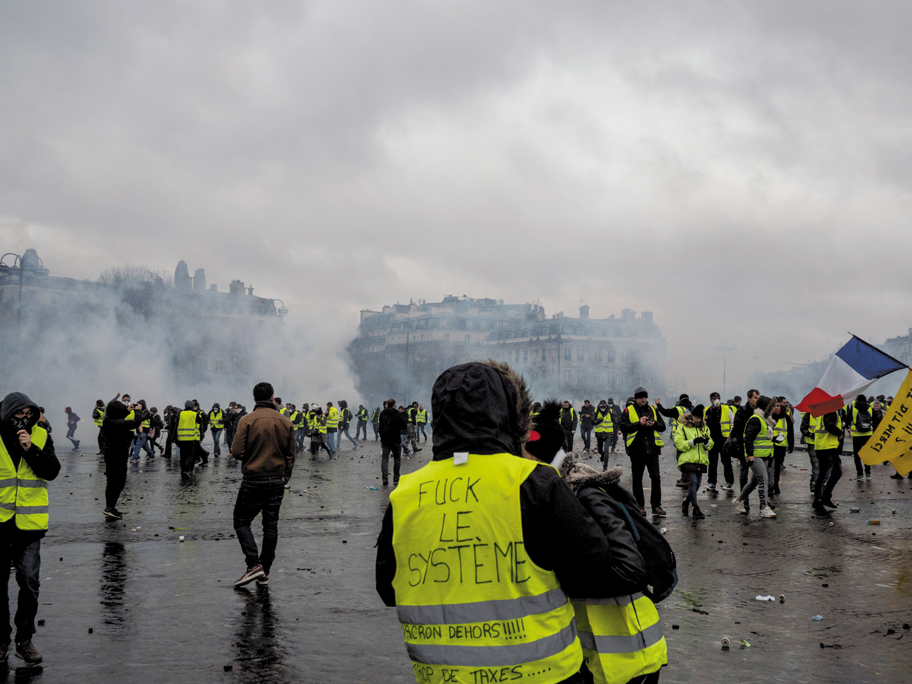

James McAuley's article ["Low Visibility"](https://www.nybooks.com/articles/2019/03/21/low-visibility-france-gilet-jaunes/), published on the 21st March, is nominally a review of *Twilight of the Elites: Prosperity, the Periphery, and the Future of France* by Christophe Guilluy, translated from the French by Malcolm DeBevoise. However, the article is primarily the author's own analysis of the gilets jaunes movement, exploring its inception and motivations as well as the nihilism and apoliticism that distinguishes it from other protest movements in France's history.
## A nihilistic distrust of systems as a whole has characterized many recent protests

*Fuck Le Systeme graffiti on back the of a gilet jaune at a protest in Place de la Republique, in Decemember 2018.*

This slogan epitomizes the nihilistic distrust of all structures that pervades and handicaps many recent protest efforts. This is a perverted anarchism, a "green" twist to the 60s protests that renders such efforts both angry and impotent.

## The gilets jaunes movement is a protest without a vision of utopia

> The gilets jaunes are more than a protest. This is a modern-day jacquerie, an emotional wildfire stoked in the provinces and directed against Paris, and most of all, the elite. French history since 1789 can be seen as a sequence of anti-elite movements, yet the gilets jaunes have no real precedent. **Unlike the Paris Commune of 1871, this is a proletarian struggle devoid of utopian aspirations.** Unlike the Poujadist movement of the mid-1950s -- a confederation of shopkeepers likewise opposed to "Americanization" of a "thieving and inhuman" state and similarly attracted to anti-semitic conspiracy theories -- the gilets jaunes include shopkeepers seemingly content to destroy shop windows.

## Unlike other recent populist movements, the gilet jaunes are militantly apolitical

> Many have said that the gilets jaunes are merely another “populist movement,” although the term is now so broad that it is nearly meaningless. Comparisons have been made to the Britain of Brexit, the United States of Donald Trump, and especially the Italy of Cinque Stelle. But the crucial difference is that the gilets jaunes are apolitical, and militantly so. **They have no official platform, no leadership hierarchy, and no reliable communications. Everyone can speak for the movement, and yet no one can. When a small faction within it fielded a list of candidates for the upcoming European parliamentary elections in May, their sharpest opposition came from within: to many gilets jaunes, the ten who had put their names forward—among them a nurse, a truck driver, and an accountant—were traitors to the cause, having dared to replicate the elite that the rest of the movement disdains.**

## Although lower than in the US and Britain, inequality in France is growing

> Inequality in France is less extreme than in the United States and Britain, but it is increasing. Among wealthy Western countries, the postwar French state—l’État-providence—is something of a marvel. France’s health and education systems remain almost entirely free while ranking among the best in the world. In 2017 the country’s ratio of tax revenue to gross domestic product was 46.2 percent, according to statistics from the Organization for Economic Co-operation and Development (OECD)—the highest redistribution level of any OECD country and a ratio that allows the state to fight poverty through a generous social protection system. Of that 46.2 percent, the French government allocated approximately 28 percent for social services.
>
> ...
>
> And yet the rich in France have gotten much richer. Between 1983 and 2015, the vast majority of incomes in France rose by less than one percent per year, while the richest one percent of the population saw their incomes rise by 100 percent after taxes. According to World Bank statistics, the richest 20 percent now earns nearly five times as much as the bottom 20 percent. This represents a stark shift from the Trente Glorieuses, France’s thirty-year economic boom after World War II. As the economist Thomas Piketty has pointed out, between 1950 and 1983, most French incomes rose steadily by approximately 4 percent per year; the nation’s top incomes rose by only one percent.

Ed: Ed: Which is related to the geographical fractures i.e. the divide between major cities and the rest -- this is the centralization of the platform economy but for cities rather than Amazon. Just as platform economy creates centralization and growing inequality in tech so it does with cities: there are the "grandes villes" and the rest. That platformization has been accelerating for the classic reasons platforms grow in general: lower transport costs which mean people can move to major cities and growing benefit of platforms in terms of the liquidity and variety premiums (modern knowledge based production requires a greater diversity of skills, the mating market etc).

## The decreasing quality of provincial life can be traced to the increasing complexity, centralization and monopolization of the economy

> What has become painfully visible, however, is the extent of the country’s geographical fractures. Paris has always been the undisputed center of politics, culture, and commerce, but France was once also a country that cherished and protected its vibrant provincial life. This was la France profonde, a clichéd but genuinely existing France of tranquil stone villages and local boulangeries with lines around the block on Sundays. “Douce France, cher pays de mon enfance,” goes the beloved song by the crooner Charles Trenet. “Mon village, au clocher aux maisons sages.” These days, the maisons sages are vacant, and the country boulangeries are closed.
>
> The story is familiar: the arrival of large multinational megastores on the outskirts of provincial French towns and cities has threatened, and in many cases asphyxiated, local businesses.¹ In the once-bustling centers of towns like Avignon, Agen, Calais, and Périgueux, there is now an eerie quiet: windows are often boarded up, and fewer and fewer people are to be found. This is the world evoked with a melancholy beauty in Nicolas Mathieu’s novel Leurs enfants après eux, which won the Prix Goncourt, France’s most prestigious literary prize, in 2018.

> Footnote 1. This phenomenon [of dying towns - something I saw so eloquently in Calais in 2016] has been widely discussed in France since the publication of the journalist Olivier Razemon's *Comment la France a tue ses villes* (Rue de l'Echiquier 2016). No one has written more extensively on this question in English than my fellow correspondent Adam Nossiterr. See especially his dispatch from Albi "As France's Towns Wither, Fears of a Decline in "Frenchness"' NYT Feb 28 2017.

Ed: The footnote (and these points) raise interesting questions about the existence and nature of the underlying structural changes: the complexification of the economy leading to the push for scale in aggregation, leading to centralization around major cities; the move to an information economy running on monopoly rights and proprietary platforms (centralizing wealth); the nature of unconstrained, globalized "free market" (monopolized?) capitalism ...

## There is a growing gap between liberal (multicultural) elites and those in rural France

> This has long been Guilluy’s battle cry, and he has focused his intellectual energy on attacking what he sees as the hypocrisy of the bobos, or bourgeois bohemians. His public debut was a short 2001 column in *Libération* applying that term, coined by the columnist David Brooks, to French social life. What was happening in major urban centers across the country, he wrote then, was a “ghettoization by the top of society” that excluded people like his own family.
> 
> Guilluy crystallized that argument in a 2014 book that won him the ear of the Élysée Palace and regular appearances on French radio. This was La France périphérique: comment on a sacrifié les classes populaires, in which he contended that since the mid-1980s, France’s working classes have been pushed out of the major cities to rural communities—a situation that was a ticking time bomb—partly as a result of rising prices. He advanced that view further in 2016 with *La Crépuscule de la France d’en haut*—now translated into English as *Twilight of the Elites: Prosperity, the Periphery, and the Future of France*—a pithy screed against France’s bobo elite and what he sees as its shameless embrace of a “neoliberal,” “Americanized society” and a hollow, feel-good creed of multicultural tolerance. In 2018, one month before the rise of the gilets jaunes, he published *No Society*, whose title comes from Margaret Thatcher’s 1987 comment that “there is no such thing as society.”
> 
> In Guilluy’s view, an immigrant working class has taken the place of the “native” working class in the banlieues on the outskirts of major cities. This native class, he argues, has been scattered throughout the country and become an “unnoticed presence” that France’s elite has “made to disappear from public consciousness” in order to consolidate its grip on power. Cities are now the exclusive preserve of the elites and their servants, and what Guilluy means by “no society” is that the visible signs of class conflict in urban daily life have vanished. This is his trompe l’oeil: rich, insulated Parisians have convinced themselves that everything is fine, while those who might say otherwise are nowhere near. “The simmering discontent of rural France has never really been taken seriously,” he writes in *Twilight of the Elites*.

## Guilluy acknowledges racially motivated white working-class behaviour but does not present it as a problem

> Guilluy, whose analysis of la France périphérique ultimately fails to grapple significantly with France’s decidedly peripheral overseas territories, does not shy away from the question of identity. He sees a racial element to the frustrations of la France périphérique, but he does not see this as a problem. Some of the most frustrating moments in his work come when he acknowledges but refuses to interrogate white working-class behavior that seems to be racially motivated. “Public housing in outlying communities is now a last resort for workers hoping to be able to go on living near the major cities,” he writes in *Twilight of the Elites*, describing the recent astronomic rise in France’s urban real estate prices. “These projects, mostly occupied by immigrant renters, are avoided by white French-born workers. Barring some utterly unforeseeable turn of events, their expulsion from the largest urban centers will be irreversible.” It would not diminish Guilluy’s broader point about la France périphérique if he acknowledged that victims of structural changes can also be intolerant.
>
> Guilluy also regularly recycles anxieties over immigration, often from controversial theorists such as Michèle Tribalat, who is associated with the idea of le grand remplacement, the alleged “great replacement” of France’s white population by immigrants from North and Sub-Saharan Africa. In making his case about “the demographic revolution in process,” Guilluy has been accused of inflating his statistics. France, he wrote in Fractures françaises, “welcomes a little less than 200,000 legal foreigners every year.” But these claims were attacked by Patrick Weil, a leading French historian of immigration, who noted in his book *Le sens de la République* (2015) that Guilluy failed to consider that a large number of those 200,000 are temporary workers, students who come and go, and others of “irregular” status. Guilluy has not responded to these criticisms, and in any case his rhetoric has since grown more radical. In *No Society* he writes, **“Multiculturalism is, intrinsically, a feeble ideology that divides and weakens.”**