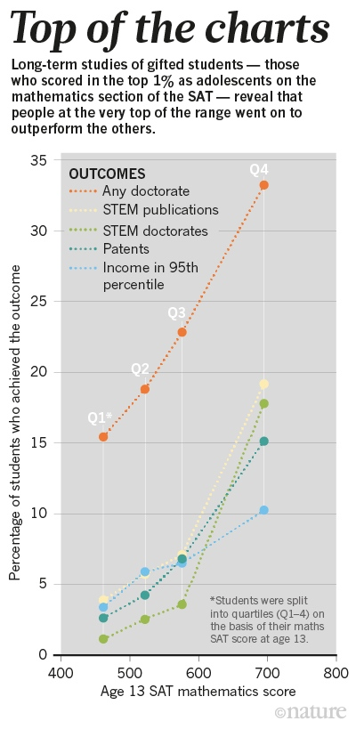

What's the source of exceptional ability? Is it innate talent ("natural genius") or is it lots of hard-work and practice? It's an old and fascinating question with important implications for education and society.

One big entry in the debate is Ericsson et al's now famous 1993 “10,000”[^10k] hours study. Crudely put, their answer was: **it’s the practice, and lots of it (not natural ability so much)**.

[^10k]: Note the attractive 10k hours comes from Gladwell and is expressly disowned for its inaccuracy by Ericsson -- it wasn't a rule and it wasn't 10k hours!

Put even more crudely: anyone can reach an expert (or even genius) level of performance with enough and right kind of practice. (It's a little bit fuzzy whether Ericsson's himself make this argument but he is certainly attracted to it).

This is an attractive story, even politically (success is due to your efforts not to the luck of the genetic draw or who your parents were). It is also a hopeful story: anyone cane become anything if they work at it hard enough (and deliberately, and early).

However, it turns out that neither of these is correct -- the second especially so. Of course, performance is related to practice and all exceptional performers have practiced long and hard. However, performance, especially exceptional performance, has many sources including "innate talent".

This doesn't mean that deliberate practice isn't useful, or that you can achieve far more than you might imagine through dedicated, deliberate practice. But it does mean that not everyone can be a genius if they work hard at it.

# Put More Formally

Performance = function(innate, practice, environment)

Note practice is itself a function of other factors:

Practice = function(amount(effort), quality(deliberateness, coaching))

With amount being a function of effort and quality a function of deliberateness, coaching etc. And effort is itself a function of yet more factors e.g. self-control, motivation, concentration etc (some of which are partially innate).

There seems little debate that Performance is influenced by practice, and that exceptional performers in any given area have practiced *a lot*. In short, practice is a necessary condition for (exceptional) performance.

However, Ericsson (and others go further) and seem to be arguing the controversial (and much more interesting) argument that practice is necessary **and sufficient** for exceptional performance. This is much more dubious as we discuss below.

# Ericsson

Famous “10,000” hours study is Ericsson et al 1993 ([PDF](http://www.mockingbirdeducation.net/uploads/5/4/0/7/5407628/ericsson_1993.pdf) or[ PDF](https://www.gwern.net/docs/1993-ericsson-deliberatepractice.pdf))

The Role of Deliberate Practice in the Acquisition of Expert Performance. K. Anders Ericsson, Ralf Th. Krampe, and Clemens Tesch-Romer. Psychological Review. 1993, Vol. 100. No. 3, 363-406

**Crudely put: it’s the practice, and lots of it (not natural ability so much)**

> Abstract: The theoretical framework presented in this article explains expert performance as the end result of individuals' prolonged efforts to improve performance while negotiating motivational and external constraints. In most domains of expertise, individuals begin in their childhood a regimen of effortful activities (deliberate practice) designed to optimize improvement. Individual differences, even among elite performers, are closely related to assessed amounts of deliberate practice. Many characteristics once believed to reflect innate talent are actually the result of intense practice extended for a minimum of 10 years. Analysis of expert performance provides unique evidence on the potential and limits of extreme environmental adaptation and learning.

p. 397:

> “From our search for immutable characteristics corresponding to innate talent, we conclude that individuals acquire virtually all of the distinguishing characteristics of expert performers through relevant activities (deliberate practice). At least one characteristic, height, cannot be acquired. However, even height is imperfectly related to expert performance, and adult height has a correlation of only around 0.8 with height at ages younger than 17 to 18 (Malina & Bouchard, 1991), when decisions to start practice are made. Apparently no valid information on innate talent is available during an individual's initial exposure to the domain. In spite of this, assessments of talent and decisions to initiate deliberate practice are as a rule made during this period (Bloom, 1985b). … Our framework differs from a view that is based on innate talent in that we emphasize the motivation and enjoyment nec essary to start and maintain deliberate practice and the motiva- tion of parents and coaches to support the individuals without assuming that the initial superior performance reflects immutable characteristics (innate talent). 

P.399

> In summary,our review has uncovered essentially no support for fixed innate characteristics that would correspond to general or specific natural ability and, in fact, has uncovered findings inconsistent with such models.

Conclusion p.400:

> We agree that expert performance is qualitatively different from normal performance and even that expert performers have characteristics and abilities that are qualitatively different from or at least outside the range of those of normal adults. However, we deny that these differences are immutable, that is, due to innate talent. Only a few exceptions, most notably height, are genetically prescribed. Instead, we argue that the differences between expert performers and normal adults reflect a life-long period of deliberate effort to improve performance in a specific domain.

# Subsequent Research has Called this into Question

Much subsequent research has called this into question -- good overview in https://www.newyorker.com/science/maria-konnikova/practice-doesnt-make-perfect

> So how much did practice actually explain? In a 2014 meta-analysis[^meta] that looked specifically at the relationship between deliberate practice and performance in music, games like chess, sports, education, and other professions, Hambrick and his team found a relationship that was even more complex than they had expected. For some things, like games, practice explained about a quarter of variance in expertise. For music and sports, the explanatory power accounted for about a fifth. But for education and professions like computer science, military-aircraft piloting, and sales, the effect ranged from small to tiny. For all of these professions, you obviously need to practice, but natural abilities matter more.
>
> What’s more, the explanatory power of practice fell even further when Hambrick took exact level of expertise into account. In sports—one of the areas in which deliberate practice seems to make the most difference—it turned out that the more advanced the athlete, the less of a role practice plays. Training an average athlete for a set number of hours yields far more results than training an élite athlete, which, in turn, yields greater results than training a super-élite athlete. Put differently, someone like me is going to improve a great deal with even a few hundred hours of training. But within an Olympic team tiny differences in performance are unlikely to be the result of training: these athletes train together, with the same coach, day in and day out. Those milliseconds come from somewhere else

[^meta]: 2014 meta analysis http://www.scottbarrykaufman.com/wp-content/uploads/2014/07/Macnamara-et-al.-2014.pdf

SMPY program

> So where else, exactly, do performance differences come from? While Hambrick’s work has been focussed more explicitly on practice and genetics, David Lubinski, a professor of psychology at Vanderbilt University, has been approaching the question from a slightly different angle: through what’s called the Study of Mathematically Precocious Youth (smpy), a longitudinal study of the lives of students who, by the age of thirteen, had scored in the top one per cent of mathematical-reasoning ability and were then selected to take part in an enriched educational environment. (The study, co-directed for many years by Lubinski and his wife, Vanderbilt’s education-school dean, Camilla Benbow, was described in detail in a recent article in Nature.) It’s a crucial supplement to work like Hambrick’s; the data you get from close observation of the same sample and the same individuals over time can answer questions other approaches can’t. “What kinds of practice are more effective? What approaches more effective for some people than others?” Hambrick asks. “We need all the pieces to the puzzle to maximize people’s potential. Lubinski’s work on mathematically precocious youth is an essential piece.”
>
> Now, more than four decades since the smpy observation began, we are beginning to see some answers. Perhaps not surprisingly, kids in both the smpy sample and an unrelated cohort of talented students identified by Duke University excel at measures like academic accomplishment, patents, publications, academic tenure, and organizational leadership. They reach full professorship and C.E.O. status at rates far above any population norm. They were selected on nothing more than measurable intellectual promise, and here they are.

## How to Raise a Genius - Nature Article

Summary: Evidence that natural ability is a big deal.

http://www.nature.com/news/how-to-raise-a-genius-lessons-from-a-45-year-study-of-super-smart-children-1.20537

> Wai combined data from 11 prospective and retrospective longitudinal studies[^2], including SMPY, to demonstrate the correlation between early cognitive ability and adult achievement. “The kids who test in the top 1% tend to become our eminent scientists and academics, our Fortune 500 CEOs and federal judges, senators and billionaires,” he says.
>
> Such results contradict long-established ideas suggesting that expert performance is built mainly through practice — that anyone can get to the top with enough focused effort of the right kind. SMPY, by contrast, suggests that early cognitive ability has more effect on achievement than either deliberate practice or environmental factors such as socio-economic status.

[^2]: Wai, J. Intelligence 45, 74–80 (2014).
																											 			 	
> 
>		
> Source: K. Ferriman Robertson _et al_. _Curr. Dir. Psychol. Sci._ **19**, 346–351 (2010).

> ...
>
> Some insights have come from German studies<a href="http://www.nature.com/news/how-to-raise-a-genius-lessons-from-a-45-year-study-of-super-smart-children-1.20537#b9">9</a>,<a href="http://www.nature.com/news/how-to-raise-a-genius-lessons-from-a-45-year-study-of-super-smart-children-1.20537#b10"> 10</a>,<a href="http://www.nature.com/news/how-to-raise-a-genius-lessons-from-a-45-year-study-of-super-smart-children-1.20537#b11"> 11</a> that have a methodology similar to SMPY's. The Munich Longitudinal Study of Giftedness, which started tracking 26,000 gifted students in the mid-1980s, found that cognitive factors were the most predictive, but that some personal traits — such as motivation, curiosity and ability to cope with stress — had a limited influence on performance. Environmental factors, such as family, school and peers, also had an impact.

### Ericsson is probably “wrong”

> The data from such intellectual-talent searches also contribute to knowledge of how people develop expertise in subjects. Some researchers and writers, notably psychologist Anders Ericsson at Florida State University in Tallahassee and author Malcolm Gladwell, have popularized the idea of an ability threshold. This holds that for individuals beyond a certain IQ barrier (120 is often cited), concentrated practice time is much more important than additional intellectual abilities in acquiring expertise. But data from SMPY and the Duke talent programme dispute that hypothesis. A study published this year[^3] compared the outcomes of students in the top 1% of childhood intellectual ability with those in the top 0.01%. Whereas the first group gain advanced degrees at about 25 times the rate of the general population, the more elite students earn PhDs at about 50 times the base rate.

[^3]: Makel, M. C. et al. Psychol. Sci. 27, 1004–1018 (2016).

# See Also

Lubinski, D., Benbow, C. P., & Kell, H. J. (2014). Life Paths and Accomplishments of Mathematically Precocious Males and Females Four Decades Later. Psychological Science, 25(12), 2217–2232. https://doi.org/10.1177/0956797614551371

> Two cohorts of intellectually talented 13-year-olds were identified in the 1970s (1972–1974 and 1976–1978) as being in the top 1% of mathematical reasoning ability (1,037 males, 613 females). About four decades later, data on their careers, accomplishments, psychological well-being, families, and life preferences and priorities were collected. Their accomplishments far exceeded base-rate expectations: Across the two cohorts, 4.1% had earned tenure at a major research university, 2.3% were top executives at “name brand” or Fortune 500 companies, and 2.4% were attorneys at major firms or organizations; participants had published 85 books and 7,572 refereed articles, secured 681 patents, and amassed $358 million in grants. For both males and females, mathematical precocity early in life predicts later creative contributions and leadership in critical occupational roles. On average, males had incomes much greater than their spouses’, whereas females had incomes slightly lower than their spouses’. Salient sex differences that paralleled the differential career outcomes of the male and female participants were found in lifestyle preferences and priorities and in time allocation.

https://blogs.scientificamerican.com/beautiful-minds/practice-alone-does-not-make-perfect-studies-find/

* a “work ethic” / aptitude for practice may be heritable

