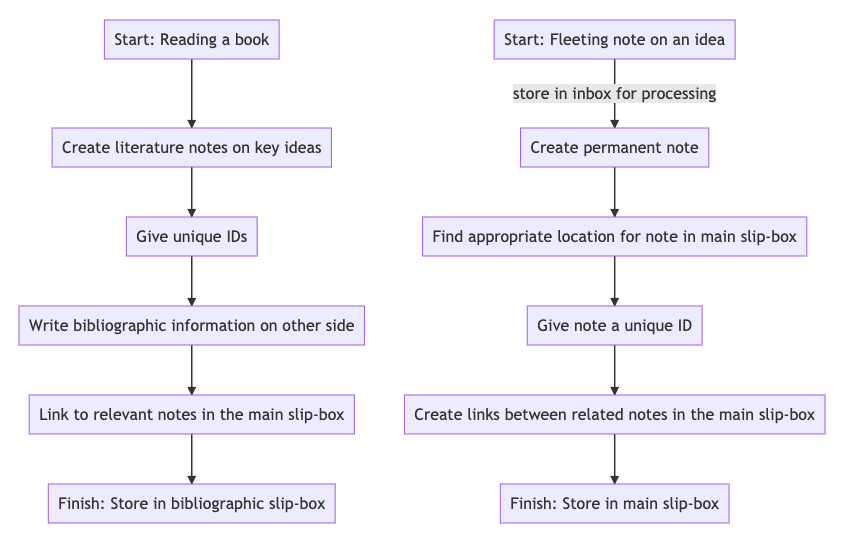
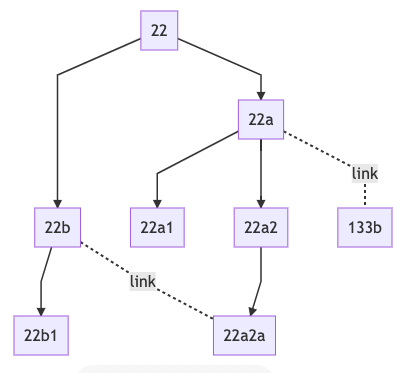

---  
title: The Zettelkasten Method 
slug: zettelkasten-method
date: 2020-07-01
---  

Niklas Luhmann (1927-1998) was a social scientist whose wide-ranging and prolific writing is often attributed to his note-taking system named "Zettelkasten." Luhmann wrote around 60 books and 400 articles upon numerous social phenomena, such as law, education, mass media and love, in the process of creating a comprehensive theory of society.

Luhmann's system was made up of index cards (zettel) which he kept in  slip-boxes. Luhmann used alphanumeric strings to connect related notes, allowing him to combine ideas into chains of thought which he could repeatedly return to and expand. 

The idea behind the Zettelkasten method is to encourage cross-linking of information and ideas that might otherwise remain siloed — for example in the notes of a particular research project — in order to produce novel insights and connections. As lines of reasoning are created through the linking of notes, the method also maximises the extent to which a finished piece of writing emerges as part of the note-taking process.

As someone who does a lot of note-taking, I decided to look into the Zettelkasten method: to see if it would be useful and, if so, how I would implement it.

Below I've written up my research on the Zettelkasten system based on my reading. I've also included the most useful resources I found at the end if you want to learn more.
# The method

## Overview of the workflow

## Implementing

My focus here is on how to implement Zettelkasten in a digital setup.

To implement Zettelkasten digitally you need:

* A location to store ideas.
* A location to store bibliographic notes.
* A method of linking the bibliographic notes to related ideas.
* A method of linking ideas together in order to create linear sequences.
* A method of indicating weaker links between ideas.

### You need two slip-boxes

These are a 'main' slip-box and a 'bibliographic' slip-box. 

* If you're using digital software, Ahrens recommends Zotero as a bibliographic slipbox.
* For my implementation I'll probably use directories on my hard disk in the place of a slipbox.

### There are 3 types of notes you'll take at first: fleeting, permanent and literature notes

There are three types of notes you'll take when you're getting started with the Zettelkasten method:

1. Fleeting notes — notes you take when you have an idea but don't have time to write it out in full. Fleeting notes go into the inbox to be processed until those of value can be turned into permanent notes.

2. Permanent notes — these record your own thoughts, comments and ideas and go into the main slip-box.

  * Each card records only one idea.
  * These cards are written clearly, with sources and references.

3. Literature notes — these record the gist of ideas in the text and any related observations. If you're using a physical slip-box, a bibliographic reference is written on the other side of each of these literature notes.  Literature notes should be:

    * Short
    * Selective
    * Generally written in your own words
    * Linked to relevant notes in the main slip-box.

### As the slip-box grows you may want to create notes mapping the contents of the slip-box and topics within it, and providing 'ways in' to different topics

4. Compilation notes — these record the IDs of notes relevant to a specific topic.

    * You may find compilation notes useful once a topic in the main slip-box is well-developed.
    * Write a sentence on the compilation note explaining the relevance of each note it links to.
    * This kind of note can be seen as a step towards developing a manuscript on the topic.

5. Notes summarising the contents of physical sections of the slip-box.

    * You may find it useful to create notes which give an overview of the contents of physical sections of the slip-box, to aid with navigation.
    * This is unnecessary with a digital system.

6. Index note — an index note records 'ways in' to topics in the slip-box.

    * The index contains keywords, with the IDs of relevant notes next to each keyword.
    * Only one or two notes are listed next to each keyword.
    * The idea is not to list every relevant note, but to provide a couple of 'ways in' to each topic in the slip-box.
    * However if a topic is sufficiently well-developed that you've created a compilation note for it, you may want to link to the compilation note from the index.

### Project notes (notes which will cease to be useful once a project is complete) should be kept outside the slip-boxes.

* Project notes are kept together in a project-specific folder.
* They might be to-do lists, first drafts or snippets that are only relevant to the current project.
* They should be thrown away after the project is finished.

## How to link notes together

### Give notes unique IDs to indicate where they belong in a line of reasoning

* All notes apart from project notes are given IDs of alphanumeric strings which indicate where they belong in a line of reasoning.
* If an existing note has the number 22, a note that is intended to follow-on directly will if possible be located next to it (in a paper system) and become 23. 
  * If 23 already exists, the new note will become 22a. 
  * If 22a already exists, it might become 22b.
* Luhmann sometimes used dashes and other punctuation in the strings. For example, the note 21/3d7a7 followed the note 21/3d7a6.
* IDs are written on the notes to indicate back links and forward links, resulting in a linear branch (or branches) of notes. The 'children' of the 'parent' note will all back link to it.
* These branches result in multiple chains of thought that can be followed through the Zettelkasten.

### Create additional, weaker links between related notes

* Luhmann also created links between notes that were 'weaker' than the links creating linear branches through the slip-box, but still indicated relevant connections to other notes elsewhere in the slipbox.
* Luhmann didn't only make links between notes at the end of each note; sometimes he linked a particular word in the middle of a note to a different note.

Here's a visual representation of branches and weaker links between notes:

### Add new notes to the slip-box

Does the new note fit into a line of thought already in the slip-box? If so:

1. Number it so it follows on from another note (you may need to create a new branch from the parent note).
2. Create links between the new note and any other notes it's relevant to.

You may also want to update your index and/or compilation notes to reflect the change.

# Why do Zettelkasten?

## Strengths of the method

### It supports the creation of linear lines of argument before the writing process has begun

* Unlike using tags to link associated ideas, creating forward links and back links results in the creation of a linear line of argument.
* At the same time, writing ideas down individually and creating multiple links supports flexibility in the structure of writing.
* Thinking about how a note connects to other notes immediately after writing it makes it easier to keep an eye on how a current research direction fits into the bigger picture.
* At the same time, ideas generated during one project can be used in the future even if not immediately useful.
* Over time the Zettelkasten grows to contain multiple linear lines of reasoning that could be turned into finished pieces of writing.

### The process is the same for all note-taking

* All notes are in a single location, regardless of topic (unless they're only intended as temporary notes). => This means fewer decisions and lower cognitive load.

### It encourages understanding and integration of new knowledge and recollection of pre-existing knowledge

* Literature notes give quick feedback on understanding of the text, as they require concisely summarising the key ideas.
* Links integrate new knowledge into pre-existing knowledge.
* Searching for new connections encourages recalling existing knowledge.

### And of course, it encourages novel connections

* Unlike categories, links reflect the multiplicity of meanings and associations a piece of knowledge can have.
* Making links and having one location for all notes means knowledge from different projects isn't siloed.
* The approach of continually looking for links that can be made during the note-taking process facilitates new, novel insights.

## Weaknesses of the method

### More repetitious writing

For all the advantages of ideas had during one writing project remaining easily available for use in future, it does increase the chance of self-plagiarism.

### More challenging to convey ideas linearly as notes become more densely interconnected

Ideas may be very interlinked and dependent on other notes for context, such that it actually becomes difficult to isolate and extract linear lines of reasoning.

### The potential benefits may take months to emerge

* The Zettelkasten method becomes increasingly effective as you accrue notes and links.
* Consequently it may be quite costly to try – you can't just experiment with it for an hour to get a sense of the benefits.
* You'll probably need to invest weeks or months before you have enough notes that you start seeing the potential for cross-pollination of ideas within the Zettelkasten.

# Bibliography

* Ahrens, Sonke. *How to Take Smart Notes: One Simple Technique to Boost Writing, Learning and Thinking – for Students, Academics and Nonfiction Book Writers* CreateSpace, 2017.
  
  A summary of Zettelkasten plus misc opinions on the importance of note-taking and tips on motivation / writing. A reasonable introduction, but there are shorter ones out there if you're only interested in Zettelkasten. I wrote a longer review of this book [here](https://rufuspollock.com/2020/04/01/ahrens-how-to-take-smart-notes/).
* Demski, Abram. ‘The Zettelkasten Method’. LessWrong, 20 Sept. 2019, https://www.lesswrong.com/posts/NfdHG6oHBJ8Qxc26s/the-zettelkasten-method-1.
  
  This is a very detailed overview of the Zettelkasten method, though focused on pen and paper implementation.
* Kam, Bryan. ‘Zettelkästen?’ Clerestory, 9 Oct. 2019, https://clerestory.netlify.com/zk/.
  
  A blog post that's worth reading if you want a quick overview of how Zettelkasten works and why it's a promising method along with links to other resources.
* Lüdecke, Daniel. 'Introduction to Luhmanns Zettelkasten-Thinking.' https://strengejacke.files.wordpress.com/2015/10/introduction-into-luhmanns-zettelkasten-thinking.pdf.
  
  A very good, detailed overview of Luhmann's method in slides, with diagrams showing how Luhmann used links and note sequences, as well as a link to Lüdecke's software for implementing Zettelkasten digitally.
